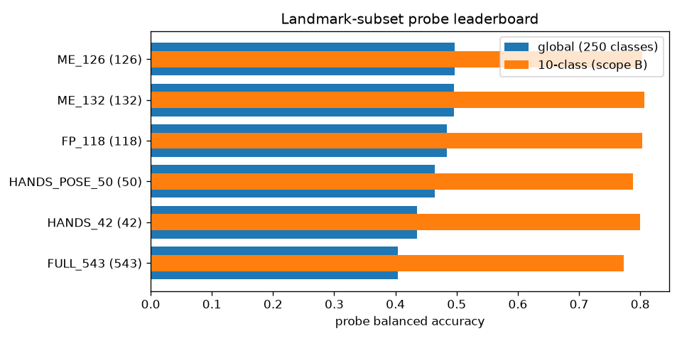

# 2026-07-16 — Landmark-Subset Discriminability Comparison & POPSIGN Extraction Infrastructure

**Scope of this report**

1. **Part I — subset discriminability comparison** (TODO §3.0):
   the follow-up instrument to the 2026-07-15 motion-energy analysis — methods
   that measure *class information* rather than *movement*
   (`src/gislr.0.dataset.subset-comparison.ipynb`, executed end-to-end), the new
   canonical landmark-subset registry
   (`src/modules/dataset/landmark/subsets.py`), and the verdict: **ME-126 wins**.
2. **Part II — POPSIGN extraction infrastructure** (TODO §2):
   the new extraction module (`src/modules/dataset/landmark/extraction.py`) and
   driver notebook (`src/popsign.0.dataset.extraction.ipynb`) with a pilot
   parameter-optimization stage — built and smoke-validated; the pilot + bulk
   runs are handed to the operator.

---

# Part I — Landmark-Subset Discriminability Comparison

## 1. Why motion energy wasn't enough

The 2026-07-15 analysis ranked landmarks by how much they *move*. Its two
predicted blind spots: it over-values redundant motion and cannot see
low-motion, high-information articulators (lips sit in a flat 0.003 band).
This analysis measures **discriminability** directly — and the data confirmed
the blind spots emphatically: the global per-landmark discriminability ranking
is essentially **uncorrelated with the motion-energy ranking (Spearman
rho = −0.12, n = 543)**. Motion energy and class information are different
quantities; subset decisions must use the latter.

## 2. Methods

Everything operates on **per-video, per-landmark descriptors** — 6 summary
statistics per landmark per video, xy only (z is ~92% noise for pose, 2026-07-15
§3.3): `rms_speed_xy` (motion-energy recipe: Savitzky-Golay window 7 /
polyorder 2, RMS over raw-valid transitions), `x_mean`, `y_mean`, `x_std`,
`y_std`, `detection_rate`. NaN→0 after tensor assembly, matching the training
NaN policy.

| instrument | level | what it measures |
|---|---|---|
| within-class consistency | landmark | CV of `rms_speed_xy` + positional spread across videos of one class |
| ANOVA F-ratio (`f_classif`) | landmark | between/within-class variance per descriptor; landmark score = max over its 6 descriptors |
| mutual information | landmark | non-linear descriptor↔label dependence (10-class scope only — kNN estimator cost) |
| **probe classifier** | **subset** | multinomial logistic regression on the subset's flattened descriptors — **the headline subset score** |

The probe uses the **canonical evaluation split** (stratified 90/10, seed 42,
9,448 val videos), so probe numbers live on the same split as every GRU run.
The probe sees summary statistics, not trajectories — it ranks *input
information content*, not achievable accuracy; only its ordering across subsets
matters.

**Scopes** (seed 42): (A) 10 videos of one random class (`'better'`) —
within-class consistency; (B) all videos of the 10 motion-energy sample signs
(3,672 videos — same sample as 2026-07-15 for comparability); (C) global —
all 94,477 videos, 250 classes, in 189 resumable chunks (manifest pattern from
TODO §1.2; descriptor extraction ≈50 min at ~31 videos/s, all probes ≈7 min).

**Subjects**: every subset in the new registry
`src/modules/dataset/landmark/subsets.py` — the single source of truth for
landmark index lists (component groups + named subsets; `ME_126.array` is
byte-identical to the trained run's `landmarks.npy`).

## 3. Results

### 3.1 The leaderboard (global probe, 250 classes — the verdict)

| subset | landmarks | **probe acc (global)** | macro | probe acc (10-class) | median F (global) |
|---|---|---|---|---|---|
| **ME_126** | 126 | **49.9%** | **49.7%** | 80.7% | 24.5 |
| ME_132 | 132 | 49.8% | 49.5% | 81.0% | 24.4 |
| FP_118 (1st place) | 118 | 48.6% | 48.4% | 81.0% | 24.5 |
| HANDS_POSE_50 | 50 | 46.7% | 46.5% | 79.4% | 17.0 |
| HANDS_42 | 42 | 43.7% | 43.5% | 80.7% | 19.4 |
| FULL_543 | 543 | 40.6% | 40.4% | 77.7% | 25.1 |

Reading the deltas as component values (at 250 classes):

- **ME_126 > FP_118 (+1.3 pts): upper-body pose {11–16, 23–24} adds real
  information** beyond the 1st-place 118 — this adjudicates the one divergence
  between the motion-energy subset and the 1st-place subset in favor of keeping
  pose, consistent with the trained result (ME-126 GRU +3.14 over baseline).
- **ME_132 ≈ ME_126 (−0.2): pose wrist points {17–22} add nothing** once hands
  and arms are in. ME_126 stays the recommended subset; no expansion.
- **Face is worth ~3 pts** (HANDS_POSE_50 46.7% → ME_126 49.9%) and
  **hands alone lose ~6 pts** to ME_126. At 10 classes hands alone nearly
  match everything — the face/pose contributions only become visible when the
  class count stresses fine distinctions.
- **FULL_543 is dead last (40.6%)** despite having the *highest* median
  per-landmark F (25.1). 417 individually-informative-but-redundant landmarks
  actively hurt the joint model — the probe replicates the GRU finding
  (70.59% full vs 73.73% ME-126) purely from input statistics.

### 3.2 Per-landmark picture: redundancy is the story

Per-landmark F at 250 classes is *high across the whole face* (median 25.7 —
the highest type!), because head pose/motion is itself class-informative and
every face landmark carries that same rigid signal. Lips (26.8) barely edge
out the rest of the face (25.8) — **marginal F cannot rank face landmarks
either**; what it shows is that ~400 face points duplicate one head-pose
signal. The subset probe is the instrument that correctly prices that
redundancy (FULL_543 last, 36-point eyes/nose anchor enough).

Other per-landmark findings:

- **`x_std` is the most discriminative descriptor** (median F 25.1), ahead of
  `rms_speed_xy` (17.3) — *where* a landmark ranges horizontally separates
  signs better than *how fast* it moves. `x_mean` is nearly useless (1.0) —
  absolute position is signer-dependent, spread is not.
- Per-landmark rankings are **class-set dependent**: F ranks from the 10-class
  scope correlate only moderately with global (rho 0.51) — unlike motion
  energy, which was stable at rho 0.95+. Discriminability analyses must run at
  the target class count; small class samples are not a shortcut here.
- F vs MI agreement at 10 classes: rho 0.52 (MI heavily favors hands, which
  carry non-linear signal; F spreads credit onto the face).

### 3.3 External validation & hard classes

Probe per-class recall (ME_126) vs the trained ME-126 GRU's per-class accuracy:
**Spearman rho = 0.640 (n = 250)** — the probe's per-class difficulty profile
tracks the real model's, so the leaderboard ordering is credible beyond the
probe's own terms.

Probe-hardest classes under ME_126: `after, cereal, go, there, pen, nap,
beside, garbage, give, snack` — `there / nap / beside / give` are exactly the
GRU's worst classes, again suggesting genuinely confusable signs rather than
representation artifacts.

### 3.4 Scope A — within-class consistency (context only)

Across 10 videos of `'better'`, hands are the most repeatable movers
(median speed-CV: HANDS_42 0.54 vs FULL_543 0.56; face/pose higher), and the
winner subsets sit in a narrow 0.58 band — consistency did not differentiate
the candidate subsets much at n=10/1 class. Kept as a direction check
(`scope_a_consistency.csv/.png`).

## 4. Verdict & follow-ups

**ME-126 is confirmed as the project's landmark subset** — now by three
independent lines: motion-energy keep/discard logic (2026-07-15), trained GRU
ablation (+3.14 pts), and input-information probes (best of 6 subsets, +1.3
over the 1st-place 118). Scores are recorded in the registry
(`SUBSETS[...].probe_acc_global`).

Follow-ups filed (TODO §3.1):

- The probe says pose helps and pose-wrist points don't — the **FP_118
  training ablation** remains the definitive test of the former.
- **`x_std` dominance** suggests the xy-only ablation (drop z; input 252) is
  well-motivated; also worth trying spread-style engineered features for the
  streaming model (causal running std is streamable).
- A face-anchor reduction (e.g. eyes/nose 36 → ~8 anchor points) is a
  candidate new subset: the face's signal is one rigid transform, which far
  fewer points could carry. Needs a trained ablation before registry admission.

---

# Part II — POPSIGN Extraction Infrastructure

## 5. What was built

**Module — `src/modules/dataset/landmark/extraction.py`** (replaces the
deleted `modules/data/landmark_worker.py` and fixes its bugs: landmarks were
never written; stale model path; hardcoded output dir):

- Per video: MediaPipe Holistic (tasks API, VIDEO mode, persistent
  per-process landmarker with monotonic-timestamp handling) → one npz with
  `landmarks (T, 543, 3) float16` in **GISLR holistic row order** (face 0–467,
  left_hand 468–488, pose 489–521, right_hand 522–542 — the `subsets.py`
  indices apply unchanged), NaN where undetected, + `fps`, `num_frames`.
- Output: `data/raw/popsign/{train,test}/<label>/<id>.npz`, rooted at
  `POPSIGN_LANDMARKS_DRIVE` (`.env`) when set, else the gitignored `src/data/`.
- **Resource cap ≤70%**: workers = `floor(0.70 × logical cores)` (19 of 28
  here), each pinned to single-threaded math libs; psutil RAM backpressure at
  70%; GPU untouched (MediaPipe GPU delegate is Ubuntu-only).
- **Resumable**: atomic npz writes (temp + `os.replace`) *before* `done`;
  atomic, batched manifest saves (every 50 videos — a per-video rewrite of a
  30K-entry JSON would dominate runtime); orphaned npz files from an interrupt
  are adopted, `failed` retried.

**Driver — `src/popsign.0.dataset.extraction.ipynb`** (replaces the deleted
`popsign.0.dataset.ipynb`): manifest verification → **pilot batch (≤100
videos, seeded)** sweeping worker counts {6, 10, 14, 19} on disjoint 20-video
slices with measured videos/s, frames/s, CPU% → ETA + disk projection → full
train/test runs (`LIMIT`-stageable, interrupt-safe) → QC section (failure
reasons, npz spot-checks, frames/video stats).

## 6. Validation done today

- Single-video extraction: 211-frame clip → `(211, 543, 3)` float16, 7% NaN,
  all four landmark groups populated.
- Multiprocess path (Windows spawn), resume-skip, and atomic writes validated
  on a 4-video 2-worker run (25.9s incl. ~13s worker init).
- Both manifests verified: 30,867 train / 33,600 test rows, unique ids,
  spot-checked paths exist. Train covers 72 labels — **only 1 of 4 POPSIGN
  train datasets is downloaded/enabled** (TODO §2.2); test covers all 250.

## 7. What the operator runs next

1. `popsign.0.dataset.extraction.ipynb` top → §2 (pilot). Inspect
   `pilot_results.csv` / the throughput plot; the notebook picks
   `BEST_N_WORKERS` and writes `eta.json` (expect single-digit-hours per split
   at ~19 workers; single-process floor measured at ~10 frames/s incl. warmup).
2. §3 (train) and §4 (test) — resumable; interrupt freely.
3. Enable + download the remaining 3 train datasets (~650GB), regenerate the
   train manifest, re-run §3 — resumability makes the union incremental.

---

# Artifacts index

| artifact | path |
|---|---|
| subset registry (with scores) | `src/modules/dataset/landmark/subsets.py` |
| comparison notebook (executed) | `src/gislr.0.dataset.subset-comparison.ipynb` |
| leaderboard / per-class recalls | `src/cache/subset_comparison/leaderboard.csv`, `scope_c_per_class/<subset>.csv` |
| per-landmark scores | `src/cache/subset_comparison/scope_{b,c}_landmark_scores.parquet` |
| extraction module | `src/modules/dataset/landmark/extraction.py` |
| extraction driver notebook | `src/popsign.0.dataset.extraction.ipynb` |
| figures | `docs/assets/2026-07-16/` |
