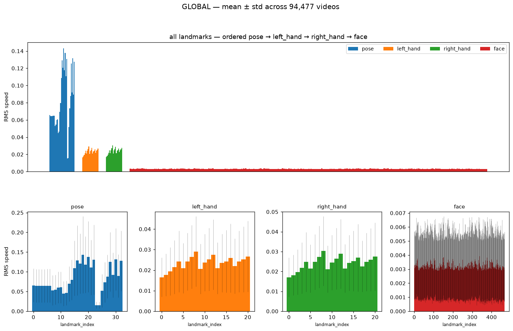
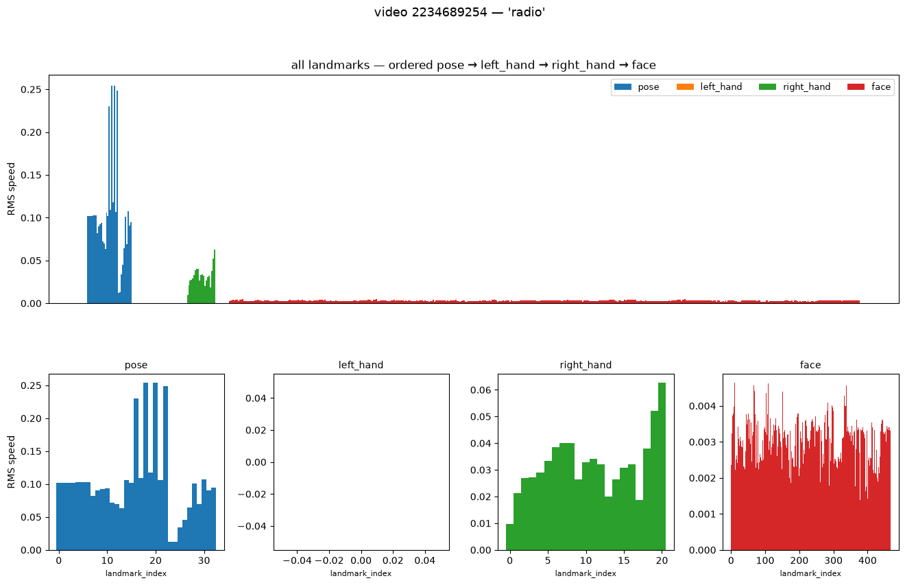
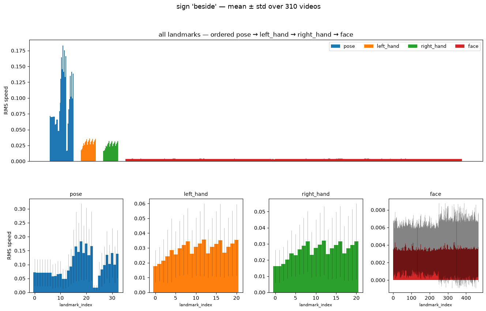
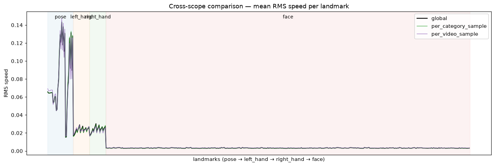
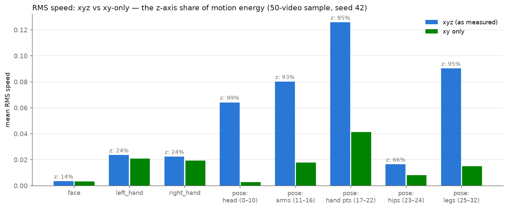
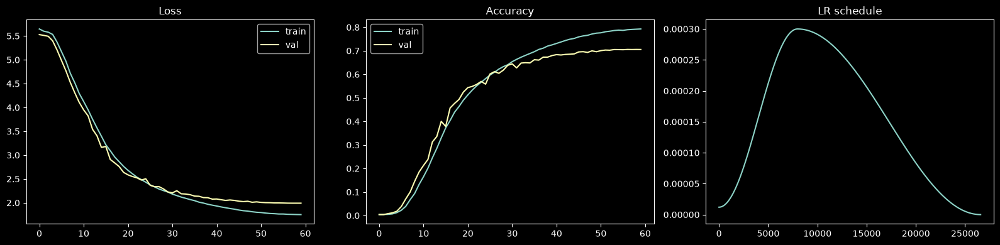
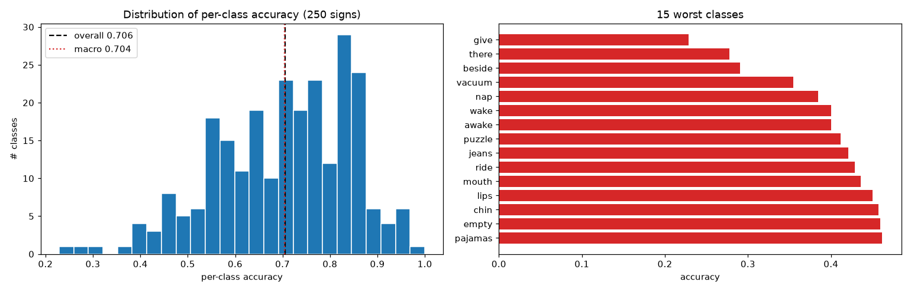
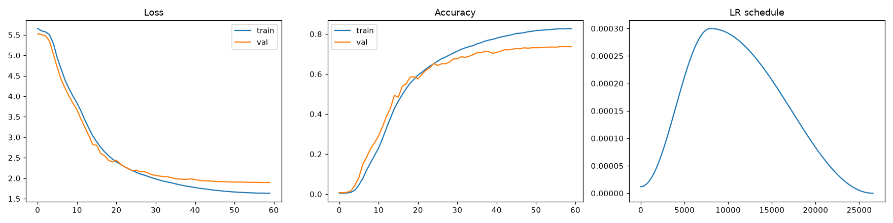
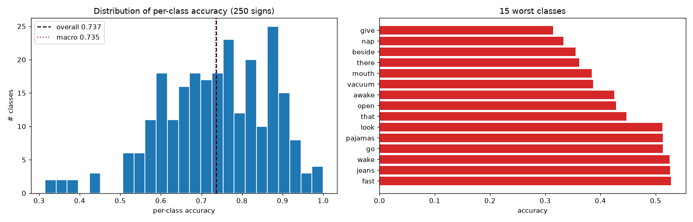
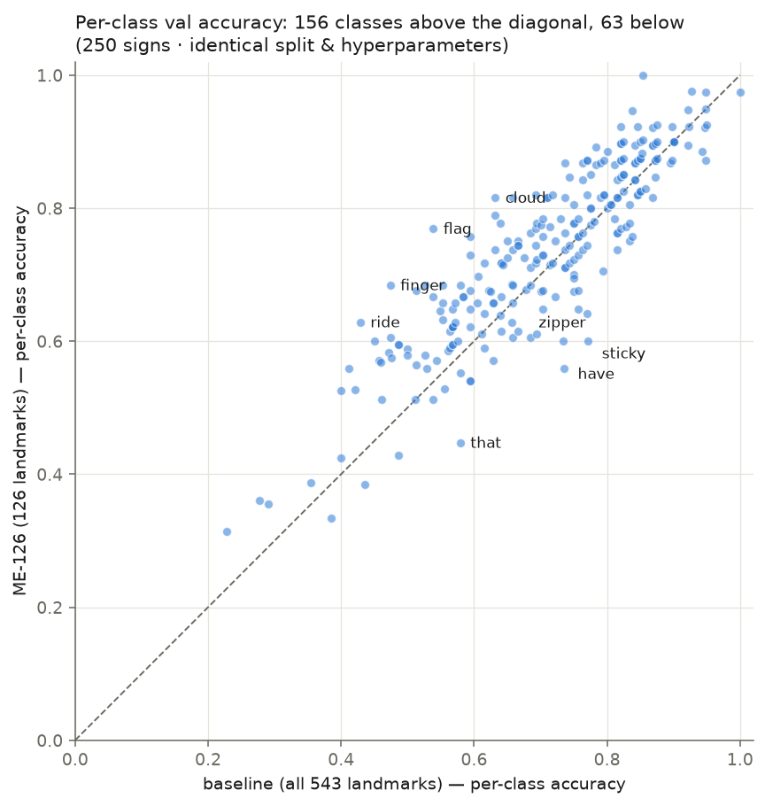

# 2026-07-15 — GISLR Landmark Motion-Energy Analysis & GRU Landmark-Subset Training

**Scope of this report**

1. Results of the GISLR landmark motion-over-time ("motion-energy") test
   (`src/gislr.0.dataset.motion-energy.ipynb`, TODO §1) — purpose, methods,
   evaluation, and a keep/discard landmark recommendation (Part I, §1–§4).
2. A follow-up experiment run for this report: how much of the measured motion
   is z-axis noise (xy vs xyz decomposition, §3.3).
3. A cross-check against the Kaggle GISLR **1st-place solution**
   (`src/gislr.0.competition.entry.1st.ipynb`): which landmarks it uses, whether
   it uses the whole dataset, and how its subset compares with the
   motion-energy findings (§5).
4. **GRU training in detail** (Part II, §6): the rationale for choosing a GRU
   over an LSTM, the full training protocol, both runs — the full-543 baseline
   and the **ME-126** reduced-landmark run — with accuracy, per-class accuracy,
   and a class-level comparison of what the landmark reduction changed.

---

# Part I — Motion-Energy Analysis

## 1. Purpose of the test

Architecture work (TODO §4) needs an answer to *"which of the 543 MediaPipe
Holistic landmarks actually carry signal?"* before GPU-hours are spent on
models that ingest all of them. The motion-energy test is the first, cheapest,
model-free probe of landmark importance: measure how much each landmark
**moves over time** and at what consistency, at three scopes (per-video,
per-category, global). It deliberately measures *motion*, not
*discriminativeness* — a landmark that moves identically in every sign has high
motion energy and zero class information, so findings here feed (not replace)
the discriminability analysis planned in TODO §3.

Secondary goals baked into the same notebook:

- validate DuckDB as the memory-bounded loading layer over 94K parquet files
  (TODO §1.0), and
- validate the resumable manifest pattern that the future POPSIGN bulk
  extraction (TODO §2.2) will reuse.

## 2. Methods

**Data.** GISLR competition data (`asl-signs`): 94,477 videos, 250 signs,
21 participants, 543 landmarks/frame (468 face, 21 per hand, 33 pose), xyz
normalized image coordinates.

**Metric.** Per-landmark **RMS speed**: pivot each video to frames × (landmark,
coordinate), reindex to a contiguous frame range (uniform dt), linear-interpolate
gaps, Savitzky-Golay smooth (window 7, polyorder 2 — carried over from the
earlier motion-energy exploration), frame-to-frame displacement, then
`sqrt(mean(speed²))` over **valid transitions only**.

**NaN policy.** Hands are absent in many frames (MediaPipe returns NaN). A
transition t→t+1 counts toward a landmark's RMS only if the landmark was
observed at *both* t and t+1 in the raw data. Interpolated stretches are used
for smoothing but never scored, so a hand visible in 20% of frames is measured
on those frames rather than diluted toward stillness. Landmarks with zero valid
transitions get `rms_speed = NaN` and are excluded from aggregates.

**Loading layer.** In-memory DuckDB; every scope calls one function
(`load_landmarks_for_paths`) that passes an explicit parquet file list, so only
requested files are opened. Full in-SQL aggregation was rejected (Savitzky-Golay
needs ordered per-frame series), but the final global aggregation *is* done
in-SQL over the cached chunk parquets.

**Resumability.** All three scopes run through one manifest-driven loop
(`process_units`): per-unit artifact written *before* the unit is marked done,
atomic manifest saves, `done` skipped / `failed` retried on re-run. It survived
the full 189-chunk global run with **0 failures**.

**Scopes executed** (all complete, seed 42):

| scope | units | output |
|---|---|---|
| per-video | 50 random videos | `cache/motion_analysis/per_video/summary.parquet` + 50 PNGs |
| per-category | 10 random signs (~375 videos each) | `per_category/summary.parquet` (mean ± std per landmark) |
| global | all 94,477 videos in 189 chunks of 500 | `global/summary.parquet` |

Measured throughput ≈ 65 videos/s single-threaded; the global scope completed
in ≈ 25 minutes.

## 3. Results

### 3.1 Global per-type picture (xyz, as measured)

| type | n landmarks | mean RMS | range | detected in % of videos |
|---|---|---|---|---|
| pose | 33 | 0.0827 | 0.0152 – 0.1431 | 100.0% |
| right_hand | 21 | 0.0241 | 0.0171 – 0.0303 | 54.7% |
| left_hand | 21 | 0.0233 | 0.0166 – 0.0291 | 41.4% |
| face | 468 | 0.0032 | 0.0029 – 0.0039 | 99.9% |



Within-type detail:

- **Hands:** fingertips move most (index tip 8 > middle tip 12 > pinky tip 20),
  wrist and thumb base least (0, 1, 2) — exactly the articulation hierarchy
  expected if the signal is real. Right hand ≈ left hand in magnitude, but the
  right hand is detected in 55% of videos vs 41% for the left (dominant-hand
  asymmetry).
- **Pose:** the top movers as measured are 18/20/22 (right wrist-adjacent hand
  points), 16 (right wrist) — but also 27–32 (**ankles, heels, feet**), which are
  out of frame in seated signing videos. That was the first hint that raw xyz
  motion energy is contaminated (see §3.3). Hips 23/24 are the stillest points
  of the whole body (0.015).
- **Face:** an extremely flat profile — all 468 landmarks fall in a
  0.0029–0.0039 band, i.e. the face moves **as a rigid object** (head motion)
  with almost no per-landmark differentiation. Motion energy alone cannot rank
  face landmarks meaningfully.

Example single-video and per-category figures (the per-video PNGs for all 50
samples live in `src/cache/motion_analysis/per_video/plots/`):




### 3.2 Do the samples represent the global pattern? (cross-scope validation)

Spearman rank correlation of per-landmark mean RMS against the global run:

| sample | rho vs global (n=543) |
|---|---|
| per-video (50 videos) | **0.954** |
| per-category (10 signs, ~3,750 videos) | **0.996** |



Small seeded samples reproduce the global per-landmark motion ranking almost
perfectly. **Consequence:** future landmark analyses (e.g. the xy/xyz
decomposition below, discriminability probes) can run on ~50-video samples and
be trusted, which turns day-scale experiments into minute-scale ones.

### 3.3 How much of the "motion" is z-axis noise? (follow-up run for this report)

MediaPipe's z is known to be far less reliable than x/y (the 1st-place solution
drops it outright — §5). Re-computing RMS speed on the 50-video sample with
**xy only** vs **xyz**:

| group | RMS (xyz) | RMS (xy) | z share of motion energy |
|---|---|---|---|
| face | 0.0035 | 0.0032 | 14% |
| left_hand | 0.0236 | 0.0210 | 24% |
| right_hand | 0.0224 | 0.0194 | 24% |
| pose: head (0–10) | 0.0642 | **0.0028** | **99%** |
| pose: arms (11–16) | 0.0801 | 0.0179 | 93% |
| pose: hand pts (17–22) | 0.1258 | 0.0412 | 85% |
| pose: hips (23–24) | 0.0165 | 0.0081 | 66% |
| pose: legs (25–32) | 0.0903 | 0.0150 | 95% |



This reorders the conclusions substantially:

- **~92% of pose "motion energy" is z-axis noise.** Pose-head landmarks are
  *essentially static* in the image plane (xy RMS 0.0028, below face level) —
  their apparent 0.064 xyz motion was almost pure depth jitter. Same story for
  legs (95% z).
- In honest xy terms the ranking becomes: **pose hand points (0.041) > hands
  (~0.020) ≈ pose arms (0.018)** > legs > hips > face ≈ pose head.
- Hands keep ~76% of their energy in xy — their motion is real. Face keeps 86%,
  but at a magnitude 6× smaller than hands.
- The raw-xyz global summary (§3.1) is therefore **not wrong but misleading**
  for pose; any landmark-importance decision must use xy (or z-corrected)
  motion. Cached: `src/cache/motion_analysis/xy_vs_xyz_sample50.parquet`.

## 4. Landmark keep/discard recommendation

Combining §3 (xy motion, detection rates, articulation structure) with the
caveat that motion ≠ discriminativeness:

| group | count | verdict | rationale |
|---|---|---|---|
| left/right hand (all 21 each) | 42 | **keep** | primary articulators; highest genuine xy motion after pose hand pts; fingertip>wrist hierarchy confirms signal quality |
| pose 11–16 (shoulders, elbows, wrists) | 6 | **keep** | genuine arm trajectory (~hand-level xy motion) and 100% detection — the only motion signal left when the hand mesh drops out (hands are missing in 45–59% of videos) |
| pose 23–24 (hips) | 2 | **keep (cheap anchor)** | stillest points measured — useful spatial reference / normalization anchor, near-zero cost |
| pose 17–22 (wrist-adjacent hand pts) | 6 | optional | highest xy movers but duplicate the hand meshes when those are present; same fallback argument as arms; 1st place drops them |
| face: lips | 40 | **keep (not on motion grounds)** | motion profile is flat — kept for linguistic reasons (mouthing distinguishes minimal pairs); see §5 |
| face: eyes + nose | 36 | keep (small) | near-rigid — serve as head-pose anchor + non-manual cues (gaze, brows); 1st place keeps them |
| pose 0–10 (face duplicates) | 11 | **discard** | 99% z-noise, xy-static, redundant with the face mesh |
| pose 25–32 (legs, feet) | 8 | **discard** | out of frame; apparent motion is jitter |
| face: everything else | 392 | **discard** | rigid head motion duplicated 392×; no per-landmark differentiation |
| **z coordinate** (all kept landmarks) | — | **discard** | 92% of pose energy is z-noise; even for hands z adds only a noisy 24%; 1st place trains on xy only |

Keeping all "keep" rows = **126 landmarks** ("ME-126" below); the strict
1st-place-compatible variant without pose = 118.

## 5. The 1st-place solution: dataset usage & landmark cross-check

From `src/gislr.0.competition.entry.1st.ipynb` plus the author's write-up
(hoyso48, 1D CNN + Transformer, CV 0.80 / public LB 0.80 / private LB 0.88).

**Does it use the entire dataset?** Yes in *videos*, no in *features*. It
trains from scratch on **all training videos of the competition data and
nothing else** (no external data; 4× seed ensemble for the final submission;
5-fold participant-split CV). But per frame it keeps only a fraction of the
holistic input:

| | raw | 1st place keeps | share |
|---|---|---|---|
| landmarks | 543 | **118** | 21.7% |
| coordinates per landmark | 3 (xyz) | 2 (xy) | 66.7% |
| raw values per frame | 1,629 | 236 | **14.5%** |

**The 118 landmarks** (`POINT_LANDMARKS = LIP + LHAND + RHAND + NOSE + REYE + LEYE`):

| group | count | face-mesh / holistic indices |
|---|---|---|
| lips | 40 | `0, 13, 14, 17, 37, 39, 40, 61, 78, 80–82, 84, 87, 88, 91, 95, 146, 178, 181, 185, 191, 267, 269, 270, 291, 308, 310–312, 314, 317, 318, 321, 324, 375, 402, 405, 409, 415` |
| left hand | 21 | holistic rows 468–488 |
| right hand | 21 | holistic rows 522–542 |
| nose | 4 | `1, 2, 98, 327` |
| right eye | 16 | `33, 7, 163, 144, 145, 153–155, 133, 246, 157–161, 173` |
| left eye | 16 | `263, 249, 390, 373, 374, 380–382, 362, 466, 384–388, 398` |
| pose | 0 | `POSE = [500–505, 512, 513]` is **defined but commented out** (`#+POSE`) |

Notable details:

- The commented-out `POSE` list maps to pose landmarks **11–16 + 23–24**
  (shoulders, elbows, wrists, hips) — *exactly* the upper-body subset the
  motion-energy analysis flags as the only genuinely-moving, always-detected
  pose points. The author evidently tried it and shipped without it.
- z is dropped (`x = x[..., :2]`) — independently confirming §3.3.
- Normalization: per-video mean of face landmark 17 (a lip-center point that
  sits near frame center, ~[0.5, 0.5]) as reference, scaled by the NaN-aware
  std of the kept points.
- Motion is re-introduced as *features*, not landmarks: lag-1 and lag-2
  differences concatenated to the positions (118 × 2 × 3 = 708 channels);
  lag > 2 didn't help.

**Does it match the motion-energy subset?** Largely — with one instructive
divergence in each direction:

| decision | motion-energy (xy) verdict | 1st place | agreement |
|---|---|---|---|
| keep both full hands | keep | keep | ✅ |
| discard 392 of 468 face landmarks | discard (flat/rigid profile) | discard | ✅ |
| discard pose legs + face-duplicate pose head | discard (jitter / static) | discard | ✅ |
| discard z | discard (noise-dominated) | discard | ✅ |
| upper-body pose (11–16, 23–24) | **keep** (real arm motion, 100% detection, hand-dropout fallback) | **drop** (drafted, commented out) | ⚠️ divergence |
| lips / eyes / nose | motion energy sees *nothing special* (flat 0.003 band) | **keep** (mouthing & non-manual markers) | ⚠️ divergence |

The two divergences are exactly the two blind spots motion energy is expected
to have: (a) it *over*-values redundant motion — pose arms move genuinely, but
much of that trajectory may be recoverable from hand positions alone, which is
presumably why dropping them didn't hurt the 1st-place model; (b) it
*under*-values low-motion, high-information articulators — lips barely move in
RMS terms yet carry mouthing, which the 1st place (and the broader ASL
literature) treats as essential. **Conclusion: motion energy agrees with ~110
of the 118 kept landmarks and with every wholesale discard, but it cannot by
itself justify the lips/eyes or adjudicate pose — the within-class /
cross-class discriminability analysis (TODO §3) is the right next instrument.**

---

# Part II — GRU Training: Full-543 Baseline vs ME-126

All trained runs are registered in the
[model leaderboard](../src/models/README.md); each run's folder holds its full
record (README with training conditions and metrics, `data.md` with the exact
data/subset/split, plots, per-class tables):

- baseline — [`src/models/gislr/gru/20260713-213000/`](../src/models/gislr/gru/20260713-213000/README.md)
- ME-126 — [`src/models/gislr/gru/20260715-190729/`](../src/models/gislr/gru/20260715-190729/README.md)

## 6. The two runs in detail

### 6.1 Why a GRU at all — and why it should beat an LSTM here

The deployment target is **streaming, frame-by-frame inference**: the model
must emit a usable state after every incoming frame with no access to future
frames. That rules the architecture space down to causal sequence models
(unidirectional RNNs, causal TCN/1D-CNN, causal transformers). Within the
recurrent family, the GRU was chosen over the LSTM deliberately:

1. **Less compute and state per streamed frame.** An LSTM carries four gate
   matrices and two state tensors (h, c); a GRU carries three gate matrices
   and a single state h. At equal hidden size that is ~25% fewer recurrent
   parameters and FLOPs per frame — which is exactly the budget that matters
   for a real-time pipeline (the competition's own constraints, 40 MB TFLite /
   100 ms per video, make the same point). The single state tensor also makes
   the streaming loop and the ONNX → TFLite export graph simpler: one hidden
   state to carry between frames instead of two.
2. **The LSTM's advantage regime doesn't apply here.** The extra cell state
   pays off on *long* dependency chains (hundreds–thousands of steps). GISLR
   sequences are short — capped at 128 frames after uniform subsampling, most
   far shorter — so the classic empirical result (Chung et al., 2014: GRU ≈
   LSTM on short/medium sequence tasks, at lower cost) is the expected regime.
3. **At equal parameter budget the GRU is the stronger model.** Whatever
   accuracy an LSTM would buy with its fourth gate, the same parameters buy
   the GRU a larger hidden state — usually the better trade on a
   250-class classification task with 85K training sequences.

To be explicit about epistemics: this is a *reasoned prior*, not yet a measured
result — the LSTM/BiLSTM baselines are still open in TODO §4 (BiLSTM strictly
as an offline accuracy reference; being bidirectional it can never ship in the
streaming pipeline).

### 6.2 Common training protocol (identical in both runs)

Both runs share the model and every training knob; the **landmark subset is
the only variable**, so the delta is attributable to input selection alone.

```
input (B, T≤128, D)
  → LayerNorm(D)
  → GRU(D → 256, 2 layers, unidirectional, dropout 0.3 between layers)   [packed]
  → last valid timestep
  → LayerNorm(256) → Dropout(0.3) → Linear(256 → 250)
```

| | both runs |
|---|---|
| split | stratified-by-sign 90/10, seed 42 → 85,029 train / 9,448 val |
| batch / optimizer | 192 / AdamW (lr 3e-4, weight decay 1e-4) |
| schedule / loss | OneCycleLR (per-step) / CrossEntropy + label smoothing 0.1 |
| epochs / precision | 60 / AMP (autocast + GradScaler), grad-clip 5.0 |
| sequence handling | >128 frames uniformly subsampled (`np.linspace`), shorter packed |
| NaN policy | `nan_to_num → 0` at cache build |
| hardware | RTX 4080 Super, Windows 11, PyTorch 2.13 cu130 |

Baseline trained 2026-07-13 via `src/gislr.1.model.gru.ipynb`; ME-126 trained
2026-07-15 by a script mirroring that notebook cell-for-cell (preserved at
`src/models/gislr/gru/20260715-190729/cache/train_gru_me126.py`). Per-class
evaluation for both: `scripts/eval_gru.py`, straight from raw parquet — it
reproduces each checkpoint's stored best val accuracy exactly.

### 6.3 Run 1 — baseline, all 543 landmarks (`20260713-213000`)

Input 543 × xyz = **1,629 values/frame**, **1,911,988 parameters**.
Full record: [run README](../src/models/gislr/gru/20260713-213000/README.md) ·
[data.md](../src/models/gislr/gru/20260713-213000/data.md).

| metric | value |
|---|---|
| overall val accuracy | **70.59%** (best epoch 57/60) |
| macro (mean per-class) | 70.36% · median class 72.22% |
| classes below 50% | 22 / 250 |
| final train accuracy | 78.98% (~8.4 pt train–val gap) |
| worst 5 | give 22.9 · there 27.8 · beside 29.0 · vacuum 35.5 · nap 38.5 |
| best 5 | gum 100 · brown 95.0 · horse 94.9 · clown 94.9 · sad 94.9 |




### 6.4 Run 2 — ME-126 subset (`20260715-190729`)

**ME-126** = the 1st-place 118 ∪ upper-body pose {11–16, 23, 24} — the union
of both columns of the §5 table, resolving the pose divergence in favor of
keeping it (100% detection is a strong fallback argument for a streaming model
that must survive hand-tracking dropouts frame by frame). **xyz kept** so the
subset is the only changed variable (dropping z is a separate ablation,
TODO §3.1). Input 126 × xyz = **378 values/frame**, **948,718 parameters**
(−50.4%); subset feature cache 5.4 GB vs ~21 GB.
Full record: [run README](../src/models/gislr/gru/20260715-190729/README.md) ·
[data.md](../src/models/gislr/gru/20260715-190729/data.md).

| metric | value |
|---|---|
| overall val accuracy | **73.73%** (best epoch 59/60) |
| macro (mean per-class) | 73.49% · median class 74.36% |
| classes below 50% | **9** / 250 |
| final train accuracy | 82.76% (~9 pt train–val gap) |
| worst 5 | give 31.4 · nap 33.3 · beside 35.5 · there 36.1 · mouth 38.5 |
| best 5 | donkey 100 · shhh 97.6 · gum 97.4 · clown 97.4 · horse 94.9 |
| wall time | **17.5 min** (~0.3 min/epoch, in-RAM cache, `num_workers=0`) |




### 6.5 Comparison

| | baseline [`20260713-213000`](../src/models/gislr/gru/20260713-213000/README.md) | ME-126 [`20260715-190729`](../src/models/gislr/gru/20260715-190729/README.md) |
|---|---|---|
| landmarks | all 543 | 126 (23.2%) |
| input dim / frame | 1,629 | 378 |
| parameters | 1,911,988 | **948,718 (−50.4%)** |
| feature cache size | ~21 GB | 5.4 GB |
| val accuracy (overall) | 70.59% | **73.73% (+3.14)** |
| val accuracy (macro) | 70.36% | **73.49% (+3.13)** |
| median class accuracy | 72.2% | 74.4% |
| classes below 50% acc | 22 | **9** |
| best epoch | 57 / 60 | 59 / 60 |

**The ME-126 subset beats the full-543 baseline by +3.1 points with half the
parameters** — the model had already passed the baseline's *final* accuracy by
epoch 38 of 60. Feeding the GRU the 417 noisy/redundant landmarks wasn't
neutral bulk; it actively cost ~3 points.

**Per-class movement** (full table:
[`per_class_vs_baseline.csv`](../src/models/gislr/gru/20260715-190729/cache/per_class_vs_baseline.csv)):

- **156 classes improved, 63 regressed, 31 unchanged**; mean per-class delta
  +3.1 pts, and the two models' per-class profiles stay strongly rank-correlated
  (Spearman 0.881) — the subset shifts the whole distribution up rather than
  trading one group of signs for another.
- Macro tracks overall exactly (+3.13 vs +3.14), i.e. the gain is not
  concentrated in a few high-frequency classes, and the *tail* improves most:
  failing classes (<50%) drop from 22 to 9.
- Biggest winners: `flag` +23.1, `finger` +21.1, `ride` +20.0, `cloud` +18.4,
  `tongue` +16.2 — predominantly handshape/motion-defined signs, consistent
  with the subset concentrating capacity on the hands.
- Biggest losers: `have` −17.6, `sticky` −17.1, `zipper` −13.3, `that` −13.2,
  `kitty` −12.8. `mouth` also enters the new worst-5 (38.5%). Plausibly signs
  whose discrimination leaned on discarded context (torso-adjacent face
  regions, body contact points) — but with ~38 val samples/class, ±13 pts is
  ~5 videos, so per-class regressions this size are within noise for any
  single class. Whether these signs *systematically* need the discarded
  landmarks is exactly what the discriminability analysis (TODO §3) should
  answer.



The hardest classes are stable across both models (`give`, `there`, `beside`,
`nap` appear in both worst-5 lists) — these look like genuinely confusable
signs, not artifacts of either input representation.

Leaderboard across datasets and architectures:
[`src/models/README.md`](../src/models/README.md).

---

# Follow-ups filed in TODO.md

## 7. Open items produced by this report

- Global xy-only re-aggregation of the motion-energy summaries (z-noise
  correction at full-dataset scale) — TODO §1.8.
- Landmark-subset training ablations: exact 1st-place 118 (no pose), xy-only
  channels, lag-1/lag-2 motion features — TODO §3.1.
- Within-class consistency + cross-class discriminability (ANOVA-style) — the
  instrument that can rank the face landmarks motion energy can't — TODO §3.
