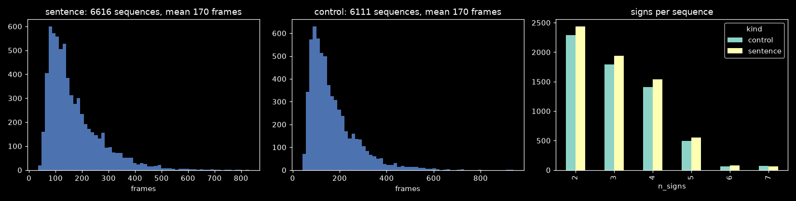
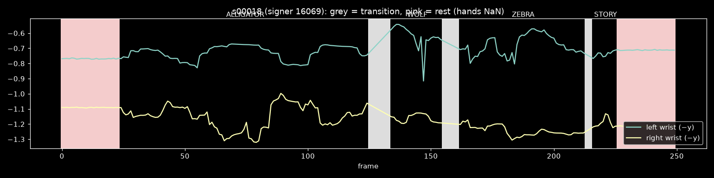

# 2026-09-23 — continuous signing scoped (TODO §12); GISLR-Sentences v1 built

The user asked for four experiments: a model that outputs a confidence over
every gloss at every frame, a continuous multi-sign dataset built from
GISLR_Stratified's test split, testing existing models on it, and null /
add-a-sign support. Pipeline and deployment research comes after those. Each
experiment is planned and reviewed by the user before it is built. Filed as
`TODO.md` §12 with an agreed order: dataset (12.1) → baselines (12.2) →
continuous model + null + open vocabulary (12.3) → rerun + add-a-sign
(12.4) → pipeline research (12.5).

## 1. Facts measured before planning

- **GISLR clips are trimmed to the sign.** A 1,500-clip test sample had
  **0** hand-absent lead-in/lead-out frames and 0.4% hand-absent frames
  overall. Clip length: median 22, p95 131, max 405 frames. So there is no
  null/non-sign data anywhere in GISLR, and every null frame has to be
  synthesized.
- **Each test signer covers 221–249 of the 250 glosses**, so every sequence
  can come from a single signer.
- `test.csv` is also the canonical val set that registry checkpoints were
  early-stopped on. Baselines on a test-derived set carry that selection
  advantage (the five-arch checkpoints do not: they selected on an internal
  val carved from `train.csv`).

## 2. Built

- `sb.recognize.sequences`:
  - `corpus.py` plus a committed, versioned corpus: 1,757 ASL-gloss-order
    sentences in 11 themed files, every gloss in ≥12 sentences, a POS
    lexicon, and a line-ending-independent content hash.
  - `compose.py`: a coverage-driven planner (one signer per sequence, every
    clip placed, reuse flagged), a random-order control planner, and a
    materializer that interpolates transitions, synthesizes hands-absent
    rest, and records per-frame labels and segments.
  - `kaggle_notebook.py`: generates a self-contained Kaggle twin of the
    build, because uploading from this machine was too slow.
- `experiments/recognition/gislr.0.dataset.sentences.ipynb` (+
  `configs/gislr.sentences.json`) and the generated
  `gislr.0.dataset.sentences-kaggle.ipynb`.
- **Planner tuning.** Scoring by fraction-fresh alone preferred 2-gloss
  sentences (mean 2.7 vs the corpus's 3.14) and reused 15% of slots.
  Adding a length bonus (0.3) and a pull toward the glosses a signer has
  most left (0.3) gave **8.0% reuse at mean length 3.11**.

## 3. Build run (local, user-executed)

| | sentence | control |
|---|---|---|
| sequences | 6,616 (1,227 distinct sentences) | 6,111 |
| frames | 1,125,262 (mean 170, max 830) | 1,041,154 (mean 170, max 939) |
| sign / transition / rest frames | 69.1% / 7.4% / 23.5% | 69.1% / 7.4% / 23.5% |
| sign boundaries | 13,931 | 12,785 |
| clip use | 18,896/18,896; 17,560 once, 1,336 more than once (max 7) | each exactly once |

**12,727/12,727** sequences built with 0 failures. **Round-trip 300/300
exact** (every sampled segment is bit-identical to its source clip).
**0 segment-consistency issues** across all sequences. **12.12 GB** at
float32, below the 16 GB estimated from a 40-sequence smoke test. Corpus
sha256 `daeca9e5e82a`, config sha256 `8dfc2cdb9eb6`. Not yet uploaded.



The two splits are matched on length and sign count by construction, so a
later sentence-vs-control difference can only come from word order/meaning.



**A realism flaw the exemplar exposes:** during rest (pink), the pose
wrists stay at signing height while the hand landmarks are NaN. A real
resting signer drops their wrists to the hips, and MediaPipe does report
hands that are in frame. "Hands NaN" therefore makes rest frames trivially
separable from signing. That is harmless for measuring *carry-over* and
*transitions*, but it overstates null detection. 12.2 has to score rest and
transition frames separately, and the training generator for 12.3 should
synthesize a lowered-hands rest instead.

## 4. Step B (§12.2) planned, approved, built

The user approved the recommended options:
- decoder settings chosen on 5 held-out selection signers, reported on the other 16;
- a sliding-window mode for the stateless/offline models;
- v1 published as is, with the fixes deferred;
- the dataset read from Kaggle via kagglehub, falling back to the local build (`sb.core.paths.gislr_sentences_dir`).

The Kaggle build notebook is running on Kaggle.

Built `gislr.3.streaming.sentence-baselines.ipynb` and its config. New
decoding code in `sb.recognize.streaming`, plus
`sb.recognize.sequences.{metrics,baselines}`.

- **Two failure modes found before building the sweep**, by decoding three
  real sequences with every model and mode:
  - Reset-on-accept re-fires inside long signs (`lstm` accepted one
    247-frame clip 8 times).
  - Without reset, a model repeats one gloss for the whole stream.

  Every mode is therefore scored raw and with consecutive repeats collapsed.
- **Correctness checks:**
  - The vectorized `first_accept` matches `AcceptTrigger`: 0 mismatches over
    3,000 random cases and 576 real ones.
  - The fast batch decoder matches the true live loop
    (`RecurrentSession.step` + `AcceptTrigger` + `reset()` on CPU): 0
    mismatches over 120 cases each for `gru` and `lstm`.
  - Oracle-boundary predictions match the saved isolated test predictions
    on 39/39 clips for all six models, which confirms the stream features
    and checkpoint loading.
- A smoke run of every cell passed, at 6 sequences per group (numbers not
  meaningful). The stream feature caches are built (2 × ~2.1 GB, ~30 s
  each).

## 5. Step B run (user) — results

`docs/reports/sentence-baselines.md`. On the 16 evaluation signers:
- **GER:** oracle **0.221** (`gru_reg`) → best streaming **0.507** (`gru`
  sliding window, collapsed) → reset-on-accept **0.659** (`lstm`) / 0.681
  (`gru`).
- **Error mix:** deletions dominate (0.30–0.47); substitutions ~0.14,
  insertions ~0.05.
- **Sentence ≡ control**, within 0.01.
- **Sliding window leans on the synthetic gaps:** hard-cut degrades it
  0.507 → 0.669, while reset-on-accept stays flat.

**Diagnostic added after the run:** with the state reset at each TRUE sign
start, the fixed-hold trigger still commits the right gloss on only 60% of
signs, vs 76% for the same model's isolated read-out.
- Signs under 12 frames (25% of all signs) need a short hold: 34% correct
  at hold 8.
- Signs of 50+ frames commit early and wrong at short holds: 48% at hold 2.
- The best single hold (5) reaches 0.617.

A fixed frame count cannot locate the end of a sign. The continuous model
has to signal it itself, which is the core of the §12.3 plan.

## 6. Step C (§12.3) planned, approved, built

The user approved the recommended plan: a boundary head, continuous
training with no reset, four runs (C1 GRU, C2 LSTM, C3 CTC, C-open with
20 glosses held out), and a separate open-vocabulary run.

**Built:**
- `ContinuousRNN` in `architectures.py`: a cosine gloss+null head with a
  class mask and prototype enrollment, plus a boundary head. It keeps the
  isolated read-out for `sb-evaluate`.
- `sb.recognize.continuous` (`data`, `train`, `decode`).
- A training notebook, an evaluation notebook, and two configs.

**Checks:** the driver's `smoke` mode passes for all four runs; the model
contract tests pass for GRU and LSTM; the evaluation notebook runs end to
end on random-init fake runs.

**One design correction before any training.** The first composer preview
put "lowered" hands visibly below the image (y ≈ 1.28). Measured on the
training frames:
- hips are out of frame in 97% of frames (median y 1.25);
- hands are never detected below y ≈ 0.9;
- each hand is present in only ~30% of frames even while signing.

A resting hand in these selfie-framed videos is below the frame, so
MediaPipe extrapolates the pose and drops the hand. Lowered rest now drops
the pose wrists to hip height and blanks each hand once it leaves the
frame. The same preview exposed a bug, now fixed: hands-absent rest blanked
only the y columns.

## 7. Step C run (user) — training results

All four continuous-model runs trained and canonically evaluated on the same
day (2026-09-23). The canonical eval uses `sb-evaluate` at the isolated
read-out (last valid frame, clipped to 128 frames) — the standard leaderboard
metric, so these numbers sit beside the isolated-GRU baseline at 0.7517.

| run | arch | run_id | epochs | best@epoch | val seg acc | canonical acc | macro acc |
|---|---|---|---|---|---|---|---|
| **C1** | `gru_continuous` | `1790143122` | 95 (early-stopped) | 83 | 0.7233 | **0.7188** | 0.7163 |
| **C2** | `lstm_continuous` | `1790144582` | 79 (early-stopped) | 74 | 0.7103 | **0.7144** | 0.7122 |
| **C3** | `gru_continuous` (CTC) | `1790142624` | 93 (early-stopped) | 81 | 0.5005 | **0.3354** | 0.3353 |
| **C-open** | `gru_continuous` | `1790146838` | 95 (early-stopped) | 95 | 0.7243 | **0.6696** | 0.6670 |

Auxiliary metrics at each run's best epoch:

| run | frame acc | boundary F1 (±3) |
|---|---|---|
| C1 | 0.682 | 0.427 |
| C2 | 0.676 | 0.422 |
| C3 | 0.290 | 0.257 |
| C-open | 0.685 | 0.448 |

**Key observations:**

- **C1/C2 isolated accuracy (0.72)** is within 3pp of the best isolated GRU
  (0.7517), trained on isolated clips only. Continuous training does not
  destroy isolated performance, which validates the model's design: the
  standard read-out at the clip's last frame still works after per-frame
  supervision on mixed streams.
- **C-open (0.67)** is lower by design — 20 glosses are masked in the cosine
  head (their classes are excluded from the softmax), so isolated canonical
  accuracy is penalised on exactly those 20 glosses. The 0.67 should be read
  as ~0.72 on the 230 trained glosses.
- **C3 (CTC, 0.34)** is far below the others. CTC is alignment-free: it maps
  sequences of frames to a shorter sequence of labels. The canonical isolated
  eval reads the last frame's output, which for CTC is rarely the mode of the
  output distribution — CTC is not designed to be decoded this way. Its
  continuous-stream performance under greedy CTC (D4) is the number that
  matters, and that requires the evaluation notebook (§12.4 / TODO §12.3).
- **Boundary F1 ~0.42–0.45** (C1/C2/C-open): the boundary head learns a
  meaningful signal, but not sharply — boundary frames are sparse (one per
  sign, typically 3-frame window), so F1 is sensitive to recall. The
  evaluation notebook will score decoders D1/D1r against the real
  GISLR-Sentences boundaries.

Two earlier run folders exist (`1790139949` for `gru_continuous`,
`1790141422` for `lstm_continuous`) with `eval_status: pending`. These were
the initial runs that the setup cell already had pointers to when the notebook
was re-run — the training cells created fresh runs (the driver always starts
a new folder for a finished run), leaving the first pair as finished-but-
unevaluated orphans. They are not on the leaderboard; the canonical numbers
above are from the fresh runs.

## 8. Step D (§12.4 eval) — parity bug blocks the run

`gislr.3.streaming.continuous-eval.ipynb` ran through the setup cell (all
three runs loaded: C1 `1790143122`, C2 `1790144582`, C3 `1790142624`) and
into the parity check (§1), which asserts that `decode_stream(..., reset=True,
exclude=null)` produces the same emissions as the manual live loop
(`RecurrentSession.step` + `AcceptTrigger` + `reset()` on accept). It did
not:

```
C1: session vs batch max |diff| 5.36e-06 · D2 vs live loop 1/10 mismatches
AssertionError
```

The session-vs-batch numerical difference (5.36e-06) is fine. The mismatch
is in the decoder: for one of the five sequences at one of the two `(τ, hold)`
settings, `decode_stream` with `exclude=null` emits a different sequence than
the live loop. C2/C3 were never reached.

**What changed since the baseline parity check passed:** the baselines' B2 in
`gislr.3.streaming.sentence-baselines.ipynb` checked `decode_stream` without
`exclude` and without the `cache` parameter (0/120 mismatches). This notebook
adds both `exclude=r["null"]` (to block null from being accepted) and
`cache=cache_g` (to reuse the forward pass). One of those two additions, or
their interaction, introduces the mismatch. The bug is in
`sb.recognize.streaming.decode_stream`.

No results produced. The notebook is saved with the failure output; it is
**not** marked done in TODO. Blockers: (a) fix `decode_stream`; (b) Kaggle
dataset upload (GISLR-Sentences v1 → `gislr_sentences_dir()` points to
Kaggle).

## 9. Open

- **Fix `decode_stream` parity bug** (`sb.recognize.streaming`, `exclude` +
  `cache` interaction) — then re-run the parity cell to confirm, and proceed
  with the rest of the eval notebook.
- Run `gislr.3.streaming.continuous-eval.ipynb` (§12.4) once both blockers
  are clear. GISLR-Sentences is available locally (`gislr_sentences_dir()`
  falls back to the local build), so the Kaggle upload is not a hard blocker;
  the parity bug is.
- Push the six new registry run folders (`sb-sync push`), then prune local
  copies of `best.pt`/`last.pt`.
- Write `docs/reports/continuous-models.md` after the eval notebook runs.
- Deferred to v2: the `minemy`-as-"I" sentences, and a lowered-hands rest in
  the dataset.
- `uv.lock` changed in the working tree (`pyarrow` dropped from `sb-mlops`;
  its `pyproject.toml` never declared it). Not from this work; left for the
  user.
