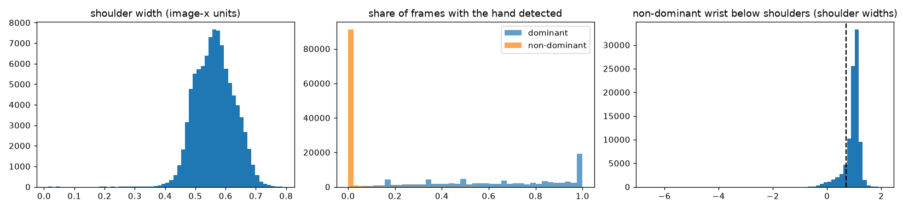
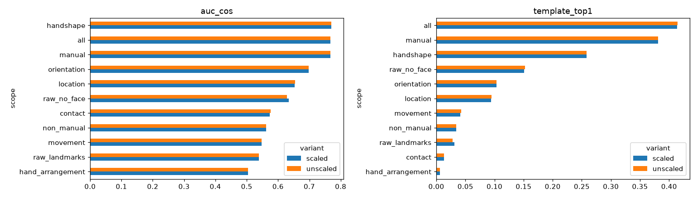
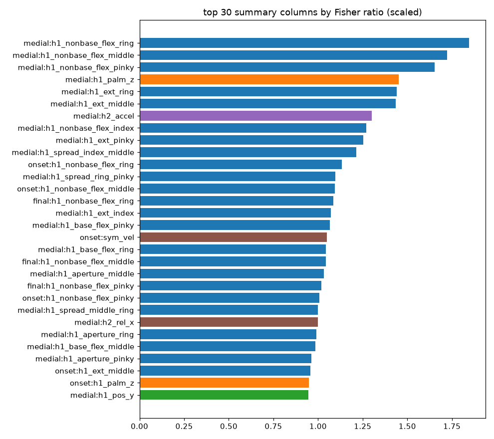
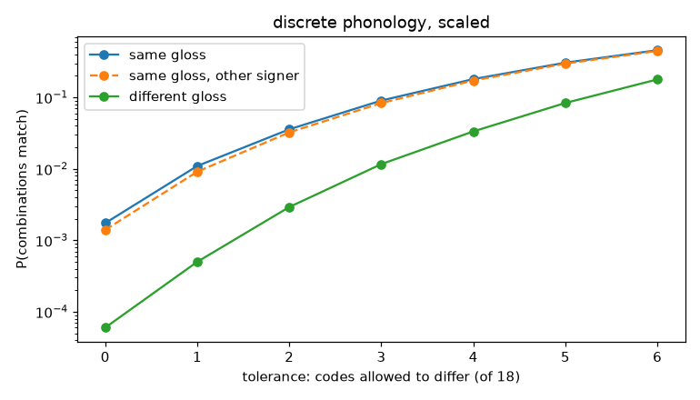

# ASL phonology from landmarks: a phonological feature system, and how consistent it is within and between signs

**Question (user, 2026-09-26, TODO §3.10):** research the phonological features of ASL; turn each
`(T, 543, 3)` GISLR clip into phonological features only (all 543 landmarks in, no subset); normalize
coordinates to a fixed point, once with and once without shoulder-width scaling; and measure how alike
the phonology of clips of the same gloss is, with tolerance, and how different it is across glosses. The
aim behind it: fewer input parameters and more accuracy. **No model is trained**: every number below is
a statistic, a distance, or a nearest-template match.

Code: `sb.recognize.phonology` (features, codes), `sb.recognize.phonology_stats` (statistics).
Notebook: `experiments/recognition/gislr.0.dataset.phonology-features.ipynb`. Every table below is
regenerated there into `data/cache/gislr/phonology_features/results/`.

**Answer in brief** (all 94,477 GISLR clips; templates and neighbours from `train.csv`, scored on the
canonical 18,896-clip `test.csv`; chance 0.4%):

- **Fewer parameters, more accuracy, confirmed without training.** 130 phonological numbers per frame
  (520 per clip) reach **41.4% nearest-template top-1 and 54.3% 1-nearest-neighbour**. The raw 543
  landmarks, with 12.5× more numbers, reach 3.1% and 13.0%. Raw hands + pose without the face (892 per
  clip) reach 15.1% and 22.2%. This beats the earlier training-free best (38.8%, `sign-patterns.md` §7).
- **Handshape carries the sign.** Alone (200 numbers) it reaches 25.8% / 39.8%, and every top-ranked
  feature is the dominant hand's finger flexion in the middle of the sign. Then orientation, then
  location. Movement, two-handedness and non-manuals add almost nothing as measured here.
- **Scaling by shoulder width makes no difference on GISLR** (every metric within 0.6 points): shoulder
  width varies only ±11% across its clips. Keep it anyway, for live cameras (§5).
- **Within a gloss, the phonology is similar but loose, and signers are the main source of variation.**
  Same-gloss clips are closer than different-gloss clips (AUC 0.77), but two clips of one gloss by
  *different* signers are less than half as similar as by the same signer (cosine 0.195 vs 0.435).
- **With tolerance, the combinations work.** On 9 informative discrete codes, 5.4% of same-gloss pairs
  match exactly (0.3% of different-gloss pairs, 18×), 18.5% within one differing code (2.2%), 38% within
  two (9%).
- **Two-handedness is almost invisible in GISLR.** Both hands are detected together in 0.27% of frames
  (the same in Google's original parquet), and the non-dominant arm is raised in 13% of clips, as often
  for two-handed signs as for one-handed ones.

## 1. Research: the phonological features of ASL

### 1.1 Where the parameters come from

Phonology is the level of a language where meaningless units combine into words. For sign languages
the units are visual, and a small set of them recurs across the whole lexicon:

- **Stokoe (1960), Stokoe, Casterline & Croneberg (1965)** showed ASL signs are built from three
  simultaneous aspects: *tab* (location), *dez* (handshape) and *sig* (movement). Signs that differ in
  one aspect only form minimal pairs, as spoken words do. A classic set (Klima & Bellugi 1979): SUMMER,
  UGLY and DRY share handshape and movement and differ only in location (forehead, nose, chin). In ASL-LEX
  2.0, MOM and DAD differ only in minor location (chin vs forehead).
- **Battison (1974, 1978)** added **orientation** of the palm as a fourth parameter, and constrained
  two-handed signs: the *Symmetry Condition* (if both hands move, they share handshape, location and
  movement type, symmetrically or alternating) and the *Dominance Condition* (if the hands differ in
  handshape, the non-dominant hand stays still and uses one of a few unmarked handshapes). Together
  these give the **sign types**: one-handed; two-handed symmetrical or alternating; asymmetrical, with
  the same or a different handshape.
- **Non-manual markers**: the face and head carry lexical and grammatical information: raised brows for
  yes/no questions, furrowed brows for wh-questions, headshake for negation, mouth morphemes and mouthing
  (Baker & Padden 1978; Liddell 1980). They are often counted as a fifth parameter.
- **Liddell & Johnson (1989)** made the sign sequential: a sign is a string of **Holds** and
  **Movements**, each segment carrying a bundle of articulatory features (hand configuration, point of
  contact, facing, orientation, non-manuals). It also names the movement *between* signs, from rest
  and between adjacent signs (epenthesis), which is not part of any sign.
- **Sandler (1989)** (Hand-Tier: location-movement-location with an autosegmental hand configuration) and
  **Brentari (1998)** (the Prosodic Model) organize the features hierarchically. Brentari splits them into
  - **inherent features**, constant through the sign: the *articulator* (handshape = **selected
    fingers** + **joint configuration**: flexion of the base and non-base joints, aperture, spread,
    thumb), the **place of articulation** (major body region + setting within it), and **orientation**;
  - **prosodic features**, the movements: **path movement** (straight, arc, circle; direction), **local
    movements** (aperture change, orientation change / wrist rotation, handshape change, finger
    wiggling), and **repetition**.
  Selected vs unselected fingers go back to Mandel (1981).
- **ASL-LEX 2.0** (Caselli et al. 2017; Sehyr et al. 2021) codes 2,723 signs for a practical subset:
  handshape, selected fingers, flexion, flexion change, spread, spread change, thumb position, thumb
  contact, sign type, path movement shape, repeated movement, major location, minor location, second
  minor location, contact, non-dominant handshape and ulnar rotation (read from its `signdata.csv`; up to
  6 morphemes per sign). It does not code orientation directly or non-manuals.

### 1.2 The full inventory, and what this system measures for each

| parameter | phonological features (literature) | measured here per frame (130 total) | clip code |
|---|---|---|---|
| **Handshape** | selected fingers; base (MCP) and non-base (PIP/DIP) flexion; spread; aperture; thumb position and contact; finger crossing/stacking | per hand (×2): extension ratio ×5, base flexion ×5, non-base flexion ×5, spread ×4, thumb-to-fingertip aperture ×4, thumb position ×2 = 25 | selected fingers, flexion, spread, thumb, thumb contact |
| **Orientation** | palm facing; finger direction; (Liddell & Johnson's "facing") | per hand: palm normal ×3, wrist → middle-knuckle direction ×3 | palm direction, finger direction |
| **Location** | major region (head, torso, arm, non-dominant hand, neutral space) and setting within it (forehead, eye, cheek/nose, mouth, chin, …) | per hand: palm centre x/y; distance to forehead, eyes, nose, mouth, chin, cheek, ear (closest hand point) and to both shoulders, torso, other hand (palm centre); dominant pose wrist x/y and elbow angle | major location, minor location |
| **Contact** | contact with the body or the other hand, and where | per hand: closest hand point to any of the 468 face points; hand-to-hand closest point | contact |
| **Movement** | path shape and direction; local movement (aperture, handshape, orientation change); repetition; manner (speed, size) | per hand: velocity x/y, speed, acceleration, aperture change, flexion change, palm rotation; dominant pose-wrist speed | movement shape, path direction, repeated, handshape change, orientation change |
| **Hand arrangement** | one- vs two-handed; symmetry / alternation; same vs different handshape; the non-dominant hand as a place | both hands present, hand-to-hand contact, non-dominant hand relative position, velocity symmetry (+1 symmetric, −1 alternating), handshape similarity; non-dominant pose wrist x/y, speed, elbow | sign type |
| **Non-manual** | brows, eyes (squint, gaze), mouth (morphemes, mouthing), cheeks, tongue, head (nod, shake, tilt), shoulders/torso | brow raise ×2, eye openness ×2, mouth opening and width, head yaw, pitch, roll, shoulder tilt | brows, mouth (vs the signer's own baseline) |

**Not measurable from GISLR's landmarks** (named so the gaps are explicit):
- *finger crossing and stacking* (ASL-LEX "Crossed", "Stacked") would need finger-to-finger occlusion
  order;
- *eye gaze* needs iris landmarks, which the 468-point mesh has not got;
- *tongue and cheek puffing* have no landmarks;
- *true contact* needs depth: a hand in front of the face looks like a hand on it in 2-D, and MediaPipe's
  z for pose, hands and face are measured from different origins;
- *torso vs neutral space* is the same problem: a hand at the chest and a hand in front of it project
  to the same 2-D point.

## 2. The system: `(T, 543, 3)` → phonological features

**Input**: all 543 MediaPipe Holistic landmarks per frame; nothing selected in advance.

**Normalization.**
1. **Anchor**: every coordinate minus that frame's mid-shoulder point (the centre of the signing space).
2. **Dominance**: the dominant hand is the one detected in more frames (44% of clips are left-dominant or
   tied). x is negated for right-dominant clips, so **+x always points to the dominant side**; a
   left-handed and a right-handed signer then produce the same numbers.
3. **Scale** (the experiment's variable): lengths and velocities divided by the clip's median shoulder
   width, or left in image-width units. Handshape, orientation and non-manual features are angles and
   ratios inside the hand or face, so scaling never changes them: it touches 45 of the 130 features.

**Choices forced by the data** (all checked on GISLR clips before building):
- MediaPipe's left/right labels were verified against geometry: GISLR's `right_hand` rows sit at pose
  landmark 16 (the right wrist), and face-mesh 33/105/234 are the signer's right eye, brow and face edge.
- Hand geometry (handshape, orientation) uses the hand's own xyz: its z is relative to the wrist, on the
  x scale. Location, contact and movement use xy only.
- Face locations are measured from the **closest hand point**, not the palm centre: place of articulation
  is where the hand contacts. With the palm centre, DAD (thumb at the forehead) read as "cheek"; with the
  closest point it reads "forehead".
- Movement codes use the **sign nucleus**, the middle 60% of the dominant hand's detected span. Every
  GISLR clip includes the hand rising from rest and dropping back, which otherwise dominates the path.
- The non-dominant hand and the sign type are read from the **pose arms** (see §3: GISLR's hand
  landmarks almost never show both hands).

**Per clip**: the mean of each third of the clip (onset / medial / final, after the hold-movement-hold
model) and the std over the clip: 4 × 130 = 520 numbers. And 18 discrete codes: 16 from the dominant hand
(thresholds fixed in advance, in shoulder widths, and not tuned to the results), plus brows and mouth
relative to the signer's own median.

**Baselines**: the same anchor, mirror, scale and summary on the raw coordinates: all 543 landmarks
(4 × 1,629 = 6,516 numbers), and without the 468-point face mesh (hands + pose, 4 × 225 = 900).

## 3. What the landmarks contain (extraction quality)

| | |
|---|---|
| clips / frames per clip | 94,477; median 22 frames, 95th percentile 135 |
| left-dominant clips | 42.4% (mirrored, so they read like right-dominant ones) |
| dominant hand detected | 65% of frames; missing from the whole medial third in 17% of clips |
| non-dominant hand detected | **0.5% of frames** |
| both hands in the same frame | **0.27% of frames**; any such frame in only 2.5% of clips |
| non-dominant arm raised (pose wrist < 0.7 shoulder widths below the shoulders) | 13% of clips |
| shoulder width (image-x units) | median 0.563, 5th–95th percentile 0.468–0.669, **CV 0.11** |

Two consequences:
- **Two-handed phonology is barely present in the data.** The 0.27% was checked against Google's
  original `asl-signs` parquet for a BOOK clip: identical presence pattern and coordinates, so this is
  how GISLR was extracted, not our npz conversion. For signs that ASL-LEX codes as two-handed, both
  wrists are raised in only 11–14% of clips, no more than for one-handed signs (15%). The likely cause
  is recording on a handheld phone, but that is not verifiable here.
- **Scale barely varies**: the camera framing is uniform across GISLR, so the scaling test has little to
  correct.

## 4. Results

### 4.1 Same gloss vs different gloss, per parameter, against raw landmarks

Scaled variant (the unscaled one is within 0.6 points on every number; §4.5). Pairs are train clips:
50,000 same-gloss, 50,000 different-gloss, and 50,000 same-gloss by different signers. AUC = probability
that a same-gloss pair is more similar (cosine) than a different-gloss pair.

| scope | numbers per clip | PCA dims for 95% | AUC | AUC, other signer | template top-1 | template top-5 | 1-NN top-1 |
|---|---|---|---|---|---|---|---|
| handshape | 200 | 50 | **0.770** | 0.763 | 25.8% | 49.3% | 39.8% |
| orientation | 48 | 20 | 0.698 | 0.689 | 10.3% | 28.4% | 15.8% |
| location | 116 | 22 | 0.654 | 0.644 | 9.4% | 24.2% | 20.0% |
| contact | 8 | 4 | 0.573 | 0.565 | 1.3% | 5.9% | 0.9% |
| movement | 60 | 27 | 0.548 | 0.543 | 4.1% | 12.2% | 5.7% |
| hand arrangement | 40 | 12 | 0.504 | 0.497 | 0.6% | 2.9% | 0.6% |
| non-manual | 40 | 21 | 0.562 | 0.544 | 3.4% | 12.3% | 11.2% |
| **manual** (all but non-manual) | 480 | 126 | 0.767 | 0.758 | 38.1% | 60.6% | 50.3% |
| **all phonology** | **520** | 146 | **0.768** | **0.757** | **41.4%** | **63.4%** | **54.3%** |
| raw landmarks, all 543 | 6,508 | 33 | 0.540 | 0.525 | 3.1% | 10.8% | 13.0% |
| raw landmarks, no face (hands + pose) | 892 | 71 | 0.634 | 0.625 | 15.1% | 34.3% | 22.2% |

- **The raw 543 landmarks are dominated by the face**: 86% of their columns. 95% of their variance sits in
  33 directions, and they identify the *signer*, not the sign: same-gloss pairs by the same signer have
  cosine 0.547, by different signers 0.032. Dropping the face raises raw template accuracy 3.1% → 15.1%.
  The phonology then adds another 2.7× on top (41.4%), with fewer numbers than raw hands + pose.
- **Non-manual features behave like the raw face**: cosine 0.542 for the same signer, 0.048 across
  signers. They describe the signer's face more than the sign, which is why they add only +3.3 points
  (manual 38.1% → all 41.4%).
- **Cohen's d** of same- vs different-gloss cosine: handshape 1.06, all 1.05, orientation 0.74, location
  0.57, movement 0.17, hand arrangement 0.01, raw 0.15, raw without face 0.50.
- **Separable glosses** (held-out clips closer on average to their own train centroid than to any
  other): 100% for all phonology and manual, 99% handshape, 90% orientation, 81% location, 97% raw
  without face, 67% raw. The mean margin is small (0.086 cosine), which is why single-clip accuracy is
  41% even though every gloss is separable on average.
- **Silhouette** is negative everywhere (all phonology −0.06, raw −0.21): with 250 classes and strong
  signer variation, a clip is on average closer to some other gloss's clips than to its own.

### 4.2 Tolerance, continuous: how many features agree within τ standard deviations

| scope | same gloss, τ = 0.25 / 0.5 / 1 | different gloss, τ = 0.25 / 0.5 / 1 |
|---|---|---|
| handshape | 61.9% / 71.6% / 85.2% | 57.8% / 66.0% / 79.3% |
| all phonology | 58.1% / 68.1% / 82.2% | 55.5% / 64.5% / 78.3% |
| movement | 63.0% / 73.6% / 86.1% | 62.2% / 72.8% / 85.5% |
| raw landmarks | 21.0% / 36.2% / 59.5% | 20.1% / 34.8% / 58.0% |

With a tolerance of half a standard deviation, two clips of the same gloss agree on 68% of the
phonological features, but two different glosses still agree on 64%. **Most features are shared across
most signs.** A sign is identified by a few features that differ, mostly handshape, not by agreeing on
all of them. That is why a tolerance per feature separates poorly while the combination (§4.1, §4.4)
separates well.

### 4.3 Which features carry the sign (Fisher ratio, η²)

Median over each parameter's summary columns, scaled (unscaled is within 0.005):

| parameter | median Fisher | median η² |
|---|---|---|
| handshape | 0.309 | 0.236 |
| orientation | 0.254 | 0.202 |
| location | 0.235 | 0.190 |
| contact | 0.190 | 0.160 |
| hand arrangement | 0.111 | 0.096 |
| movement | 0.104 | 0.094 |
| non-manual | 0.055 | 0.052 |
| raw landmarks | 0.055 | 0.052 |

The strongest single columns are all the dominant hand in the **medial** third: non-base flexion of the
ring (Fisher 1.85, η² 0.65), middle (1.72) and pinky (1.65) fingers, palm direction z (1.45), ring and
middle extension (1.44), index non-base flexion (1.27), index–middle spread (1.22). By time block, the
median Fisher is 0.48 for the medial third, 0.22 onset, 0.21 final and 0.10 for the std. That is the
hold-movement-hold picture: the sign's identity is in its middle.

Caveat: `h2_accel` and `sym_vel` score Fisher > 1 in some blocks, but they are 99% missing (they need
the non-dominant hand), so those values rest on a few hundred clips and mean nothing.

### 4.4 Discrete phonological combinations, with tolerance

**Per code** (scaled; modal share = how often a gloss's clips agree on its most common value):

| code | within-gloss modal share | chance | NMI with the gloss |
|---|---|---|---|
| selected fingers | 0.671 | 0.416 | **0.201** |
| palm direction | 0.633 | 0.329 | 0.143 |
| flexion | 0.680 | 0.376 | 0.136 |
| spread | 0.755 | 0.459 | 0.126 |
| minor location | 0.567 | 0.407 | 0.122 |
| finger direction | 0.717 | 0.631 | 0.068 |
| contact | 0.775 | 0.666 | 0.059 |
| thumb contact | 0.765 | 0.669 | 0.048 |
| major location | 0.730 | 0.593 | 0.047 |
| thumb | 0.726 | 0.634 | 0.038 |
| path direction, orientation change, handshape change, mouth, movement, brows, repeated | = chance | | 0.004–0.022 |
| sign type | 0.874 | 0.874 | 0.002 |

Nine codes carry the sign; the movement, repetition, two-handedness and non-manual codes are no more
consistent within a gloss than across all clips.

**Tolerant matching**: the probability that two clips' combinations agree with at most m codes
different, for all 18 codes and for the 9 informative ones (NMI ≥ 0.04, chosen on train clips):

| m | 18 codes: same / different gloss | 9 codes: same / different gloss | 9 codes, same gloss, other signer |
|---|---|---|---|
| 0 | 0.17% / 0.01% | **5.4% / 0.30% (18×)** | 4.9% |
| 1 | 1.1% / 0.05% | 18.5% / 2.2% (8.5×) | 17.6% |
| 2 | 3.6% / 0.29% | 38.3% / 8.8% (4.4×) | 37.4% |
| 3 | 9.0% / 1.2% | 60.7% / 24.2% (2.5×) | 59.3% |
| 4 | 18.0% / 3.3% | 79.8% / 49.5% | 78.7% |

- **Signatures** (each gloss's modal combination of all 18 codes): only 1.1% of a gloss's clips match it
  exactly, 5.4% within 1 code, 14.2% within 2, 27.8% within 3. 63,929 distinct 18-code combinations
  occur among 94,477 clips; the noise codes make almost every clip unique.
- **Uniqueness of the signatures** (18 codes): 72% of glosses have one no other gloss shares exactly;
  32% within 1 code; 5% within 2. Phonologically close glosses are the norm.
- **Classifying by signature alone** (train signatures → test clips, fewest differing codes, ties
  split): **11.1% top-1** with 18 codes; 9.5% with the 9 informative codes, which tie more often (4.9
  glosses per clip vs 2.8) but contain the right gloss more often (27.8% vs 21.4%). 28× chance, far below
  the continuous features' 41.4%: discretizing loses most of the information.

### 4.5 Scaled vs unscaled

| scope | template top-1, unscaled / scaled | 1-NN, unscaled / scaled | AUC, unscaled / scaled |
|---|---|---|---|
| all phonology | 41.4% / 41.4% | 54.1% / 54.3% | 0.768 / 0.768 |
| location | 9.5% / 9.4% | 20.4% / 20.0% | 0.655 / 0.654 |
| raw landmarks, no face | 15.2% / 15.1% | 22.1% / 22.2% | 0.629 / 0.634 |
| raw landmarks | 2.8% / 3.1% | 12.7% / 13.0% | 0.538 / 0.540 |

The code tables, the ASL-LEX agreement and the per-signer accuracy also move by less than a point.
Scaling touches only 45 of the 130 features, and GISLR's shoulder width varies ±11%. So **on GISLR,
scaling is neither needed nor harmful**. It still matters for deployment: in the live-camera probes
(`live-streaming-gap.md`), a 0.7× scale change alone raised the sentence error rate from 0.293 to 0.375,
and a per-session reframe recovered it. Scale normalization is cheap insurance for cameras that frame
people differently from GISLR.

### 4.6 Validity against the lexicon (ASL-LEX 2.0)

Our codes against the gloss's ASL-LEX code (a clip counts where the gloss maps and ASL-LEX's variants
agree). Balanced agreement = mean per lexicon value, so a code that always says the common value scores
chance (1/K):

| ASL-LEX parameter | clips | balanced agreement | chance | gloss-level (modal code) | always-majority |
|---|---|---|---|---|---|
| selected fingers | 77,735 | **0.510** | 0.143 | 0.740 | 0.481 |
| major location (head / hand / body+neutral) | 80,930 | 0.462 | 0.333 | 0.751 | 0.531 |
| ulnar rotation (orientation change) | 82,775 | 0.590 | 0.500 | 0.881 | 0.863 |
| flexion | 72,619 | 0.333 | 0.250 | 0.370 | 0.531 |
| minor location (head signs) | 28,650 | 0.259 | 0.200 | 0.431 | 0.254 |
| contact | 81,280 | 0.560 | 0.500 | 0.619 | 0.567 |
| thumb position | 83,123 | 0.562 | 0.500 | 0.654 | 0.687 |
| flexion change | 78,595 | 0.556 | 0.500 | 0.766 | 0.742 |
| repeated movement | 83,530 | 0.532 | 0.500 | 0.496 | 0.504 |
| spread | 49,056 | 0.432 | 0.500 | 0.459 | 0.597 |
| sign type | 79,448 | 0.333 | 0.333 | 0.692 | 0.692 |
| path movement shape | 63,967 | 0.194 | 0.250 | 0.096 | 0.647 |

- **Handshape and location codes are valid**: selected fingers agree with the lexicon at 3.6× chance
  (balanced), and the gloss-level code matches 74% of glosses. Major location is well above chance.
- **Movement shape is below chance**, and repetition and sign type are at chance. Short clips (median 22
  frames), a noisy pose wrist, and the missing second hand make path shape, repetition and
  two-handedness unreadable with fixed rules. This matches the NMI ranking in §4.4.
- ASL-LEX codes the citation form; GISLR's signers do not always produce it (§3's one-arm two-handed
  signs, and `sign-patterns.md` §7's `look`/`see`, `sleepy`/`tired`), so perfect agreement is not
  reachable even with perfect codes.

### 4.7 Per signer and per gloss

**Per signer** (21 signers, test clips, all phonology): template top-1 from **16.6% to 58.8%** (mean
40.9%, SD 12.4). Raw landmarks: 0.6–8.2%. The spread between signers is as large as the gap between
feature sets. Signer variation is the main open problem, matching the cross-signer similarity drop in §4.1.

**Per gloss** (template top-1, all phonology): from **0% to 85%**, median 40.6%. 32% of glosses reach
50% or more; 3.6% are under 10%.
- **Easiest**: COW 85%, UNCLE 84%, HORSE 81%, SHHH 81%, OWL 79%, AIRPLANE 77%, STUCK 74%, DAD 74%. A
  distinctive handshape at a distinctive head location.
- **Hardest**: CEREAL 0% (nearest: SHHH), GO 3% (OUTSIDE), GARBAGE 3%, HE/SHE/IT 3%, THERE 6%, CLOSE 7%,
  GIVE 9% (nearest: GIFT, a merge pair in `label-merging.md`). Handshape changes, two hands, or pointing
  signs whose meaning is the direction.

Full tables: `results/per_signer.csv`, `results/per_gloss.csv`.

## 5. Conclusions

1. **Phonological features are a better input than raw landmarks at a fraction of the size.** 130 per
   frame instead of 1,629 (12.5× fewer), and 13× the nearest-template accuracy of the raw 543 landmarks
   (2.7× that of raw hands + pose). The raw face mesh actively hurts: it encodes who is signing.
2. **Handshape is the backbone** (the top Fisher features, 26% template accuracy alone, the most valid
   code against ASL-LEX), then orientation, then location. That ranking matches the trained model's
   permutation importance (`phonology-models.md` §3: shuffling right handshape costs 44 points).
3. **Tolerance is needed, and it has to be on the combination, not per feature.** Most features take
   similar values for most signs; signs differ in a few. A 9-code combination matched within 1–2 codes
   separates same-gloss from different-gloss pairs 4–9×.
4. **Scale normalization does not matter on GISLR** (uniform framing), but costs nothing and protects live
   use.
5. **What GISLR cannot show**: two-handedness (0.27% of frames with both hands), reliable path movement
   and repetition in 22-frame clips, true contact and torso location in 2-D, eye gaze.

## 6. Next steps (for the user to decide; none started)

- **Train on it** (the user runs it): the `StreamingGRU` on the 130 per-frame features alone (all 543 in,
  no subset), vs `gru_phono_raw` ME_134 (0.7632, 84 phonology features + raw xy). The question this
  experiment cannot answer is how much of the remaining gap a learned model closes with fewer inputs. A
  natural ablation: drop the non-manual and hand-arrangement groups (−50 features) and check whether
  accuracy holds.
- **Signer normalization**: the per-signer spread (17–59%) and the cross-signer drop are the largest
  effect measured. Candidate: standardize each feature per signer (a per-session calibration in the app).
- **Better movement codes**, if movement is wanted: DTW on the per-frame sequence (kept in the chunks,
  32 steps per clip) rather than fixed rules. `sign-patterns.md` §8 got +2.8 points from time order.

## References

- Baker, C. & Padden, C. (1978). Focusing on the nonmanual components of ASL. In Siple (ed.), *Understanding Language through Sign Language Research*.
- Battison, R. (1978). *Lexical Borrowing in American Sign Language*. Linstok Press.
- Brentari, D. (1998). *A Prosodic Model of Sign Language Phonology*. MIT Press.
- Caselli, N., Sehyr, Z., Cohen-Goldberg, A. & Emmorey, K. (2017). ASL-LEX: A lexical database of American Sign Language. *Behavior Research Methods* 49.
- Klima, E. & Bellugi, U. (1979). *The Signs of Language*. Harvard University Press.
- Liddell, S. (1980). *American Sign Language Syntax*. Mouton.
- Liddell, S. & Johnson, R. (1989). American Sign Language: The phonological base. *Sign Language Studies* 64.
- Mandel, M. (1981). *Phonotactics and Morphophonology in American Sign Language*. PhD thesis, UC Berkeley.
- Sandler, W. (1989). *Phonological Representation of the Sign*. Foris.
- Sehyr, Z., Caselli, N., Cohen-Goldberg, A. & Emmorey, K. (2021). The ASL-LEX 2.0 Project. *Journal of Deaf Studies and Deaf Education* 26.
- Stokoe, W. (1960). *Sign Language Structure*. Studies in Linguistics, Occasional Papers 8.
- Stokoe, W., Casterline, D. & Croneberg, C. (1965). *A Dictionary of American Sign Language on Linguistic Principles*.
