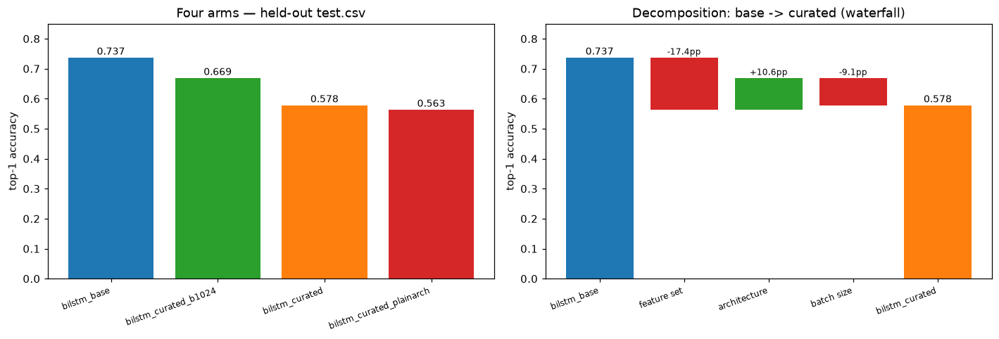

# BiLSTM: exact replica vs curated-feature variant, plus a why-it-lost ablation

**Status: complete.** Four arms trained and evaluated on the current
GISLR_Stratified canonical split (18,896-video held-out `test.csv`).

| | |
|---|---|
| **Question** | Is there a current-split BiLSTM number at all (every historical registry entry predates the 2026-09-16 split reset)? Does the interp-track's engineered feature set help a bidirectional model the way it helped the causal LSTM? |
| **Instrument** | `experiments/recognition/gislr.1.models.bilstm-curated.ipynb` (TODO §3.6) |
| **Data** | GISLR_Stratified, ME-126 subset, xy coordinates; `base_v1` (252-dim raw) vs `landmark_curated_v1` (922-dim: position/velocity/accel/speed + 28 joint angles + 12 relational distances) |
| **Arms** | `bilstm_base`, `bilstm_curated`, `bilstm_curated_plainarch`, `bilstm_curated_b1024` — see §1 |

---

## 1. Method

Four bidirectional-LSTM arms, same fwd-last/bwd-first readout, same training
regime (`experiments/recognition/configs/gislr.bilstm-curated.json`'s
`shared` block — copied verbatim from `gislr.training.json`), single final
fit (small internal-val carve-out for early stopping, no k-fold, matching
`curated-features.ipynb`'s convention), held-out `test.csv` eval.

| arm | model class | features | batch size |
|---|---|---|---|
| `bilstm_base` | `sb.recognize.architectures.BiLSTM` (unmodified) | `base_v1`, ME-126/xy, 252-dim | 1024 |
| `bilstm_curated` | `sb.recognize.interp.models.LandmarkBiLSTM` (attention gate + 922→256 projection) | `landmark_curated_v1`, 922-dim | 4096 |
| `bilstm_curated_plainarch` | `BiLSTM` (unmodified, `input_size=922`) | `landmark_curated_v1`, 922-dim | 1024 |
| `bilstm_curated_b1024` | `LandmarkBiLSTM` | `landmark_curated_v1`, 922-dim | 1024 |

`bilstm_base` and `bilstm_curated` were the original pair (TODO §3.6). The
first run of `bilstm_curated` **collapsed** (train loss pinned at
`ln(250)=5.52`, val acc stuck at chance 0.42%) — a `batch_size=4096, lr`
override 4x'd both together, and Adam-family optimizers don't tolerate linear
LR scaling without a warmup. Fixed by dropping the `lr` override; re-run
trained cleanly but still lost to `bilstm_base` by ~16pp, with two
confounded variables (architecture, batch size) not distinguishable from
that result alone. `bilstm_curated_plainarch` and `bilstm_curated_b1024`
were added specifically to isolate them — see §2.

## 2. Results

### 2.1 Headline numbers

| arm | top-1 | top-3 | top-5 | n_params |
|---|---|---|---|---|
| `bilstm_base` | **0.7371** | 0.8615 | 0.8936 | 2,751,218 |
| `bilstm_curated_b1024` | 0.6689 | 0.8167 | 0.8542 | 2,997,676 |
| `bilstm_curated` | 0.5782 | 0.7482 | 0.8044 | 2,997,676 |
| `bilstm_curated_plainarch` | 0.5634 | 0.7384 | 0.7952 | **4,124,718** |

`bilstm_curated_plainarch` has the *most* parameters of the four (no
compression before the LSTM — its input-to-hidden weight matrices scale with
the full 922-dim input) yet scores lowest. Capacity was never the
constraint.

### 2.2 Ablation decomposition

Three of the four arms share `batch_size=1024`; only `bilstm_curated` uses
`4096`. The three pairwise deltas below sum exactly to `bilstm_curated` −
`bilstm_base` (−15.90pp), verified in the notebook as a sanity check:

| effect | comparison | Δ top-1 |
|---|---|---|
| **Feature set** | `bilstm_curated_plainarch` − `bilstm_base` | **−17.37pp** |
| **Architecture** | `bilstm_curated_b1024` − `bilstm_curated_plainarch` | **+10.55pp** |
| **Batch size** | `bilstm_curated` − `bilstm_curated_b1024` | **−9.08pp** |
| sum | | −15.90pp |
| (actual gap) | `bilstm_curated` − `bilstm_base` | −15.90pp |

**The curated feature set is the dominant cause, not the architecture.**
Swapping 252-dim raw ME-126/xy for the 922-dim curated feature set — with
architecture and batch size both held fixed — costs 17.37pp on its own, more
than the entire original gap. The interp-track's attention gate + learned
projection bottleneck is not the problem: holding features and batch size
fixed, adding it **recovers +10.55pp**, over 60% of the feature-set loss —
plausibly because it learns to down-weight noisy/redundant curated
dimensions and compress 922→256 before the LSTM ever sees them, something a
plain `BiLSTM` structurally cannot do. Batch size costs a further 9.08pp,
real but secondary to the feature-set effect.

**Even the best curated configuration still loses.** `bilstm_curated_b1024`
(attention gate + projection, at `bilstm_base`'s own batch size) is the best
of the three curated arms at 0.6689 — but that is still **6.8pp below
`bilstm_base`** (0.7371). This is not a tunable-away artifact of one bad
config choice; the 922-dim engineered feature set is a worse fit for a
bidirectional LSTM than the historical 252-dim raw pipeline in every
configuration tested here.

### 2.3 A mechanistic hint for the batch-size effect

`bilstm_curated` (batch 4096) and `bilstm_curated_b1024` (batch 1024) both
trained for 96 epochs before early stopping — but batch 4096 means roughly
4x fewer optimizer steps per epoch (~1,680 total gradient updates vs
b1024's ~6,700 over the same 96 epochs). `bilstm_curated` also reaches the
**lowest training accuracy** of the three curated arms (90.0% vs b1024's
99.6%) despite training exactly as long in epoch count:

| arm | epochs | best epoch | train acc @ best | val acc @ best | train/val gap |
|---|---|---|---|---|---|
| `bilstm_base` | 59 | 54 | 0.9816 | 0.7360 | 0.2456 |
| `bilstm_curated` | 96 | 80 | 0.9003 | 0.5852 | 0.3151 |
| `bilstm_curated_plainarch` | 108 | 92 | 0.9015 | 0.5675 | 0.3340 |
| `bilstm_curated_b1024` | 96 | 85 | **0.9957** | 0.6717 | 0.3240 |

This reads as **under-training from too few gradient steps within a
fixed epoch budget**, not (only) "large batch generalizes worse" in the
abstract — `batch_size=4096` was chosen to keep the GPU fed (a
2026-09-19 utilization fix) without adjusting the epoch cap or
early-stopping patience for the resulting ~4x cut in step count. Note also
that train/val gap alone does **not** rank the arms by val accuracy —
`bilstm_curated_b1024` has the largest absolute train-fit (99.6%) of any
curated arm yet still generalizes best among them; gap size is a symptom
here, not the direct explanation. Not proven (no batch-4096 + 4x-epochs
control was run) — filed as a follow-up (§4).

### 2.4 Confusable pairs

The same ranking holds pair-by-pair: no arm reorders which pairs are hardest
(`awake`/`wake` and `mouth`/`lips` stay the worst-confused across all four),
only the absolute accuracy shifts with the overall trend from §2.1-2.2. No
additional signal beyond the aggregate top-1 story.

### 2.5 Does bidirectionality buy anything over the streaming architecture?

`bilstm_base` (0.7371) sits *below* every current-split canonical `gru` run:

| architecture | subset | coords | accuracy |
|---|---|---|---|
| gru | ME_132 | xy | 0.7517 |
| gru | ME_126 | xy | 0.7450 |
| gru | FP_118 | xy | 0.7425 |
| **bilstm_base** | ME_126 | xy | **0.7371** |

Combined with `bilstm_base`'s larger train/val gap (0.246 vs `gru`'s ~0.155
historically), this reproduces the pre-reset reading: more capacity plus
seeing the future memorizes the training set harder without generalizing
better. On this split, there is no accuracy argument for `BiLSTM` over the
streaming `gru` — only the causality-gap-pricing role it was built for
(`CLAUDE.md`: BiLSTM is an offline-only accuracy reference, never a
deployment candidate).

## 3. Comparison to the curated-feature DNN/LSTM (`curated-features.md`)

| model | features | top-1 |
|---|---|---|
| lstm (causal) | full-543, `landmark_interp_v1` | 0.7055 |
| lstm (causal) | curated, `landmark_curated_v1` | 0.6909 (**−1.46pp**) |
| dnn (memory-free) | full-543, `landmark_interp_v1` | 0.7102 |
| dnn (memory-free) | curated, `landmark_curated_v1` | 0.5776 (**−13.26pp**) |
| bilstm | base_v1 (252-dim, ME-126/xy) | 0.7371 |
| bilstm | curated (922-dim), best config (`b1024`) | 0.6689 (**−6.8pp**) |

Not a strictly apples-to-apples comparison — the causal LSTM/DNN rows above
compare curated (922-dim) against a *different, wider* baseline (full-543
`landmark_interp_v1`, 5,442-dim), while this experiment compares curated
against `base_v1`'s ME-126-only 252-dim raw pipeline. Still, the qualitative
pattern is informative: BiLSTM's best-case curated loss (−6.8pp) lands
between the causal LSTM's near-immunity (−1.46pp) and the memory-free DNN's
large loss (−13.26pp) — bidirectional recurrence gets *some* protection from
the wider, noisier feature set (unlike the DNN, which has no memory to fall
back on), but not nearly as much as the unidirectional causal LSTM gets.
Why a causal LSTM tolerates the curated features so much better than a
bidirectional one is an open question (§4).

## 4. Follow-ups

- [ ] **Batch-size mechanism**: re-run `bilstm_curated` (batch 4096) with the
  epoch cap and early-stopping patience scaled by ~4x, to test whether
  matching total gradient-step count (not just epoch count) to `b1024`
  closes most of the −9.08pp batch-size effect — or whether large-batch
  generalization cost is real independent of step count.
- [ ] **Why does bidirectional recurrence get less protection from the
  curated feature set than causal recurrence?** (§3) — the causal LSTM in
  `curated-features.ipynb` loses almost nothing moving to curated features;
  BiLSTM's best case still loses 6.8pp even after fixing architecture and
  batch size. Possibly related to the backward pass amplifying noise in the
  wider feature set, or an interaction with the attention-gate
  initialization; not investigated here.
- [ ] Register `bilstm_base`'s number as a literal registry entry if wanted
  — this notebook trains a single final fit outside the registry-writing
  driver (see its title cell); the simpler route is (re-)running
  `gislr.1.models.training.ipynb`'s existing `bilstm`/`ME_126`/`xy` config.
- [ ] The interp-track's attention-gate + projection pattern (which recovered
  +10.55pp here) might be worth trying on the causal `LandmarkRNN`/`LandmarkDNN`
  models too, if it isn't already there — check before assuming it would help
  there the same way.
