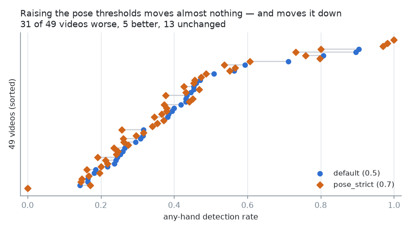
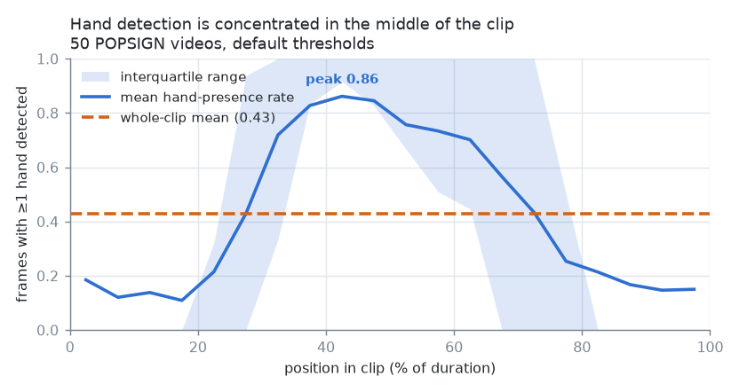
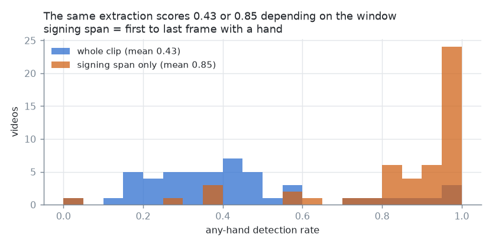

# POPSIGN landmark-extraction confidence tuning

**Status: partial — 2 of 7 configs measured.** The conclusions about *which knobs
matter* are settled; the choice of operating config is not, and the headline
finding below argues the remaining five arms matter less than a change to how
quality is measured.

| | |
|---|---|
| **Question** | Which `HolisticLandmarker` confidence thresholds produce good landmarks on POPSIGN video, before ~64K videos of CPU time is committed to bulk extraction? |
| **Instrument** | `src/popsign.0.dataset.confidence-tuning.ipynb` + `modules/scripts/tune_confidence.py` (TODO §2.3) |
| **Sample** | 50 videos = 5 classes (`alligator`, `bath`, `car`, `fireman`, `give`) × 10, seeded, recorded to `sample.json` |
| **Configs run** | `default` (50/50 videos), `pose_strict` (49/50) — the other five arms in `configs.json` are not yet extracted |
| **Ground truth** | none exists for POPSIGN — every number here is a labelled **proxy** |
| **Data** | `src/data/cache/popsign/confidence_tuning/{metrics.parquet, config_scores.csv, overlays/}` |

---

## 1. The three findings

### 1.1 The hand threshold is inert; the *pose* thresholds gate the hands

The obvious experiment — sweep `min_hand_landmarks_confidence`, since the hands
carry the sign — measures nothing. Driving each field to both extremes on one clip:

| field | 0.01 → 0.99 |
|---|---|
| `min_hand_landmarks_confidence` | **bit-identical landmarks** (inert) |
| `min_pose_{detection,landmarks}_confidence` | hand detection rate **0.52 → 0.09** |
| `min_face_{detection,landmarks}_confidence` | face lost entirely at 0.99 (91% NaN) |

Holistic derives the hand ROIs from the **pose** landmarks, so the pose thresholds
are what actually gate the hands. A grid over the hand threshold would have
produced a table of identical rows and read as *"tuning doesn't matter"* — the
right conclusion from the wrong evidence. The grid was rebuilt around the pose
thresholds (jointly and one at a time) plus a face-off arm.

Corrected against the real API while doing this: there is **no**
`min_tracking_confidence` and no separate hand *detection* threshold. The actual
field list is `extraction.CONFIDENCE_FIELDS`, and unknown keys now assert instead
of being silently dropped.

### 1.2 Within the range tested, thresholds barely move the output — and the default wins

`default` (all fields 0.5) vs `pose_strict` (pose fields 0.7), paired over the 49
videos both configs extracted:

| proxy | better is | default | pose_strict | mean Δ | videos better / worse / unchanged |
|---|---|---|---|---|---|
| any-hand rate | higher | 0.4274 | 0.4056 | **−0.0217** | 5 / 31 / 13 |
| hand rate (mean of both hands) | higher | 0.2193 | 0.2062 | −0.0131 | 5 / 32 / 12 |
| longest gap (frac of clip) | lower | 0.3133 | 0.3182 | +0.0049 | 8 / 19 / 22 |
| hand jitter | lower | 0.0311 | 0.0288 | **−0.0023** | 28 / 14 / 6 |
| bone-length CV | lower | 0.1071 | 0.1096 | +0.0025 | 13 / 13 / 23 |
| pose rate | higher | 1.0000 | 1.0000 | 0.0000 | 0 / 0 / 49 |
| face rate | higher | 0.9973 | 0.9973 | 0.0000 | 0 / 0 / 49 |

*(49 videos extracted by both configs; jitter over the 48 with a finite value in both.
One clip, `4a.8902-car-…`, is missing from the `pose_strict` arm.)*

Raising the pose thresholds costs about two points of hand detection and buys a
marginally steadier hand (jitter −0.002) — consistent with the mechanism in §1.1
(a stricter pose gate suppresses marginal detections rather than improving them).
The composite `quality_score` ranks `default` first (0.160 vs −0.163), but with
only two configs in the table that score is close to meaningless in magnitude:
`score` z-scores across the sweep, so two arms are ±1 by construction. **Treat the
ranking as directional, not as an effect size.**

`pose_rate` was **1.0 in both arms**, as it was at `min_pose_* = 0.99` during the
one-clip probe. The pose block appears to be emitted whenever any pose is found at
all, so that proxy cannot discriminate pose quality and is currently contributing
a constant to the composite score.

### 1.3 The headline: the proxies are mostly measuring clip padding, not extraction quality

Mean any-hand detection rate of **0.427** looks alarming — as though MediaPipe
fails on more than half of POPSIGN frames. It does not. Hand presence plotted
against normalized position in the clip:

Detection peaks at **0.86** in the middle of the clip and sits at **0.12–0.19**
across the first and last fifths. The median clip's first hand detection is at 27%
of its duration and its last at 72% — i.e. roughly **half of every clip is
lead-in/lead-out** with the signer's hands at rest, off-frame, or reaching for the
phone. Measured only between the first and last hand-bearing frame, the same
extraction scores **0.85 mean / 0.94 median**:

Three consequences, in order of importance:

1. **`any_hand_rate` and `longest_gap_frac`, computed over the whole clip, are
   dominated by clip length rather than by detector behaviour.** `longest_gap_frames`
   correlates with `n_frames` at **rho 0.84** — the "longest detection gap" proxy is
   very largely a measurement of the padding. Two configs that behave identically
   on a long clip and a short clip will be scored differently on clip length alone.
2. **The per-class differences are padding differences, not difficulty
   differences.** `give` scores worst (hand rate 0.125, longest gap 48% of the
   clip) and also has the longest padding; `car` and `fireman` score best. Nothing
   here yet supports "MediaPipe struggles on `give`".
3. **The remaining threshold arms are being scored on a noisy instrument.** The
   default-vs-strict difference is ~0.02 of any-hand rate; the padding effect is
   ~0.4. Running five more configs against the current proxies risks ranking them
   on clip-length variation within the sample.

An additional observation that the span-restricted view exposes: **only 1.1% of
frames carry both hands** (left hand 9.5% of frames, right hand 34.3%). `hand_rate`
tops out at exactly 0.50 across the whole sample, which is what "exactly one hand,
always" looks like. Several sampled signs (`car`, `bath`) are two-handed in ASL, so
this is a real deficiency and not an artifact of the window — but it is a
deficiency in **which** landmarks holistic returns, which no confidence threshold
in the grid addresses.

---

## 2. What was actually measured

### 2.1 Proxies

No ground-truth landmarks exist for POPSIGN, so each metric is chosen because a
known MediaPipe failure mode on this footage makes it worse
(`modules/dataset/landmark/quality.py`):

- **per-group detection rate** — fraction of frames with a non-NaN block; a
  too-high threshold shows up here first.
- **hand-presence rate** — the signs live in the hands; great face detection with
  absent hands is useless here.
- **longest detection gap** — 30 scattered missing frames and one 30-frame blackout
  are the same detection rate and very different data.
- **temporal jitter** — median frame-to-frame displacement (xy only; z is largely
  noise). Detector flicker pollutes exactly the velocity features TODO §7.3 wants.
- **bone-length CV** — coefficient of variation of shoulder→elbow. Real anatomy
  holds it constant, so variance reads instability with the signer's motion divided
  out.

The composite `quality_score` z-scores these across the sweep with explicit
weights (`DEFAULT_WEIGHTS`, hands ×3). The weighting is a judgement call, so it is
data rather than logic and the ranking can be re-derived without re-extracting.

### 2.2 Visual check

100 rendered overlay frames per config, weighted **80 worst / 10 median / 10 best**
by per-frame quality, in `confidence_tuning/overlays/<config>/`. The weighting is
deliberate: a bad config's best frames still look fine, so *how it fails* is the
informative part. The numeric proxies cannot see a detector that confidently tracks
the wrong region — which is why they don't get the last word.

Rendered so far for `default` only (100 frames).

### 2.3 The bug that shaped the tooling

A `Pool` started from a Jupyter kernel hung silently: the cell sat at **0% for 30
minutes with the CPU at 2%, zero worker processes alive, and no error**. The sweep
was therefore moved into **`modules/scripts/tune_confidence.py`**, with
`extraction._assert_pool_usable` refusing the in-notebook case up front and
`n_workers=1` running genuinely in-process for smoke tests. Same work: ~100 videos
in ~10 minutes as a script versus 0 files in 30 minutes in-notebook.

**Correction (2026-07-19).** The mechanism originally recorded for this — "spawn
re-imports `__main__`, which in a notebook is the kernel" — is wrong.
`multiprocessing.spawn.get_preparation_data` only sets `main_path` when
`__main__` has a `__file__`, which a kernel lacks, so the child never re-imports
main; `sys_path` is propagated and the worker functions live in an importable
module, so a `Pool` does start there (verified). The classic Jupyter+spawn failure
applies to workers defined *in the notebook*, which ours are not. The observed
hang was real but its cause is unestablished — and a **leaked MediaPipe graph is
now known to wedge a worker in exactly the same silent way** (see below), so that
may have been it all along. Running as a script remains right regardless: every
worker floods stderr with absl/glog output, and multi-hour runs should not die
with the kernel.

### 2.4 A deadlock this sweep probably also hit

The first extraction pilot (2026-07-19) stalled at 18/20 with every worker at 0%
CPU. Cause: POPSIGN **mixes resolutions** (1944×2592 and 1080×1920), and the
persistent per-worker `HolisticLandmarker` raises `RET_CHECK ... current_mat->rows
== previous_mat->rows` when the frame size changes — whereupon the retry handler
rebuilt it *without closing the old one*, leaking a native graph and ~70 threads
each time. The wedged worker reached 219 threads / 1.3 GB against 76 / 614 MB for
its siblings, then stopped returning; `imap_unordered` cannot distinguish that
from slow work, so the run hangs forever.

Fixed by closing before rebuilding, rebuilding *proactively* on a resolution
change, and `maxtasksperchild=64` as a safety net.

**This matters for the numbers above**: `pose_strict` completed **49 of 50**
videos, and this is the likeliest explanation for the one that never finished.
The missing clip is excluded from every paired comparison here, so the
conclusions stand — but the sweep should be re-run on the fixed code before the
remaining five arms are scored.

---

## 3. Recommendation

**Do not pick an operating config from the current evidence, and do not finish the
sweep as it stands.** In order:

1. **Restrict the proxies to the signing span** (first→last frame with a hand)
   before scoring anything else, or add a `*_span` variant alongside the whole-clip
   metrics. Everything in §1.2 should then be re-derived — the effect being ranked
   (~0.02) is an order of magnitude below the artifact being removed (~0.4).
2. **Drop `pose_rate` from the composite weighting**, or replace it with a
   per-landmark visibility signal. It is a constant 1.0 in every arm tested and
   currently contributes nothing but a fixed offset.
3. **Then run the remaining five arms** (`pose_permissive`, `pose_very_permissive`,
   `pose_det_only`, `pose_lm_only`, `face_off`) — ~250 extractions, ~25 min at 19
   workers. The direction in §1.2 predicts the permissive arms will win on hand
   rate; that prediction is worth testing precisely because it is cheap.
4. **Look at the `default` overlays for the two-hand deficit** before accepting any
   config. If the second hand is genuinely present in frame and simply not returned,
   that is a bigger accuracy lever than any threshold in this grid, and it belongs
   in a separate investigation rather than being tuned around.
5. **Interim operating config for bulk extraction, if it must start before the
   above: `default`** (all thresholds 0.5). It leads on hand detection in the only
   paired comparison available, and the measured spread across the two arms is small
   enough that no threshold choice in this range will make or break the extraction.

One thing this test does settle: **extraction quality is not on the critical path
it appeared to be.** Within the signing span, detection is 0.85–0.94, and the
thresholds move it by ~0.02. The padding and the two-hand deficit are the real
findings, and neither is a confidence threshold.

---

## 4. Follow-ups filed

- TODO §2.3 — span-restricted proxies, `pose_rate` removal, remaining five arms,
  two-hand investigation.
- The lead-in/lead-out structure is a **downstream** finding too: any temporal
  model consuming POPSIGN sees ~50% non-signing frames per clip. Trimming (or a
  learned attention over the span) belongs in the POPSIGN feature-building stage,
  not here.

*Report date: 2026-07-19 · sample seed 42 · `metrics.parquet` 99 rows (2 configs × ~50 videos)*
