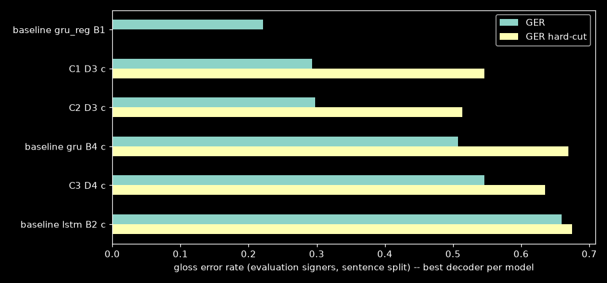
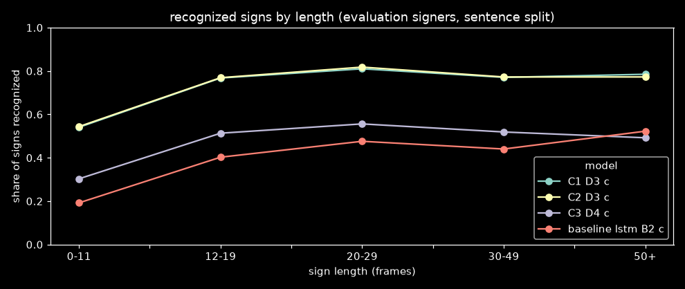

# Continuous models: frame-level recognition on GISLR-Sentences

**TODO §12.3** · notebook `experiments/recognition/gislr.3.streaming.continuous-eval.ipynb` ·
config `experiments/recognition/configs/gislr.continuous-eval.json` · run finished 2026-09-24 ·
data: GISLR-Sentences v1 (local build) · baselines: [sentence-baselines.md](sentence-baselines.md)

## Summary

- **The continuous model cuts streaming error by more than half.** C1 (a GRU trained per
  frame with a null class and a boundary head), decoded with D3, reaches **GER 0.293** on
  the 16 evaluation signers. The best §12.2 streaming baseline scores **0.507** (`gru`
  sliding window), and the reset-on-accept loop the live design specified scores
  **0.659** (`lstm` B2). That is **42% and 56% fewer errors**.
- **It is close to the oracle.** The same baselines, given the true sign boundaries (B1),
  score 0.221 (`gru_reg`) and 0.237 (`gru`). C1 D3 is 0.07 GER above the best oracle.
- **Segmentation is nearly solved; classification is what remains.** Substitutions
  (0.213) are already at the oracle's level (B1 has only substitutions: 0.221 / 0.237).
  The rest of the gap is deletions 0.064 and insertions 0.017. Before this, the baselines
  lost 0.30–0.47 of signs to deletions.
- **The simple decoder wins.** D3 ("commit when a run of non-null frames ends") beats the
  boundary-head decoder D1 (0.423) on streams with rest or transition frames between signs.
  It commits a **median of 1 frame** after the sign ends.
- **But D3 depends on those gaps.** With the gaps cut out (hard-cut), D3 rises to 0.546
  and D1 becomes the better decoder (0.486–0.491). Real signing has short or no gaps, so
  hard-cut is the pessimistic case, and the deployed decoder should combine both (§6).
- **Resetting the state hurts these models.** D1r and D2 (reset after every commit)
  insert spurious signs on transition frames: up to 5.7 per 1,000 frames. The models
  were trained on uninterrupted streams.
- **CTC (C3) is not competitive.** Its best is 0.546 (D4), with frame accuracy 0.33 vs
  C1's 0.72. **GRU ≈ LSTM** (0.293 vs 0.298), so C1, the GRU, is the deployment
  candidate.
- **Short signs are the biggest remaining loss.** Signs under 12 frames make up 25% of
  all signs, and only 54% of them are recognized, against 77–82% of longer signs.

## 1. Setup

Protocol identical to §12.2:
- decoder settings chosen by the lowest GER on **5 seeded selection signers** (`sentence`
  split);
- **every number below comes from the other 16 signers**: 5,054 `sentence` and 4,639
  `control` sequences, 15,652 reference signs;
- same scorer (`sb.recognize.sequences.metrics`).

| run | model | loss | registry | best val seg acc |
|---|---|---|---|---|
| **C1** | `gru_continuous` | per-frame (gloss + null) + boundary head | `1790143122` | 0.7233 |
| **C2** | `lstm_continuous` | per-frame + boundary head | `1790144582` | 0.7103 |
| **C3** | `gru_continuous` | CTC | `1790142624` | 0.5005 |

| decoder | rule | params |
|---|---|---|
| **D1** | commit where the boundary head rises through β; emit the gloss with the most non-null mass since the last commit | β, min_mass |
| **D1r** | D1 + reset the recurrent state after each commit | β, min_mass |
| **D2** | the user's literal loop: top gloss ≥ τ for `hold` frames → emit + reset (null excluded) | τ, hold |
| **D3** | commit at the end of each run of non-null frames (null prob < ν, ≥ `min_len` frames) | ν, min_len |
| **D4** | greedy CTC | — |

Each decoder is scored raw and with consecutive repeats collapsed (`c`).

### Checks that passed before any number was read

| check | result |
|---|---|
| `RecurrentSession.step` vs batch forward (per run) | max \|diff\| 2.1e-6 – 5.4e-6 |
| D2 vs the true live loop (`step` + `AcceptTrigger` + `reset()`) | 0/10 mismatches per run (C1: 1 float near-tie at τ, tolerated) |
| smoke run, 3 sequences per group | full pipeline, 120 rows |

The first 2026-09-24 run lost §4 to a disconnect. §4 was rewritten to save one part per
`(run, split, frames)`, and the re-run finished all 13 parts.

## 2. Headline: `sentence` split, evaluation signers

Best rows per model, plus the baselines ([full table](#appendix-full-table)):

| model | decoder | GER | correct | sub | del | ins | sentence acc | latency (med. frames) | GER control | GER hard-cut |
|---|---|---|---|---|---|---|---|---|---|---|
| baseline `gru_reg` | B1 (oracle) | **0.221** | 0.779 | 0.221 | 0 | 0 | 0.489 | 0 | 0.220 | — |
| **C1** | **D3 c** | **0.293** | 0.723 | 0.213 | 0.064 | 0.017 | 0.377 | +1 | 0.289 | 0.546 |
| C2 | D3 c | 0.298 | 0.724 | 0.223 | 0.053 | 0.022 | 0.384 | +1 | 0.295 | 0.513 |
| C1 | D1 c | 0.423 | 0.610 | 0.168 | 0.222 | 0.033 | 0.224 | −3 | 0.422 | 0.491 |
| C1 | D2 c | 0.461 | 0.606 | 0.105 | 0.289 | 0.067 | 0.192 | −13 | 0.459 | 0.508 |
| baseline `gru` | B4 c (window) | 0.507 | 0.557 | 0.140 | 0.303 | 0.064 | 0.156 | −6 | 0.515 | 0.669 |
| C3 | D4 c | 0.546 | 0.466 | 0.300 | 0.233 | 0.013 | 0.120 | −5 | 0.541 | 0.635 |
| C1 | D1r c | 0.566 | 0.657 | 0.276 | 0.067 | 0.223 | 0.174 | −4 | 0.580 | 0.598 |
| baseline `lstm` | B2 c (reset-on-accept) | 0.659 | 0.393 | 0.143 | 0.464 | 0.052 | 0.110 | −5 | 0.653 | 0.675 |

Latency is the commit frame minus the true sign's last frame. Negative means the decoder
commits before the sign ends.

**Selected settings** (on the selection signers): C1 D3 c: ν=0.7, min_len 4 · C2 D3 c:
ν=0.7, min_len 4 · C1 D1 c: β=0.8, min_mass 8 · C1 D2 c: τ=0.6, hold 5. The §3b grid
extension tested ν up to 0.9 and β up to 0.9; none of the chosen settings is at a grid
edge except D1 raw (β=0.9, min_mass 16), which is far behind D3 anyway.

**Selection signers are harder.** On the 5 selection signers C1 D3 c scored 0.413 and the
`gru` B4 baseline 0.595. Both are ~0.1 worse than on the evaluation signers, and the
relative gain is similar (−31% vs −42%).

## 3. Where the remaining errors are

Per-frame diagnostics, no decoder (evaluation signers, `sentence` split):

| run | frame acc | isolated read-out | in-context vote | boundary P | boundary R | boundary F1 |
|---|---|---|---|---|---|---|
| C1 | 0.723 | 0.746 | **0.750** | 0.330 | 0.640 | 0.435 |
| C2 | 0.712 | 0.743 | 0.741 | 0.318 | 0.646 | 0.426 |
| C3 | 0.329 | 0.366 | 0.527 | 0.194 | 0.372 | 0.255 |

- **Given perfect boundaries, C1 labels 75% of signs correctly.** That is the ceiling for
  any decoder on this model, and it matches the isolated classifiers' ~76%. D3 c's
  "correct" is 0.723, within 3 points of it.
- **Context doesn't help classification.** In-context vote (0.750) ≈ isolated read-out
  (0.746), and sentence ≈ control GER everywhere. The recognizer has no language prior;
  that is §12.6's job.
- **The boundary head fires too often.** Boundary precision is 0.33 at recall 0.64 (±3
  frames). That's why D1 needs β=0.8 and min_mass 8 to avoid splitting signs, and why it
  then loses signs (del 0.222).

**By sign length** (share of reference signs recognized, evaluation signers):

| length (frames) | share of signs | C1 D3 c | C2 D3 c | C3 D4 c | baseline `lstm` B2 c |
|---|---|---|---|---|---|
| 0–11 | 25% | **0.541** | 0.544 | 0.303 | 0.192 |
| 12–19 | 22% | 0.768 | 0.769 | 0.513 | 0.403 |
| 20–29 | 20% | 0.810 | 0.818 | 0.556 | 0.476 |
| 30–49 | 15% | 0.771 | 0.772 | 0.519 | 0.440 |
| 50+ | 19% | 0.785 | 0.773 | 0.492 | 0.522 |

§12.2 found that short and long signs needed opposite hold values. D3 has no hold, and
it removes that conflict for signs of 12 frames and longer (77–82%). Signs under 12
frames are still recognized at only 54%, probably because so few frames carry too
little motion for the classifier. They are a quarter of all signs, so this is the
largest single bucket of remaining error.

## 4. Hard-cut: the decoder choice flips

Hard-cut drops the rest and transition frames between signs, so each sign runs straight
into the next.

| model | decoder | GER (with gaps) | GER (hard-cut) |
|---|---|---|---|
| C1 | D3 c | **0.293** | 0.546 |
| C2 | D3 c | 0.298 | 0.513 |
| C1 | D1 c | 0.423 | 0.491 |
| C2 | D1 c | 0.428 | **0.486** |
| C1 | D2 c | 0.461 | 0.508 |
| baseline `gru` | B4 c | 0.507 | 0.669 |

D3 cannot split two signs that have no null frame between them, so under hard-cut it
merges them (deletions). D1 uses the boundary head and loses only 0.06 GER. Every
continuous decoder still beats the best baseline under hard-cut (0.486 vs 0.669).

Which case is realistic? Fluent signers move straight from one sign to the next, with
coarticulation and no rest, so real signing is **between the two, probably closer to
hard-cut**. The v1 transitions are linear interpolations, and the rest is synthetic. The
0.293 is therefore an optimistic number for fluent signing and a fair one for
deliberate, paused signing (a learner, or someone signing to a camera).

## 5. What didn't work

- **Reset-on-commit (D1r, D2).** Resetting the recurrent state after each commit made C1
  and C2 worse (D1r c 0.566; D2 c 0.461 vs D3 c 0.293). Insertions on transition frames
  go up 5–30× (D1r: 3.4–5.7 per 1,000 transition frames; D3: 0.6–1.2). A freshly reset
  model sees the tail of a transition as the start of a sign. These models were trained
  on uninterrupted streams, so they should run **without** resets; the user's "reset for
  the next sign" is implicit in the null class.
- **D2's early commits.** Median latency −13 frames: the literal loop commits halfway
  through a sign and then misses the rest (del 0.289).
- **CTC (C3).** Frame accuracy 0.33 and a best GER of 0.546. CTC places peaks rather than
  labelling frames, so the per-frame decoders don't suit it, and its own D4 is still
  worse than C1 on every metric. D4 on C1/C2 is meaningless (GER 2.6–2.9: per-frame
  argmax flickers).
- **LSTM over GRU.** No gain (C2 0.298 vs C1 0.293), and a larger state. **GRU it is.**

## 6. Recommendations

1. **Deploy C1 with D3 c as the default decoder** (ν=0.7, min_len 4, repeats collapsed).
   It is the best result, and it is also the simplest decoder to port: one threshold, one
   run-length count, a weighted vote, about 20 lines of TypeScript.
2. **Add a combined decoder, D5 = D3 ∪ D1:** commit at the end of a non-null run **or**
   where the boundary head crosses a high β inside a run. This targets hard-cut without
   giving up D3's result on paused signing. It costs no retraining: sweep it on the cached
   forward outputs, in the same notebook.
3. **Short signs are the next lever for accuracy.** A quarter of signs are under 12 frames
   and 46% of those are missed. This ties into §7 (normalization, augmentation).
4. **Classification is the ceiling.** Substitutions are at oracle level, so a better
   isolated classifier (§7, §4.1) moves GER almost one-for-one. §12.6's language prior is
   the other lever, since the recognizer ignores context entirely (sentence ≈ control).
5. **Test on real continuous signing before trusting any of these numbers for the
   product.** Every stream here is composed from isolated clips. The first live
   browser demo (§12.5) is the real test.

## Follow-ups (2026-09-24)

- **D3 as a live loop:** `sb.recognize.continuous.online.OnlineDecoder` runs D3 one frame at
  a time (with optional prior and accept rule) and matches the batch decoder exactly.
  Stepped over the **browser TFLite export**, it reproduces the offline PyTorch path on
  300 held-out streams (293 identical, 7 float near-ties, 0 unexplained).
- **Recommendation 4's language prior, first numbers:** a held-out trigram fused as
  `q·p^0.3` lowers selection GER from 0.413 to 0.401, all of it in substitutions. A prior
  that must *agree* before accepting trades substitutions for deletions and loses on GER.
  `sign-to-speech-downstream.md` §2.

## Caveats

- **Synthetic streams.** GISLR-Sentences v1 joins isolated test clips with interpolated
  transitions and synthesized rest. Real continuous signing is untested.
- **Selection advantage runs the other way.** `gru_reg` (the best oracle row) was
  checkpoint-selected on `test.csv`, the source of these clips. The continuous runs were
  selected on a `train.csv`-derived set. The comparison is conservative for C1.
- The rest in v1 is hands-absent; the continuous models also trained on a lowered-hands
  rest (§12.1 realism fix), which v1's test streams don't contain.

## Appendix: full table

All 120 rows (3 runs × 5 decoders × 2 collapse × 2 splits × 2 frame modes) are in
`data/cache/gislr/continuous_eval/results/final.json`. The headline slice (with-null
`sentence`, plus control and hard-cut GER per row) is
`data/cache/gislr/continuous_eval/results/final_table.csv`, and it is printed in full in the
notebook's §5 output.
