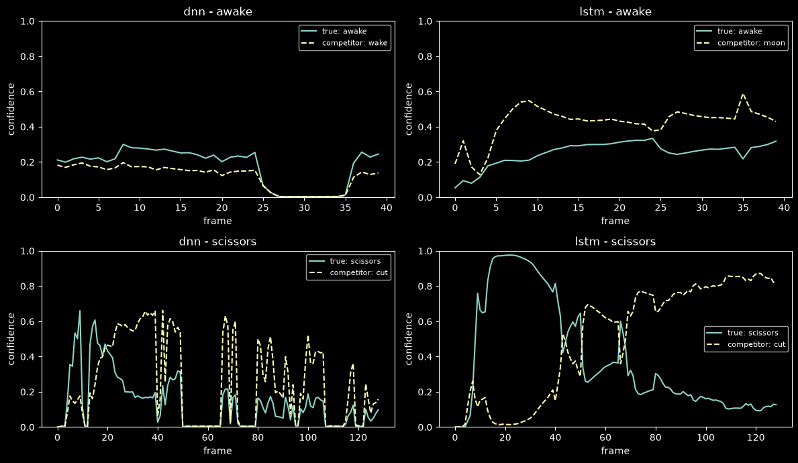

# Curated-feature DNN + LSTM (ME-126 + xy + joint angles)

**Status: run complete (2026-09-19).** Full 250-class final fit + held-out
`test.csv` evaluation, both architectures. Narrative:
[docs/logs/daily/2026-09-19.md](../logs/daily/2026-09-19.md).

| | |
|---|---|
| **Question** | Does a model actually trained on the "highest-contributing" feature recipe from this session's interpretability work (ME-126, xy-only, +28 joint angles) hold up as a real classifier, and does a top-N readout recover the documented near-synonym confusions? |
| **Instrument** | `experiments/recognition/gislr.1.models.curated-features.ipynb` (TODO §3.5), over `sb.recognize.interp.features_curated` + `sb.recognize.interp.models`/`train` |
| **Data** | GISLR_Stratified canonical split: 75,581 train videos (71,801 train / 3,780 internal-val carve-out), 18,896 held-out `test.csv` videos, 250 signs |
| **Feature pipeline** | `landmark_curated_v1` — ME-126 landmarks, xy position/velocity/acceleration/speed (7 ch × 126 = 882) + 28 joint angles + 12 relational distances = **922** features/frame (83% smaller than `landmark_interp_v1`'s 5,442) |
| **Training** | Single final fit per architecture (no k-fold), AdamW + `ReduceLROnPlateau`, 60-epoch cap, `es_patience=8` (never triggered — see §4) |
| **Data artifacts** | `data/cache/gislr/curated_feature_runs/{dnn,lstm}/{final.pt,history.json,test_predictions.npz}`, `topn_summary.csv` (all gitignored except this report) |

---

## 1. Top-N accuracy

| Architecture | Top-1 | Top-2 | Top-3 | Top-5 | Top-10 | Macro top-1 | Classes <50% |
|---|---|---|---|---|---|---|---|
| DNN (memory-free) | 57.76% | 72.53% | 79.03% | 85.08% | 90.33% | 57.40% | 88 |
| **LSTM (causal)** | **69.09%** | **79.65%** | 83.75% | 87.53% | 91.46% | 68.83% | 23 |

**LSTM beats DNN by +11.3pp at top-1**, and by a wider margin on macro
accuracy and weak-class count (23 vs 88 classes below 50%) — the causal
memory clearly earns its keep once the per-frame feature set has been cut
to 922 dimensions, more so than it did on the full 5,442-dim
`landmark_interp_v1` set (§3 below).

**Top-2 alone recovers most of what's missing**: +14.8pp for DNN, +10.6pp
for LSTM, over half the remaining gap to top-5. This is the headline the
top-N protocol was built to test — see §2.

**Not registry-comparable** (`README.md` § Models / § Canonical evaluation):
different feature pipeline (922-dim engineered vs raw ME-126-xy) and a
different architecture (`LandmarkRNN`'s attention-gate + projection head vs
the production `StreamingGRU`/`StreamingLSTM`). For scale: the canonical
ME-126-xy `StreamingGRU`/`BiLSTM` leaderboard sits at ~75.7% (`CLAUDE.md`
"Key domain facts"); this curated LSTM's 69.09% is in the same
neighborhood despite a much smaller, hand-engineered feature space and a
simpler training recipe (single fit, no augmentation).

## 2. Top-N recovers confusable pairs disproportionately

Restricting to the 31 classes in the 16 documented confusable pairs
(`docs/reports/pair-similarity.md`) vs every other class:

| Architecture | Subset | n | Top-1 | Top-2 | Top-2 gain |
|---|---|---|---|---|---|
| DNN | confusable-pair classes | 2,385 | 44.32% | 69.43% | **+25.12pp** |
| DNN | everything else | 16,511 | 59.70% | 72.98% | +13.28pp |
| LSTM | confusable-pair classes | 2,385 | 58.87% | 80.55% | **+21.68pp** |
| LSTM | everything else | 16,511 | 70.57% | 79.52% | +8.95pp |

Confusable-pair classes gain **roughly 2× the top-2 lift** of every other
class, for both architectures — direct, model-level confirmation of
`plateau-diagnosis.md` §3's finding (errors on these pairs are near-misses,
not far misses) and exactly the scenario the user's `wake`(0.9)/`awake`(0.8)
example described. The worked table below (from the notebook's confusable-pair
cell) makes it concrete per pair — e.g. LSTM's `awake` top-1 is only 60.0%,
but 20 of the 32 `awake` videos where `wake` won rank 1 are recovered at
rank 2 (of 80 `awake` test videos, `wake` wins rank 1 on 21, and 20 of those
are still correct within the top 2). `see`→`look` is the cleanest pair for
both architectures (DNN 87.2% / LSTM 85.9% top-1) — asymmetric with its
partner `look`→`see` (33.7% / 49.4%), consistent with `plateau-diagnosis.md`'s
note that several of these pairs confuse **asymmetrically**, not
symmetrically.

## 3. Curation cost the DNN far more than the LSTM

Comparing to `landmark-importance.md`'s full-543/`landmark_interp_v1` numbers
(different feature pipeline, same canonical `test.csv`, same general
architecture family — attention-gated DNN/RNN):

| Architecture | Full-543 (`landmark_interp_v1`, 5,442 dim) | Curated (`landmark_curated_v1`, 922 dim) | Δ |
|---|---|---|---|
| DNN | 71.02% | 57.76% | **−13.26pp** |
| LSTM | 70.55% | 69.09% | **−1.46pp** |

The 83% feature reduction cost the memory-free DNN **9× more accuracy**
than it cost the LSTM. Reading: the DNN has no state — every frame must
carry enough information on its own, and ME-126+angles is a much smaller
per-frame signal than the full 543 landmarks (even with the attention gate
free to reweight all of it). The LSTM's causal memory can integrate weak
per-frame evidence over time, so it barely notices the same reduction — it
gets nearly full-543 accuracy from a fifth of the features. Whether this
generalizes past this one comparison (single runs, no repeats) is an open
question — flagged, not restated as a settled result.

## 4. Neither model finished converging

Both architectures used their full 60-epoch cap; `es_patience=8` never
triggered for either. DNN's train/val gap is small (final epoch: train
57.77% / val 56.40%, best val 58.15%) — well-fit, and likely **still
underfit** rather than overfit, given training accuracy was still climbing
at epoch 60. LSTM shows the opposite: train 85.99% vs val 68.89% at the
final epoch (best val 69.26%) — a **~17pp generalization gap**, the same
train≫val signature `plateau-diagnosis.md` found for the canonical
registry runs. Both point the same direction as that report's verdict:
more epochs (with a real stopping condition, not a hard cap) for the DNN,
and the same generalization-gap levers (`TODO.md` §7.2 normalization / §7.4
augmentation) for the LSTM — this experiment didn't apply either.

## 5. Per-frame confidence traces: a concrete failure mode

Two examples, softmax confidence for the true label vs. its top competitor,
frame by frame (`LandmarkDNN.forward` per-frame; `LandmarkRNN.forward_all`):

- **`awake` (DNN, top-left)**: both curves collapse to exactly 0 for a
  ~10-frame stretch (frames ~25–35) — a genuinely undetected span (every
  landmark NaN → zeroed by `center_and_scale`, not interpolated the way
  `sb.recognize.interp.kinematics`'s pipeline does; see §6). Confidence
  recovers once real signal returns, but this is a real gap in
  `landmark_curated_v1`, not a model artifact.
- **`awake` (LSTM, top-right)**: the model's top rival for this specific
  video is **`moon`**, not `wake` — a confusion outside the 16 documented
  pairs, surfaced only by looking at one video's actual trace.
- **`scissors` (LSTM, bottom-right)** is the most important panel in this
  report. Confidence in the true label `scissors` **rises to ~0.95–1.0
  around frames 10–40** — the model is briefly almost certain and correct —
  then **`cut` overtakes it by the end of the sequence**, and the
  last-frame readout (what `forward()`/training actually use) predicts
  `cut`. **This video would have been classified correctly if the readout
  had used its peak or mid-sequence confidence instead of strictly the last
  frame.** This is concrete, video-level evidence for exactly the gap
  behind the backlogged "live per-frame-updating prediction" idea
  (`TODO.md` "Backlog / Someday", filed 2026-09-19): today's causal RNN is
  only ever supervised at the last frame, and this trace shows that choice
  actively discarding a correct answer the model already had.
- **`scissors` (DNN, bottom-left)** has no memory to lose this way — it
  oscillates frame-to-frame between `scissors` and `cut` (plus the same
  detection dead-zone) and never resolves either confidently; its
  video-level prediction (probability-averaged over frames) ends up wrong
  for a different reason (weak, noisy per-frame evidence throughout, not a
  late reversal).

## 6. Follow-ups

- [ ] **`landmark_curated_v1` doesn't interpolate detection gaps** — it
  reuses `geometry.center_and_scale`'s zero-fill (same as
  `landmark_interp_v1`), unlike `kinematics.py`'s gap-preserving
  interpolation (TODO §3.4). The dead-zone in §5's `awake`/DNN trace is a
  direct consequence. Worth an ablation: does interpolating gaps (matching
  `kinematics.py`) change the training numbers materially, given z-drop and
  angles are otherwise unaffected?
- [ ] **A non-last-frame readout for the LSTM** — §5's `scissors` example is
  a concrete case where max-over-time or an average of the last K frames
  would have been correct where last-frame was wrong. Test whether this
  changes aggregate accuracy, not just this one video, before deciding it's
  worth a training-time change (the backlogged live-prediction idea is the
  fuller version of this).
- [ ] **Neither model was trained to convergence** (§4) — re-run with a
  higher epoch cap for the DNN (still improving) and with §7.2/§7.4's
  generalization-gap levers for the LSTM (17pp train/val gap) before
  treating these numbers as the recipe's ceiling.
- [ ] **DNN suffered far more from curation than LSTM did** (§3, −13.26pp
  vs −1.46pp against the full-543 baseline) — single runs, not repeated;
  worth a second seed before treating the 9× ratio as precise, though the
  direction (memory-free models need a richer per-frame signal) is a
  reasonable reading either way.
- [ ] Feed the curated recipe into a **canonical-comparable** architecture
  (`StreamingGRU`/`StreamingLSTM`, not `LandmarkRNN`) if the smaller
  feature space is worth pursuing as a real deployment candidate rather
  than an interpretability-track experiment.
