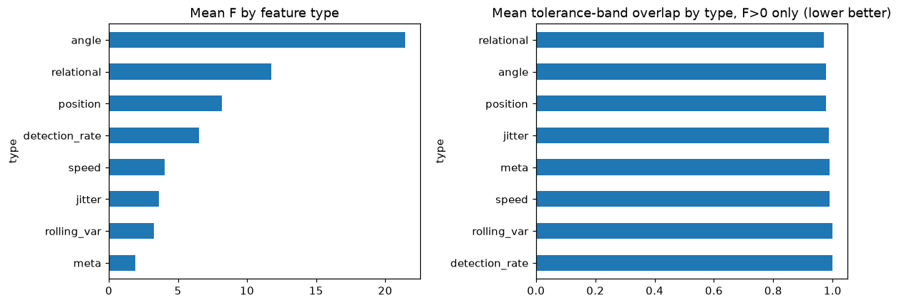
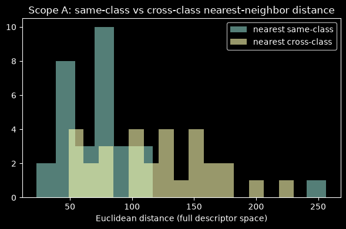

# GISLR engineered-feature discriminability (joint angles + kinematics)

**Status: Scope A + Scope B complete (2026-09-19).** Global scope (all 250
classes) not run — see §6. Narrative: [docs/logs/daily/2026-09-19.md](../logs/daily/2026-09-19.md).

| | |
|---|---|
| **Question** | Given a richer, hand-crafted per-frame feature set (joint angles, frame-gap-aware kinematics, jitter, rolling variance — not just raw xyz), which individual features are **tight within a class and separated across classes**, with an explicit per-class tolerance band? |
| **Instrument** | `experiments/recognition/gislr.0.dataset.feature-discriminability.ipynb` (TODO §3.4), over `sb.recognize.interp.kinematics` + `sb.recognize.interp.discriminability` |
| **Data** | GISLR_Stratified `train.csv`. Scope A: 3 sampled classes × 10 videos. Scope B: 15 sampled classes, 4,497 videos, 4,977 per-video descriptors each |
| **Feature pipeline** | `landmark_kinematics_v1` — mid-shoulder-centered/inter-shoulder-scaled position + speed per landmark (543 × 2 coords × {mean,std} + detection_rate), 28 joint angles, 12 relational distances, region-level jitter (Savitzky-Golay residual) + rolling-variance-of-speed, all reduced to mean+std over time |
| **Metric** | ANOVA F-ratio, a new **tolerance-band overlap** score (per-class `mean ± 1.5·std` band collision across every class pair), multinomial-logistic probe accuracy |
| **Data artifacts** | `data/cache/gislr/feature_discriminability/{scope_a,scope_b}/*.parquet` (gitignored) |

This is a **no-training, dataset-stage** analysis — a third, finer-grained
complement to the per-landmark position/speed probe
([subset-comparison.md](subset-comparison.md), now broken post-npz-migration)
and the trained-model attention/saliency ranking
([landmark-importance.md](landmark-importance.md)).

---

## 1. Headline: angles are the most information-dense feature type

At Scope B (15 classes, 4,497 videos), a probe trained on **only the 56 joint-angle
features** reaches **68.3% accuracy** — compared to 79.4% for **all 3,258**
position features, and 26.4%/11.3%/8.7% for speed/jitter/rolling-variance.
Per feature, angles carry roughly **50× more class information** than raw
position coordinates (68.3%/56 vs 79.4%/3,258).

This shows up directly in the marginal-contribution numbers: starting from a
`landmark_interp_v1`-style baseline (position + speed only, no angles or
relational distances, 4,344 features, **78.5%**), adding the 12 relational
distances + jitter/rolling-var/detection-rate features (521 more features)
gains **+1.1 pt** (79.6%); adding the 28 joint angles on top of *that* (just
56 more features, 1.1% of the total feature count) gains another **+2.5 pt**
(**82.1%**, full feature set). Angles are the single highest-value block
added by this pipeline, by a wide margin, per feature spent.

| Feature subset | n features | Probe acc. | Macro acc. |
|---|---|---|---|
| position + speed (no angles/relational — `landmark_interp_v1`-like baseline) | 4,344 | 78.52% | 77.93% |
| + relational, detection-rate, jitter, rolling-var (no angles) | 4,921 | 79.56% | 78.86% |
| **all features (+ 28 joint angles)** | **4,977** | **82.07%** | **81.54%** |
| angle only | 56 | 68.30% | 67.41% |
| relational only | 24 | 59.70% | 59.14% |
| position only | 3,258 | 79.41% | 78.81% |
| speed only | 1,086 | 26.37% | 26.05% |
| jitter only (region-level) | 4 | 11.26% | 11.06% |
| rolling-variance only (region-level) | 4 | 8.74% | 8.52% |

*(This table is a supplementary ablation — not saved by the notebook itself,
same pattern as landmark-importance.md §3's per-axis saliency addendum. If
worth keeping, promote into a notebook cell — filed in §6.)*

By raw per-feature ANOVA F-ratio (mean across all Scope B features of each
type), the ordering is the same:

| Feature type | Mean F | Mean tolerance-band overlap (F>0 only, lower=better) |
|---|---|---|
| **angle** | **21.45** | 0.977 |
| relational | 11.76 | **0.970** |
| position | 8.19 | 0.979 |
| detection_rate | 6.51 | 0.999 |
| speed | 4.01 | 0.991 |
| jitter | 3.62 | 0.987 |
| rolling_var | 3.26 | 0.999 |
| meta (n_frames/valid_frame_frac) | 1.90 | 0.990 |

**The single best individual feature, by F-ratio, is `angle_R_palm_facing_mean`**
(F=163.7) — it beats every one of the 543 raw landmarks' x/y/z coordinates
outright; the best raw-position feature (`right_hand_539_y_mean`, a
right-hand fingertip y-coordinate) scores F=111.3. Right-hand finger
PIP-flexion angles (ring, middle, pinky) and the left/right wrist-orientation
angles also place in the overall top 20. Hand orientation and finger-curl
angles — exactly the "handshape" cues ASL linguistics says should matter —
are, by this measure, the single most class-informative signals this
pipeline computes.

## 2. The tolerance-band metric: useful per-feature, flat in aggregate

Mean tolerance-band overlap **does not** separate feature types as sharply
as F-ratio does (0.97–1.0 across the board once constant features are
excluded, see §2.1) — with 15 classes and 105 class-pairs per feature, most
pairs are easy for almost any halfway-informative feature, so the *average*
overlap stays high regardless of type. The metric is more useful **per
feature** than as a type-level aggregate: the individual top-15 tightest-band
features (any type) are dominated by the same names that top the F-ratio
list (`angle_R_palm_facing_mean` 0.785, `angle_L_palm_facing_mean` 0.861,
several `right_hand_*_y_mean` and `pose_50{5,7,9,11}_x_mean` positions,
several finger-flex angles) — the two metrics agree on *which* features are
good even though they disagree on how much daylight there is *between*
types.

**Every single one of the top-20 features by either metric has
`worst_pair_overlap == 1.0`** — i.e. even the best individual feature has at
least one pair of the 15 sampled classes whose tolerance bands fully collide
on that feature alone. No single feature is a silver bullet at 15 classes;
separating all of them requires combining many features, which is exactly
what the probe classifier does (82.1%, §1). This is consistent with real
sign confusability (near-synonym pairs like `awake`/`wake`, `mouth`/`lips`
documented in `docs/reports/plateau-diagnosis.md`) rather than a flaw in the
metric.

### 2.1 A caught-and-fixed aggregation bug

The first pass of the type/region breakdown (before this fix) ranked
`detection_rate` and `meta` as the **tightest** tolerance-band types
(0.939 and 0.495 mean overlap respectively) — which looked wrong next to
their near-bottom F-ratio scores (6.5 and 1.9). Cause: 33 of 543
`detection_rate` features and 1 `meta` feature (`valid_frame_frac`) are
**exactly constant** across this 15-class sample (landmarks that are simply
never/always detected, and a sample with no dropped frames) — a constant
feature has a trivially zero-width tolerance band, which reads as "perfectly
tight" by the overlap metric despite carrying zero class information (F=0).
The per-feature top-N tables already excluded these (gated on `F > 0`,
caught during this notebook's own smoke-testing); the type/region aggregate
cell did not, and has been patched to apply the same gate
(`sb.recognize.interp.discriminability` itself is unaffected — the bug was
in the notebook's own aggregation cell, not the package). With the fix,
`detection_rate` and `rolling_var` are correctly the **worst**-separated
types (0.999 each), matching their low F-ratio.

## 3. Scope A: the tolerance idea, concretely

3 sampled classes (`better`, `outside`, `scissors`), 10 videos each. Same-class
nearest-neighbor distance is smaller than cross-class nearest-neighbor
distance on average for every class, but not uniformly:

| Class | mean margin | min margin | Reading |
|---|---|---|---|
| `scissors` | +62.4 | **+23.6** (always positive) | cleanly separated from the other two sampled classes |
| `better` | +44.4 | **−26.1** | usually separated, but at least one video sits closer to a different class |
| `outside` | +29.0 | **−1.9** | weakest margin of the three — most confusable |

A concrete per-feature example (`angle_L_elbow_angle_mean`, degrees, k=1.5
tolerance bands): `better` 125.1±14.0 [104–146], `outside` 126.6±18.4
[99–154], `scissors` 126.0±15.6 [103–149] — all three bands overlap almost
entirely on this one feature (elbow bend is similar across these three
signs), which is exactly why no single feature separates all classes (§2)
and why the probe needs the full feature vector.

## 4. Region ranking diverges from prior work — flagged, not resolved

By mean F-ratio, Scope B's region ordering is `cross-region` (angles +
relational, 16.8) > `right_hand` (16.1) > `left_hand` (8.4) > `face` (6.7) >
`pose` (6.0) — **pose ranks last**, diverging from motion-energy/
subset-comparison/landmark-importance's consistent hands > pose > face
finding. Left uninvestigated in this pass; plausible causes, not
distinguished here: (a) only 15 of 250 classes sampled, vs. the 250-class
global scope every prior region ranking used; (b) this pipeline's per-region
"position" descriptors are raw mean/std, not the `x_std`/speed descriptors
`subset-comparison.md` found most discriminative for pose specifically (§3.2
there: "x_std is the most discriminative descriptor... pose ...", not raw
mean position); (c) small-sample regions like pose (8 landmarks in
`UPPER_BODY_POSE_8`... but note this pipeline uses **all** pose rows, not
the ME-126 subset) may be diluted by less-informative pose points the
subset-comparison analysis had already screened out. Filed as an open
question, §6.

## 5. Artifacts

| Path | Content |
|---|---|
| `data/cache/gislr/feature_discriminability/scope_a/*.parquet` | Scope A per-video descriptors (gitignored) |
| `data/cache/gislr/feature_discriminability/scope_b/*.parquet` | Scope B per-video descriptors (gitignored) |
| `docs/reports/assets/feature-discriminability/*.png` | figures in this report (committed) |

## 6. Follow-ups

- **Global scope** (all 94,477 videos / 250 classes) — not run in this pass;
  needed before the region-ranking divergence (§4) or the feature-type
  ranking (§1) can be treated as settled rather than a 15-class snapshot.
- **Region-ranking divergence (§4)** — re-run with `x_std`/speed-style
  descriptors for pose specifically, or restrict pose to `UPPER_BODY_POSE_8`
  (matching every prior region ranking) rather than the full 33 pose rows,
  to isolate cause (a)/(b)/(c) above.
- **Promote the feature-type probe ablation (§1's table)** into a notebook
  cell — currently a supplementary script, not reproducible from the
  notebook itself (same status as landmark-importance.md §3's per-axis
  saliency addendum).
- **`TOLERANCE_K` sensitivity** (currently a single global 1.5) — not
  checked; §2's "flat in aggregate" finding could partly be an artifact of
  this specific band width.
- **Trained-model ablation**: `angle_R_palm_facing_mean` and the finger
  PIP-flex angles are the strongest individual candidates to add as explicit
  input features to a trained GRU/LSTM run, the way §3.0's probe findings
  fed §3.1's subset ablations.
- **Convergence**: `LogisticRegression`'s default `max_iter=200` didn't
  converge for several of §1's subset probes (`lbfgs` warning) — accuracy
  numbers are still meaningful (same budget used throughout, for
  comparability) but not each subset's ceiling; a higher `max_iter` would
  tighten them if this ablation is promoted into the notebook.
