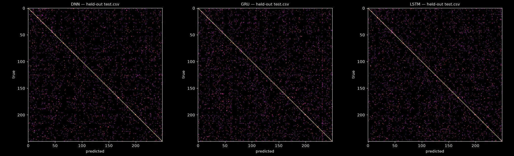
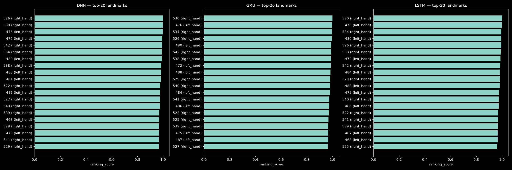
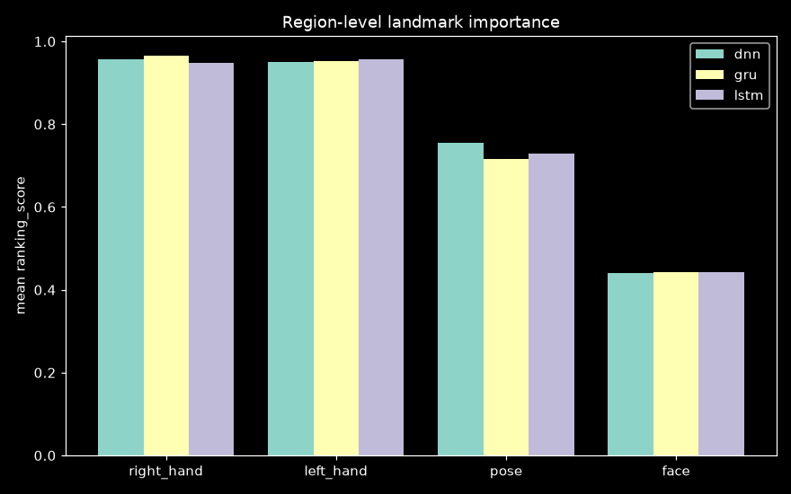
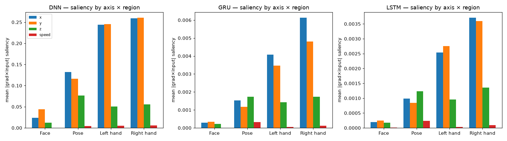
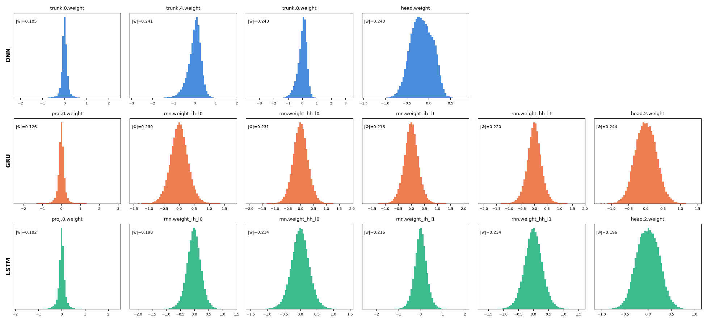

# GISLR model-derived landmark importance (custom DNN/LSTM/GRU)

**Status: run complete (2026-09-18).** All three architectures (5-fold OOF +
final fit + held-out test eval + importance ranking) finished; this report
backfills the standalone write-up for `TODO.md` §3.3. Narrative for the day is
[docs/logs/daily/2026-09-18.md](../logs/daily/2026-09-18.md).

| | |
|---|---|
| **Question** | Which of the 543 MediaPipe Holistic landmarks — and which axis of their motion — does a trained model actually rely on, independent of any subset chosen in advance? |
| **Instrument** | `experiments/recognition/gislr.1.models.landmark-importance.ipynb` (TODO §3.3), over `sb.recognize.interp.*` |
| **Data** | GISLR_Stratified canonical split: 75,581 `train.csv` videos (stratified 5-fold), 18,896 `test.csv` videos held out, 250 signs, all 543 landmarks, xyz |
| **Feature pipeline** | `landmark_interp_v1` — per-landmark position (mid-shoulder-centered, inter-shoulder-scaled) + velocity + acceleration + speed (10 channels × 543 = 5430) + 12 relational distances |
| **Metric** | attention gate + gradient×input saliency + permutation-importance drop, rank-averaged into `ranking_score`; per-class/overall accuracy on the untouched `test.csv` |
| **Data artifacts** | `data/cache/gislr/interp_runs/` (gitignored): `<arch>/{final.pt, test_predictions.npz, assets/landmark_ranking.csv}`, `comparison.csv` |

This test asks what a trained model's *own* weights depend on, as a
model-derived complement to the motion-energy (`docs/reports/motion-energy.md`,
model-free, measures raw movement) and discriminability-probe
(`docs/reports/subset-comparison.md`, measures class information) landmark
rankings.

---

## 1. Held-out test accuracy

One pass per architecture over the untouched canonical `test.csv` (18,896
videos), from a model fit on ~all of `train.csv`:

| Architecture | Test overall acc. | Test macro acc. | Test median class acc. | Classes <50% acc. | Params | OOF overall acc. |
|---|---|---|---|---|---|---|
| DNN (memory-free, per-frame) | 71.02% | 70.71% | 75.00% | 33 | 6.31M | 67.42% |
| GRU (causal, streaming-viable) | 67.96% | 67.72% | 68.83% | 32 | 3.85M | 68.68% |
| LSTM (causal, streaming-viable) | 70.55% | 70.34% | 71.72% | 16 | 4.18M | 68.18% |

DNN wins on raw accuracy despite having no recurrent state and the most
parameters, but it's also the least robust per-class (33 classes below 50%,
tied with GRU) and improved the most from k-fold OOF to the full-data final
fit (+3.6pp) — a hint the extra training data mattered more to it than
architecture. GRU is the only model that scored *worse* on test than on its
own OOF validation (67.96% vs 68.68%). LSTM is the most balanced: within
0.5pp of DNN's raw accuracy but with fewer than half as many weak classes
(16 vs 32–33), i.e. more even performance across signs rather than a few
strong classes propping up the average.

**These numbers are not comparable to the canonical GISLR leaderboard**
(`README.md` § Models) — different feature pipeline (engineered 5442-wide vs
raw landmarks) and the full 543-landmark set rather than `ME_126`. This track
exists to read out what the model itself weights, not to compete for the
leaderboard.

### Most confused sign pairs

The same pairs recur across all three independently-trained architectures —
stronger evidence the confusion is intrinsic to this landmark representation
than to any one model's inductive bias:

| Pair | DNN count | GRU count | LSTM count |
|---|---|---|---|
| wake ↔ awake | 65 / — | 25 / 38 | 33 / 29 |
| mouth ↔ lips | 25 / 21 | 30 / — | 38 / — |
| kitty → cat | 31 | 22 | — |
| pen → pencil | 20 | 20 | 31 |
| have ↔ animal | 23 | 17 | 19 |
| chin → say | — | 27 | 18 |

Worst-performing classes are consistent too: `give`, `there`, `nap`, `go`
sit in the bottom 10 for every architecture (17–39% accuracy) — these read as
genuinely hard signs in this feature space (likely low-motion or
visually-overlapping with a near-neighbor sign), not an artifact of one
model's training run.

## 2. Landmark ranking & region importance

`ranking_score` (mean of each metric's normalized rank across attention gate,
gradient×input saliency, and permutation-importance drop) per landmark, per
architecture:

The top-8 landmarks for all three architectures are **fingertips of both
hands** (thumb/index/middle/ring/pinky tips, left and right) — e.g. GRU's
#1 is the right-hand index fingertip (`ranking_score` 1.000), #2 the
left-hand index fingertip (0.997). Region-level means confirm this isn't
cherry-picked from the top-8:

| Region | DNN | GRU | LSTM |
|---|---|---|---|
| Right hand | 0.958 | 0.965 | 0.948 |
| Left hand | 0.950 | 0.953 | 0.957 |
| Pose | 0.754 | 0.717 | 0.729 |
| Face | 0.441 | 0.444 | 0.443 |

**This independently reproduces the ME-126 subset decision** (hands + upper
pose + lips/eyes/nose beats full-543, `docs/reports/motion-energy.md` +
`docs/reports/subset-comparison.md`): hands dominate, pose is a clear second,
face is a distant last — from a completely different method (a trained
model's own gradients/attention/ablation-sensitivity) than the motion-energy
or discriminability-probe instruments used to select ME-126 in the first
place. Three unrelated methods now agree.

### Cross-architecture ranking agreement

Spearman ρ of `ranking_score` over all 543 landmarks, between every pair of
architectures:

| | DNN | GRU | LSTM |
|---|---|---|---|
| DNN | 1.000 | 0.823 | 0.819 |
| GRU | 0.823 | 1.000 | 0.847 |
| LSTM | 0.819 | 0.847 | 1.000 |

All three pairs exceed 0.8 — the important landmarks are a property of the
*signs*, not one architecture's inductive bias.

## 3. Per-axis (x/y/z/speed) importance — new diagnostic, not in the notebook

The notebook's attention gate is one scalar per landmark (no axis split), so
"which axis matters" needed a separate pass: gradient×input saliency computed
per-channel (not collapsed across the 10 channels, unlike
`sb.recognize.interp.importance.gradient_saliency`), on the same seeded
400-video sample, then summed into **x** (position + velocity + acceleration,
x-component), **y**, **z**, and **speed** groups, averaged per region:

Overall saliency mass by axis (percent of total |grad×input| across all
landmarks and channels):

| Architecture | x | y | z | speed |
|---|---|---|---|---|
| DNN | 36.3% | 48.6% | 14.6% | 0.6% |
| GRU | 39.2% | 36.8% | 22.3% | 1.7% |
| LSTM | 35.8% | 38.3% | 24.1% | 1.8% |

**Partial cross-check against the z-noise finding** (`docs/reports/motion-energy.md`
§4: z carries ~92% of pose's motion-energy variance but was judged mostly
noise, motivating the xy-only ablation in TODO §3.1): saliency-wise, z gets a
real but clearly smaller share (15–24%) than x or y in every architecture —
consistent in direction (z matters less) but not as lopsided as the
motion-energy finding, which measured raw movement rather than a trained
model's gradient sensitivity. These are different instruments answering
related-but-distinct questions ("does z move" vs "does the model's prediction
depend on z"); take this as a second data point, not a restatement of the
same one. This has **not yet been reconciled** with the pending canonical xy
vs xyz ablation evals in TODO §3.1.

This per-channel pass is not saved by the notebook itself — it exists only in
this report's analysis script for now. See TODO §3.3 for the follow-up to
wire it into `sb.recognize.interp.importance` as a proper function if it's
worth keeping as a standing diagnostic.

## 4. Hidden-layer weight distributions

Histogram of every weight matrix (Linear/GRU/LSTM `weight_*`, excluding biases
and LayerNorm scales) in each architecture's final-fit checkpoint:

All layers across all three architectures are unimodal, zero-centered, and
roughly symmetric (no dead layers, no saturation toward the AdamW weight-decay
bound) — a sanity check that final-fit training converged normally rather
than collapsing. GRU/LSTM's recurrent `weight_hh` matrices have a visibly
tighter spread than their `weight_ih` counterparts in both architectures,
consistent with the standard orthogonal-ish recurrent-weight init surviving
training rather than being driven to extremes.

## 5. Artifacts

| Path | Content |
|---|---|
| `data/cache/gislr/interp_runs/<arch>/final.pt` | final-fit checkpoint (gitignored) |
| `data/cache/gislr/interp_runs/<arch>/test_predictions.npz` | per-video preds/labels/probs on `test.csv` |
| `data/cache/gislr/interp_runs/<arch>/assets/landmark_ranking.csv` | per-landmark attention/saliency/permutation/ranking_score |
| `data/cache/gislr/interp_runs/comparison.csv` | cross-architecture summary table |
| `docs/reports/assets/landmark-importance/*.png` | figures in this report (committed) |

## 6. Follow-ups

- Reconcile §3's z-channel saliency finding against the pending canonical
  xy-vs-xyz ablation evals (TODO §3.1) — same direction, different magnitude,
  not yet a single story.
- If the per-axis saliency breakdown (§3) is worth keeping as a standing
  diagnostic rather than a one-off, promote it into
  `sb.recognize.interp.importance` (e.g. `channel_saliency()`) and add a
  notebook cell/section for it, so it's reproducible from the notebook itself
  instead of only this report's analysis script.
- TODO §3.3's original follow-up — comparing this ranking against the
  motion-energy (§1) and discriminability-probe (§3.0) rankings — is
  qualitatively done at the region level here (§2); a landmark-level
  correlation (Spearman ρ of `ranking_score` vs motion-energy RMS speed and
  vs the probe's per-landmark F-ratio) is still open.
