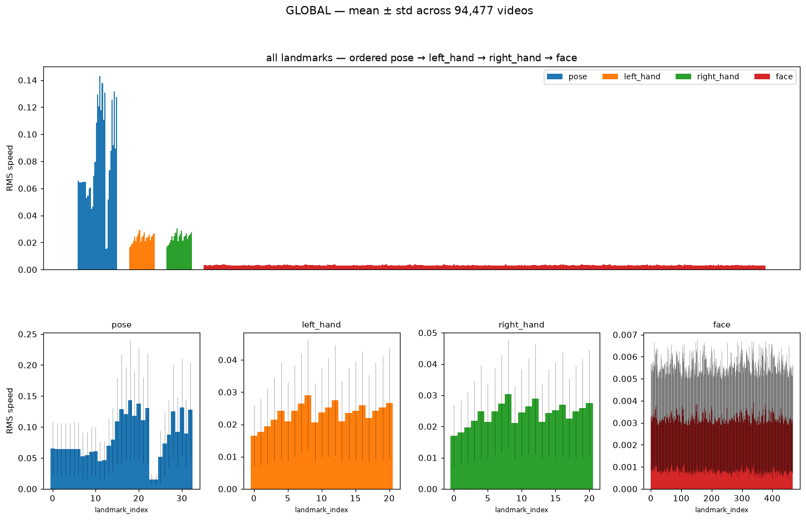
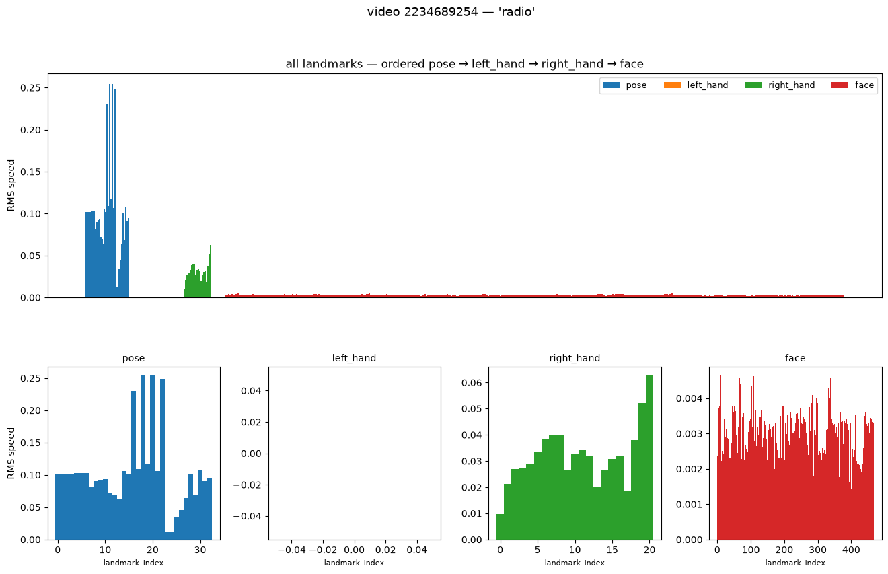
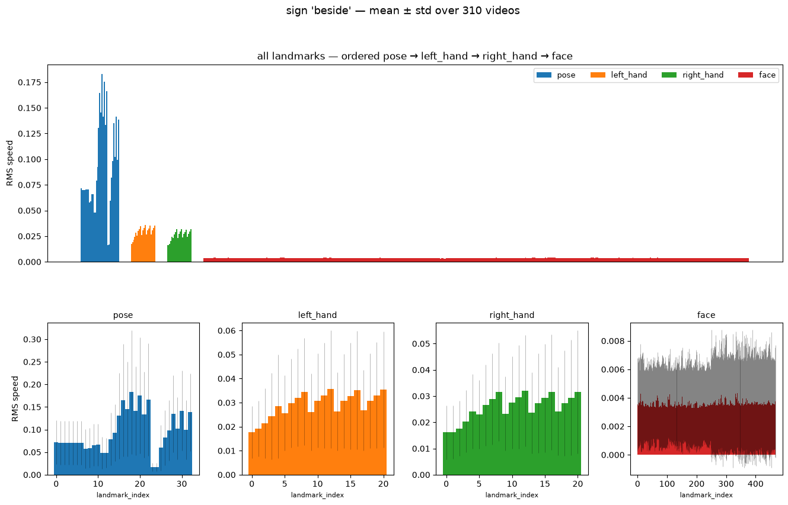
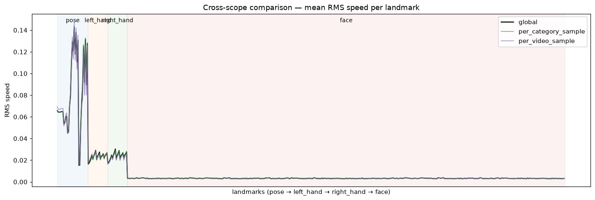
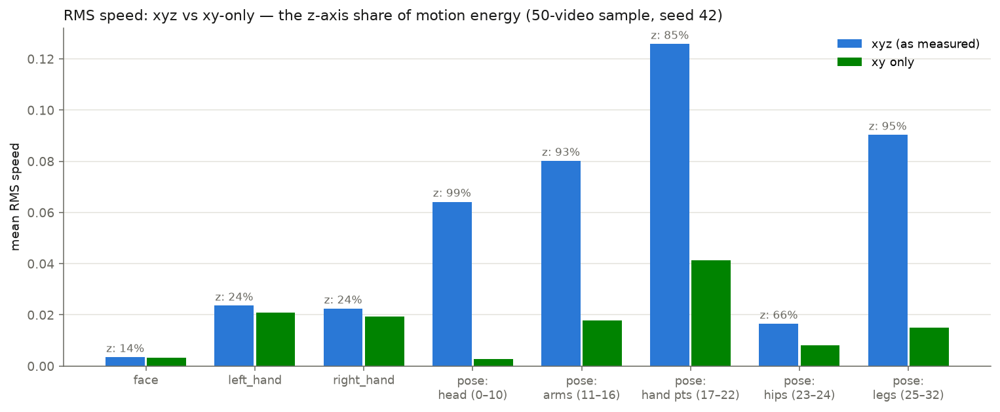
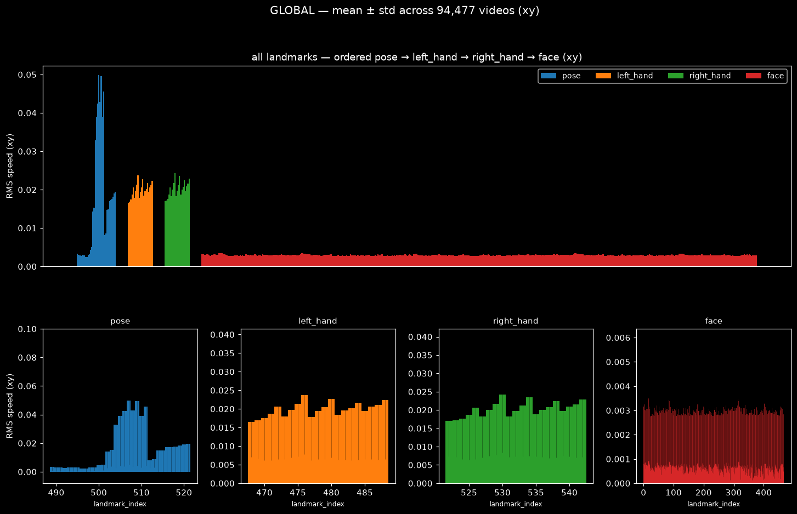
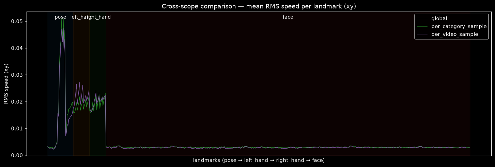
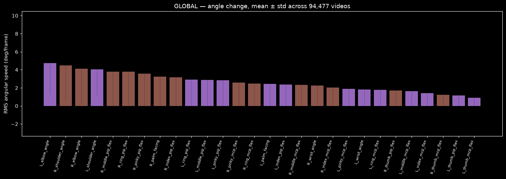
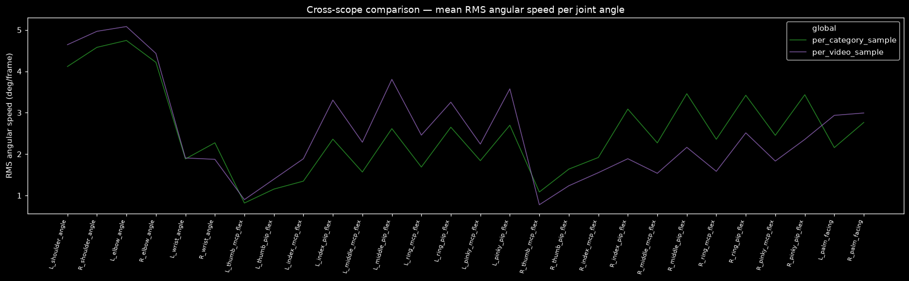

# GISLR landmark motion-energy analysis

**Status: complete, two runs.** §1–§4 below are the original 2026-07-15 run
(raw `asl-signs` parquet, xyz-first with a sample-only xy decomposition). That
notebook broke 2026-09-16 when GISLR moved to the GISLR_Stratified npz dataset,
was deleted 2026-09-19, and was rebuilt + re-run 2026-09-21 — **§5** is that
rerun: xy-native at the source (not decomposed after), jitter smoothed before
the derivative, plus a new joint-angle "change of angles" instrument. Read §5
first for the current numbers; §1–§4 stay as the original methodology
write-up and are superseded only where §5 says so.

This report backfills the standalone write-up for a test that previously lived only
as a daily-log entry (TODO §0.5); the original narrative is
[docs/logs/daily/2026-07-15.md](../logs/daily/2026-07-15.md) Part I.

| | |
|---|---|
| **Question** | Which of the 543 MediaPipe Holistic landmarks actually move, and does that motion reproduce from a small sample — before GPU-hours are spent on models that ingest all of them? |
| **Instrument** | `experiments/recognition/gislr.0.dataset.motion-energy.ipynb` (TODO §1) |
| **Data** | GISLR (`asl-signs`): 94,477 videos, 250 signs, 21 participants, 543 landmarks/frame (468 face, 21 per hand, 33 pose), xyz |
| **Scopes** | per-video (50 seeded), per-category (10 seeded signs), global (all 94,477 videos, 189 resumable chunks) |
| **Metric** | per-landmark RMS speed (Savitzky-Golay smoothed, scored over raw-valid frame transitions only) |
| **Data** | `data/cache/gislr/motion_analysis/{per_video,per_category,global}/summary.parquet` |

This test measures *motion*, not *discriminativeness* — a landmark that moves
identically in every sign has high motion energy and zero class information.
It is deliberately the cheapest, model-free first pass; the follow-up
instrument that measures class information directly is
[subset-comparison.md](subset-comparison.md).

---

## 1. Method

Per-landmark **RMS speed**: pivot each video to frames × (landmark,
coordinate), reindex to a contiguous frame range, linear-interpolate gaps,
Savitzky-Golay smooth (window 7, polyorder 2), frame-to-frame displacement,
then `sqrt(mean(speed²))` over **valid transitions only** — a transition
counts toward a landmark's RMS only if that landmark was observed (non-NaN) at
both endpoints in the raw data, so a hand visible in 20% of frames is scored on
those frames rather than diluted toward stillness.

Loading goes through DuckDB (`load_landmarks_for_paths`, explicit parquet file
list) so only requested files are opened; full in-SQL aggregation was rejected
because Savitzky-Golay needs an ordered per-frame series, but the final global
aggregation runs in-SQL over cached per-chunk parquets. All three scopes share
one manifest-driven resumable loop (`process_units`): per-unit artifact
written before the unit is marked done, atomic manifest saves, `done` skipped
/ `failed` retried — it survived the full 189-chunk global run with 0
failures, at throughput ≈65 videos/s single-threaded (~25 min total).

## 2. Results

### 2.1 Global per-type picture (xyz, as measured)

| type | n landmarks | mean RMS | range | detected in % of videos |
|---|---|---|---|---|
| pose | 33 | 0.0827 | 0.0152 – 0.1431 | 100.0% |
| right_hand | 21 | 0.0241 | 0.0171 – 0.0303 | 54.7% |
| left_hand | 21 | 0.0233 | 0.0166 – 0.0291 | 41.4% |
| face | 468 | 0.0032 | 0.0029 – 0.0039 | 99.9% |

Within-type: fingertips move most (index > middle > pinky tip), wrist/thumb
base least — the expected articulation hierarchy. The right hand is detected
in 55% of videos vs 41% for the left (dominant-hand asymmetry). Pose's top
movers include real signal (wrist-adjacent points) but also **ankles/heels/feet**
— out of frame in seated signing, the first hint that raw xyz motion is
contaminated (§2.3). The face is nearly flat across all 468 landmarks
(0.0029–0.0039): it moves as a rigid object (head motion) with almost no
per-landmark differentiation, so motion energy alone cannot rank face
landmarks.

### 2.2 Do small seeded samples represent the global pattern?

Spearman rank correlation of per-landmark mean RMS against the full 94,477-video run:

| sample | rho vs global (n=543) |
|---|---|
| per-video (50 videos) | **0.954** |
| per-category (10 signs, ~3,750 videos) | **0.996** |

Small seeded samples reproduce the global per-landmark ranking almost
perfectly — the reason later landmark work (xy/xyz decomposition here,
[discriminability probes](subset-comparison.md)) could run on ~50-video
samples in minutes instead of a day-scale global pass.

### 2.3 How much of the "motion" is z-axis noise?

MediaPipe's z is known to be less reliable than x/y. Re-computing RMS speed on
the 50-video sample with xy only vs xyz:

| group | RMS (xyz) | RMS (xy) | z share of motion energy |
|---|---|---|---|
| face | 0.0035 | 0.0032 | 14% |
| left_hand | 0.0236 | 0.0210 | 24% |
| right_hand | 0.0224 | 0.0194 | 24% |
| pose: head (0–10) | 0.0642 | **0.0028** | **99%** |
| pose: arms (11–16) | 0.0801 | 0.0179 | 93% |
| pose: hand pts (17–22) | 0.1258 | 0.0412 | 85% |
| pose: hips (23–24) | 0.0165 | 0.0081 | 66% |
| pose: legs (25–32) | 0.0903 | 0.0150 | 95% |

**~92% of pose "motion energy" is z-axis noise** — pose-head landmarks are
essentially static in the image plane (xy RMS 0.0028, below face level); their
apparent 0.064 xyz motion was almost pure depth jitter. Same story for legs
(95% z). In honest xy terms the ranking becomes: pose hand points (0.041) >
hands (~0.020) ≈ pose arms (0.018) > legs > hips > face ≈ pose head. Hands
keep ~76% of their energy in xy (their motion is real); face keeps 86% but at
6× smaller magnitude. **Conclusion: raw xyz motion energy is not wrong but
misleading for pose — any landmark-importance decision must use xy or a
z-corrected metric.**

## 3. Landmark keep/discard recommendation

| group | count | verdict | rationale |
|---|---|---|---|
| left/right hand (all 21 each) | 42 | **keep** | primary articulators; highest genuine xy motion after pose hand pts |
| pose 11–16 (shoulders, elbows, wrists) | 6 | **keep** | genuine arm trajectory + 100% detection — the fallback signal when hands drop out |
| pose 23–24 (hips) | 2 | **keep** (cheap anchor) | stillest points measured; useful normalization anchor |
| pose 17–22 (wrist-adjacent) | 6 | optional | duplicates the hand meshes when present |
| face: lips | 40 | **keep** (not on motion grounds) | flat motion profile — kept for linguistic reasons (mouthing) |
| face: eyes + nose | 36 | keep (small) | near-rigid — head-pose anchor + non-manual cues |
| pose 0–10 (face duplicates) | 11 | **discard** | 99% z-noise, xy-static, redundant with face mesh |
| pose 25–32 (legs, feet) | 8 | **discard** | out of frame; apparent motion is jitter |
| face: everything else | 392 | **discard** | rigid head motion duplicated 392×; no per-landmark differentiation |
| z coordinate (all kept landmarks) | — | **discard** | 92% of pose energy is z-noise; even hands keep only a noisy 24% |

Keeping every "keep" row = **126 landmarks (ME-126)**; the strict
1st-place-compatible variant without pose = 118 (**FP-118**).

### Cross-check against the Kaggle GISLR 1st-place solution

The 1st-place entry (hoyso48; CV 0.80 / public LB 0.80 / private LB 0.88)
keeps 118 landmarks × xy = 236 of 1,629 raw values/frame (14.5%) — no external
data, trained from scratch on the full competition set. The reference
notebook itself (`src/gislr.0.competition.entry.1st.ipynb` at the time) is no
longer in the working tree — removed in commit `f7be9a1`, recoverable via
`git show fd1c7aa:src/gislr.0.competition.entry.1st.ipynb`; its port now lives
at `experiments/recognition/gislr.1.models.firstplace.ipynb`.

| decision | motion-energy (xy) verdict | 1st place | agreement |
|---|---|---|---|
| keep both full hands | keep | keep | agree |
| discard 392 of 468 face landmarks | discard | discard | agree |
| discard pose legs + face-duplicate pose head | discard | discard | agree |
| discard z | discard | discard | agree |
| upper-body pose (11–16, 23–24) | **keep** | **drop** (drafted, commented out) | diverges |
| lips / eyes / nose | flat 0.003 band, nothing special | **keep** (mouthing & non-manual markers) | diverges |

Both divergences are the expected blind spots of a motion-only instrument: it
over-values redundant motion (pose arms move genuinely but may be recoverable
from hand position alone) and under-values low-motion, high-information
articulators (lips barely move but carry mouthing). **Motion energy agrees
with ~110 of the 118 kept landmarks and every wholesale discard, but cannot by
itself adjudicate pose or justify keeping lips/eyes** — that required the
follow-up discriminability instrument (see [subset-comparison.md](subset-comparison.md)),
which confirmed ME-126 (adjudicating pose in its favor) and separately
verified the ME-126 GRU beats the full-543 baseline 73.73% vs 70.59% at half
the parameters.

## 4. Follow-ups

- [x] Global xy-only re-aggregation of the motion-energy summaries (z-noise
  correction at full-dataset scale) — TODO §1.8. **Done in §5** (2026-09-21,
  on the GISLR_Stratified npz rebuild — xy computed at the source, not as a
  post-hoc decomposition).
- [x] Within-class consistency + cross-class discriminability — delivered as
  [subset-comparison.md](subset-comparison.md).
- [~] Re-run motion energy on normalized coordinates once TODO §7.2
  normalization lands — un-normalized motion may be biased by signer scale
  (TODO §7.7). **Partial in §5**: the new joint angles run on
  `center_and_scale`-normalized positions (angles are scale-invariant anyway,
  but this keeps them comparable to `feature-discriminability.md`'s numbers);
  per-landmark RMS speed is still deliberately un-normalized (§5's title-cell
  rationale — normalizing would conflate camera distance with actual motion).

*Report backfilled 2026-07-22 from `docs/logs/daily/2026-07-15.md` (test executed 2026-07-15, seed 42). §5 added 2026-09-21.*

---

## 5. v2 rerun — GISLR_Stratified npz, xy-native + joint-angle change (2026-09-21)

**Instrument:** `experiments/recognition/gislr.0.dataset.motion-energy.ipynb`
(rebuilt after the pre-npz version broke 2026-09-16 and was deleted
2026-09-19). **Data:** GISLR_Stratified (`bracu23101281/gislr-stratified`):
94,477 videos, 250 signs, 543 landmarks/frame — same landmark content as the
2026-07-15 run, different storage (pre-converted npz vs raw parquet) and split
(fixed 80/20 vs the dataset's internal ordering). **Method changes from §1–§4**
(full rationale in the notebook's title cell):

1. **z dropped before the speed computation**, not decomposed after — every
   scope computes `rms_speed` directly on xy. §2.3's finding (92% of pose
   "motion" was z-noise) motivated this; this run confirms it holds at full
   scale (§5.1).
2. **Savitzky-Golay smooths the position series before the frame-to-frame
   difference** (same window=7, polyorder=2) — jitter is removed before the
   derivative sees it, not filtered from the RMS output afterward.
3. **New: 28 joint angles' rate of change** ("change of angles", RMS angular
   speed in deg/frame) — reuses `sb.recognize.interp.kinematics.compute_angles`
   (shoulder/elbow/wrist flex + 10 finger joints/hand + palm-facing), computed
   on normalized (`center_and_scale`), jitter-smoothed positions.

All three scopes completed with **0 failed units** (50 videos, 10 signs ≈
3,662 videos, 189 chunks / 94,477 videos global).

### 5.1 Global landmark motion energy (xy, all 94,477 videos)

| type | n landmarks | mean RMS (xy) | detected in % of videos |
|---|---|---|---|
| right_hand | 21 | 0.0203 | 54.7% |
| left_hand | 21 | 0.0198 | 41.4% |
| pose | 33 | 0.0172 | 100.0% |
| face | 468 | 0.0030 | 99.9% |

Detection rates reproduce the 2026-07-15 numbers **exactly** (99.9% / 100% /
54.7% / 41.4%) — the landmark *content* didn't change across the dataset
migration, only its storage format, and the dominant-hand asymmetry
(right-hand detected in more videos than left) holds on the new split too.

Pose, broken out by the same subgroup the old report used — compared against
that report's **50-video xy-only sample estimate** (§2.3):

| pose subgroup | old sample (50 videos, xy) | new global (94,477 videos, xy) |
|---|---|---|
| hand pts (17-22) | 0.0412 | **0.0449** |
| arms (11-16) | 0.0179 | **0.0185** |
| legs (25-32) | 0.0150 | **0.0173** |
| hips (23-24) | 0.0081 | **0.0084** |
| head (0-10) | 0.0028 | **0.0029** |

The 50-video sample tracked the global xy pattern closely on every subgroup
(within ~15% everywhere, exact on head/hips/arms) — **independent
confirmation, on a different dataset and a different codebase, that seeded
samples reproduce the global landmark-motion ranking** (the same conclusion
§2.2 reached with rank correlation; see also §5.2 below).

Top movers globally: pose landmarks 504–511 (holistic rows = pose wrist +
wrist-adjacent hand points, pose-local indices 15–22) — 0.033–0.050 RMS.
Bottom: pose ear-region landmarks (496, 497) and face, 0.0024–0.0028 —
consistent with §2 ("fingertips move most, face is nearly flat").

**One new wrinkle, not resolved here:** at global xy scale, **legs (0.0173)
sit almost as high as arms (0.0185)** — closer than the 50-video sample
suggested (0.0150 vs 0.0179). The original keep/discard verdict (§3) discarded
legs as "out of frame; apparent motion is jitter," reasoned from xyz being
dominated by z-noise (95%, §2.3). This xy-native global number doesn't fully
support "jitter" as the explanation on its own — there's real, non-trivial
xy displacement even for landmarks that should be off-camera in seated
signing, which could be actual signer movement (shifting in the chair),
tracker drift when a landmark is unseen, or both. Motion energy alone can't
tell those apart; resolving it needs the discriminability instrument (does
leg motion correlate with sign identity, or is it noise-like and
class-independent?), not another motion-energy pass. Filed as a follow-up
(§5.5), not a revision of the ME-126 subset.

### 5.2 Cross-scope comparison (landmarks)

Spearman rank correlation of per-landmark mean RMS speed (xy) against the
global run:

| sample | rho vs global (n=543) |
|---|---|
| per-video (50 videos) | **0.951** |
| per-category (10 signs, ≈3,662 videos) | **0.990** |

Nearly identical to the pre-npz run's 0.954 / 0.996 (§2.2) — despite a
different dataset, split, and formula (xyz→xy-after vs xy-native), seeded
samples reproduce the global landmark ranking just as reliably on the rebuilt
pipeline.

### 5.3 Joint-angle motion — "change of angles" (new)

RMS angular speed (deg/frame), global, all 94,477 videos, highest and lowest
5 of 28:

| angle | RMS angular speed (deg/frame) |
|---|---|
| L_elbow_angle | 4.73 |
| R_shoulder_angle | 4.48 |
| R_elbow_angle | 4.12 |
| L_shoulder_angle | 4.04 |
| R_middle_pip_flex | 3.80 |
| … | … |
| L_thumb_pip_flex | 1.17 |
| R_thumb_mcp_flex | 1.23 |
| L_thumb_mcp_flex | **0.91** |

**Shoulder and elbow angles change fastest** — the large-amplitude arm swings
that carry most sign articulation — followed by finger PIP (middle-knuckle)
flex angles. **Thumb joints change least** across every metric (MCP and PIP
both bottom the ranking), consistent with the thumb's smaller range of motion
relative to the four fingers. Wrist-orientation angles and palm-facing sit in
the middle. **Right-hand angles exceed their left-hand counterparts in 13 of
14 paired joints** — every finger joint, the wrist, palm-facing, and the
shoulder (R 4.48 vs L 4.04) — the sole exception is the elbow, where **left**
leads (L 4.73 vs R 4.12), the single largest RMS value in the whole table and
not a near-tie. The same dominant-hand asymmetry §2.1 found in detection rate
shows up in *how much the joints move*, not just whether the hand is
visible; the elbow exception is a genuine oddity worth a closer look, not
noise.

Cross-scope rank correlation (per-angle mean RMS angular speed vs global):

| sample | rho vs global (n=28) |
|---|---|
| per-video (50 videos) | 0.743 |
| per-category (10 signs) | **0.991** |

**New finding:** a single-video sample is a much noisier estimate of the
global *angle* ranking (rho 0.743) than it is of the global *landmark*
ranking (rho 0.951, §5.2) — one video's arm-swing amplitude is idiosyncratic
to that sign/signer, while summing 543 landmarks' motion in one video already
averages out a lot of that noise. The per-category sample (aggregating ~370
videos per sign) recovers the same reliability as landmarks (0.991). Any
future angle-motion analysis should sample at the category level or larger,
not per-video.

### 5.4 What reproduced vs what's new

**Reproduced exactly:** per-type detection rates (99.9% / 100% / 54.7% /
41.4%), the fingertip-moves-most / face-is-flat pattern, dominant-hand
asymmetry, and — closely — the pose-subgroup xy magnitudes the 2026-07-15
50-video sample estimated. This is strong evidence the dataset migration
(parquet → npz) didn't change the underlying landmark content, only its
packaging.

**New:** the joint-angle "change of angles" instrument didn't exist in the
pre-npz run at all. **Not settled:** whether legs' comparatively high global
xy motion (§5.1) is real signal or tracking noise — flagged, not resolved.

### 5.5 Follow-ups (from this run)

- [ ] Investigate the legs xy-motion anomaly (§5.1) — correlate leg landmark
  motion with sign identity (a discriminability probe, not another
  motion-energy pass) to tell real signer movement from tracker drift on an
  off-camera landmark.
- [ ] Cross-check joint-angle *rate of change* against
  [feature-discriminability.md](feature-discriminability.md)'s finding that
  static angle *value* (mean/std) is the most information-dense feature
  type — is angular speed also discriminative, or mostly generic
  "how active is this sign" activity that doesn't separate classes?
- [ ] Re-run per-landmark motion energy on normalized (not just angle)
  coordinates once wanted (TODO §7.7) — deliberately left un-normalized here;
  see §5's rationale.
- [ ] Explain the elbow left/right reversal (§5.3) — every other paired joint
  favors the right (dominant) hand, but `L_elbow_angle` is the single highest
  RMS value in the whole 28-angle table while `R_elbow_angle` sits mid-pack.
  Worth checking whether it's a genuine bracing/counterbalance motion of the
  non-dominant arm during signing, or an artifact of the elbow-angle
  definition (shoulder-elbow-wrist) being more sensitive to pose-landmark
  noise on one side.
