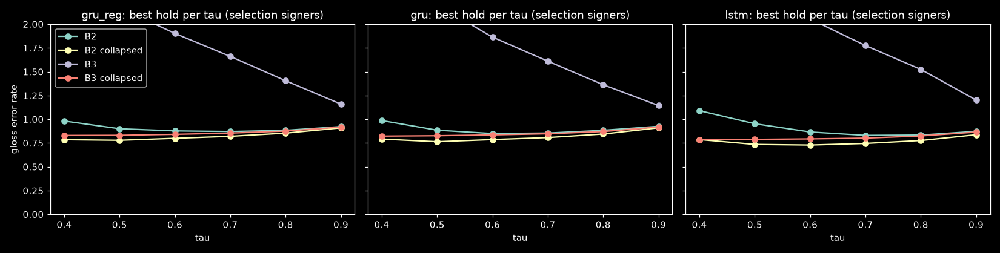
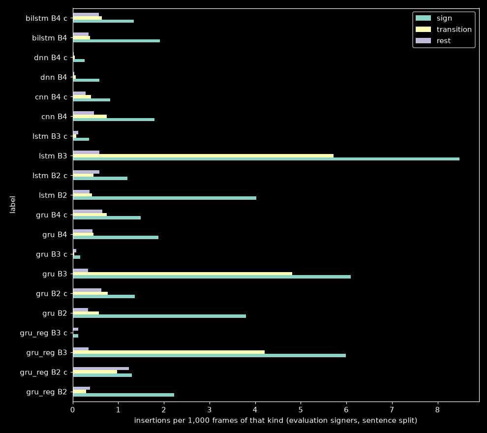
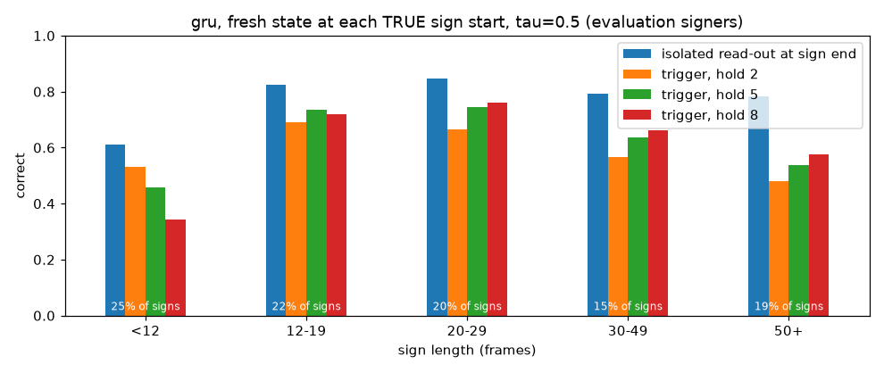

# Sentence baselines: existing isolated-sign models on continuous signing

**TODO §12.2** · notebook `experiments/recognition/gislr.3.streaming.sentence-baselines.ipynb` ·
config `experiments/recognition/configs/gislr.sentence-baselines.json` · run 2026-09-23 ·
data: GISLR-Sentences v1 (local build; the Kaggle copy was not yet published)

## Summary

- **Streaming more than doubles the error.** With true sign boundaries given (B1), the best
  model's gloss error rate (GER) is **0.22**. The best streaming decoder reaches **0.51** (a
  `gru` sliding window). The reset-on-accept loop the live design specifies does worse:
  **0.66** (`lstm`) / **0.68** (`gru`).
- **The errors are missed signs, not wrong or spurious ones.** Deletions make up 0.30–0.47 of
  the reference glosses in every streaming mode. Substitutions are ~0.14 and insertions ~0.05.
- **A fixed "confident for `hold` frames" rule cannot find the end of a sign.** Even with the
  state reset exactly at each true sign start, the rule commits the right gloss on only **60%**
  of signs, against the same model's **76%** isolated accuracy. Short signs need a short hold,
  and long signs need a long one to avoid committing early and wrong. No single value serves
  both.
- **Reset helps.** Reset-on-accept beats never resetting by 8–9 GER points (collapsed) and by
  37 points raw. Without reset, spurious signs concentrate on transition frames (4–6 per
  1,000).
- **Null frames are not the bottleneck here.** No collapsed mode inserts more than 1.3 signs per
  1,000 rest or transition frames. v1's rest frames are unrealistically easy, though (see
  Caveats).
- **Sentence ≡ control** (GER within 0.01 everywhere). None of these models uses a language
  prior, so this is expected, and it confirms the planner did not bias either split.

Together these set the design brief for the continuous model (§12.3). The brief is in the
last section.

## 1. Setup

Six existing models, no training:

| model | checkpoint | input | checkpoint selected on |
|---|---|---|---|
| `gru_reg` | registry `1789559734` | ME-132 xy | `test.csv` (the canonical val), so a small advantage here |
| `gru` `lstm` `cnn` `dnn` `bilstm` | five-arch benchmark | ME-126 xy | an internal val carved from `train.csv` |

Four decoders:

| mode | description |
|---|---|
| **B1** | oracle: fresh state per true segment, the model's own whole-clip readout |
| **B2** | reset-on-accept (the live design): top gloss ≥ τ for `hold` frames → emit + reset |
| **B3** | the same trigger, never reset |
| **B4** | sliding window (`win` frames, stride 2); a run of `min_run` windows agreeing at ≥ τ emits once |

Every mode is scored raw and with consecutive repeats collapsed. Settings are chosen by the
lowest GER on **5 selection signers** (seeded) of the `sentence` split. **Every number below
comes from the other 16 signers**: 5,054 `sentence` + 4,639 `control` sequences, 15,652
reference signs in the `sentence` split.

### Checks that passed before any number was read

| check | result |
|---|---|
| vectorized trigger vs `AcceptTrigger` on real probabilities | 0 mismatches / 960 |
| batch decoder vs the true live loop (`RecurrentSession.step` + `AcceptTrigger` + `reset()`) | 0 / 120 |
| B1 vs the saved isolated test predictions (17,829 clips ≤ 128 frames) | 99.96–100% agreement per model; the few differences are cuDNN near-ties |

## 2. Results (evaluation signers, `sentence` split, with null frames)

Best setting per model and mode. `c` = repeats collapsed. Full table:
[`assets/sentence-baselines/final_table.csv`](assets/sentence-baselines/final_table.csv).

| model | mode | GER | correct | sub | del | ins | sentence acc | latency (median frames) | GER control | GER hard-cut |
|---|---|---|---|---|---|---|---|---|---|---|
| `gru_reg` | B1 | **0.221** | 0.779 | 0.221 | 0 | 0 | 0.489 | 0 | 0.220 | — |
| `bilstm` | B1 | 0.230 | 0.770 | 0.230 | 0 | 0 | 0.480 | 0 | 0.230 | — |
| `gru` | B1 | 0.237 | 0.763 | 0.237 | 0 | 0 | 0.466 | 0 | 0.236 | — |
| `lstm` | B1 | 0.244 | 0.756 | 0.244 | 0 | 0 | 0.461 | 0 | 0.243 | — |
| `cnn` | B1 | 0.308 | 0.692 | 0.308 | 0 | 0 | 0.365 | 0 | 0.307 | — |
| `dnn` | B1 | 0.326 | 0.674 | 0.326 | 0 | 0 | 0.327 | 0 | 0.326 | — |
| `gru` | B4 c | **0.507** | 0.557 | 0.140 | 0.303 | 0.064 | 0.156 | −6 | 0.515 | 0.669 |
| `bilstm` | B4 c | 0.517 | 0.540 | 0.140 | 0.319 | 0.057 | 0.144 | −7 | 0.518 | 0.649 |
| `cnn` | B4 c | 0.615 | 0.419 | 0.150 | 0.431 | 0.035 | 0.078 | −3 | 0.620 | 0.768 |
| `lstm` | B2 c | **0.659** | 0.393 | 0.143 | 0.464 | 0.052 | 0.110 | −5 | 0.653 | 0.675 |
| `gru` | B2 c | 0.681 | 0.379 | 0.150 | 0.471 | 0.060 | 0.103 | −5 | 0.692 | 0.689 |
| `dnn` | B4 c | 0.691 | 0.319 | 0.053 | 0.628 | 0.010 | 0.052 | −13 | 0.689 | 0.707 |
| `gru_reg` | B2 c | 0.701 | 0.364 | 0.140 | 0.495 | 0.066 | 0.093 | −5 | 0.698 | 0.692 |
| `lstm` | B3 c | 0.744 | 0.270 | 0.203 | 0.528 | 0.014 | 0.027 | −6 | 0.745 | 0.737 |
| `gru` | B3 c | 0.772 | 0.235 | 0.154 | 0.611 | 0.007 | 0.019 | −6 | 0.774 | 0.759 |
| `lstm` | B2 | 0.815 | 0.334 | 0.161 | 0.505 | 0.149 | 0.058 | −3 | 0.803 | 0.817 |
| `lstm` | B3 | 1.183 | 0.148 | 0.204 | 0.648 | 0.331 | 0.001 | +2 | 1.197 | 1.136 |

Latency is the accept frame minus the true sign's last frame, over correctly aligned signs.
Negative means the model committed before the sign ended.

## 3. Findings

### 3.1 The gap is deletions

In every streaming mode, deletions dominate: 0.30 (`gru` B4) to 0.47 (B2). Substitutions stay
at the oracle's level or below (0.14–0.15 vs B1's 0.22–0.24; B1 has no deletions, so every
error there is a substitution). The models rarely say the wrong thing. They fail to say
anything at all.

### 3.2 Why: a fixed hold cannot find the end of a sign

To separate the trigger rule from reset timing, the `gru` state was reset at each **true**
sign start (15,652 signs, τ = 0.5), and the question was whether the rule commits the right
gloss within the sign or its following gap.

| sign length (frames) | share of signs | isolated read-out at sign end | trigger, hold 2 | hold 5 | hold 8 |
|---|---|---|---|---|---|
| < 12 | 25% | 0.610 | 0.530 | 0.457 | 0.344 |
| 12–19 | 22% | 0.824 | 0.690 | 0.736 | 0.721 |
| 20–29 | 20% | 0.847 | 0.667 | 0.746 | 0.760 |
| 30–49 | 15% | 0.792 | 0.566 | 0.637 | 0.661 |
| 50+ | 19% | 0.784 | 0.481 | 0.537 | 0.577 |
| **all** | | **0.763** | 0.588 | 0.617 | 0.599 |

- **Short signs** need a short hold. A quarter of all signs last under 12 frames, and 8
  confident frames rarely fit inside them.
- **Long signs** need a long hold. Their mid-sign confidence locks onto a wrong gloss before the
  sign is finished. These models were trained with a loss at the last frame only (TODO §11),
  and clips over 128 frames were subsampled during training, so mid-sign and native-length
  long-sign confidence was never supervised.
- **The best single hold (5) reaches 0.617 against the 0.763 the same model gets once it has
  seen the whole sign.** That leaves 15 points on the table from the commit rule alone.

The rest of the gap to the real B2 stream (0.599 → 0.379 correct for `gru` at hold 8) comes
from resets landing at the wrong moment: an early wrong accept resets the state in the middle
of a sign, and the leftover frames of that sign contaminate the next attempt.

### 3.3 Reset matters; collapsing repeats matters as much

| | B2 reset | B3 no reset |
|---|---|---|
| `lstm` raw | 0.815 | 1.183 |
| `lstm` collapsed | 0.659 | 0.744 |
| `gru` raw | 0.822 | 1.139 |
| `gru` collapsed | 0.681 | 0.772 |

Without reset, the carried state fires on transition frames (4.2–5.7 insertions per 1,000
transition frames, raw), which is the carry-over §11 measured. With reset, a long sign gets
accepted over and over (raw B2 inserts 0.14–0.15 per reference gloss); collapsing repeats
removes most of that.

### 3.4 The sliding window wins, but leans on the synthetic gaps

`gru` B4 (0.507) beats `gru` B2 (0.681) with null frames present. Dropping them (hard-cut)
degrades B4 to 0.669 but leaves B2 flat (0.689). The window decoder uses the interpolated
transitions as natural breaks between runs, and real co-articulated signing will not provide
those breaks so cleanly. On back-to-back signs the two decoders are equal. B4 also costs
`win` frames of look-back per emission and a full forward pass per window.

### 3.5 Null frames

Collapsed insertion rates on rest and transition frames stay at or below 1.3 per 1,000 for
every mode. The models do not hallucinate signs during non-signing. The rest number is not
trustworthy, though: v1's rest frames have NaN hands (encoded as zeros), so they are trivially
unlike any signing frame. Transition frames are real interpolations between signs, and those
stay low too.

### 3.6 Model ranking

It follows B1: `gru_reg` ≈ `bilstm` > `gru` > `lstm` > `cnn` > `dnn`. Under reset-on-accept
`lstm` edges out `gru` (0.659 vs 0.681). Bidirectionality buys nothing even offline (`bilstm`
B4 0.517 vs `gru` B4 0.507). `dnn` is the most conservative decoder: its selected τ = 0.4 sits
at the grid edge, it has the lowest insertion rate, and the most deletions (0.63).

## 4. Caveats

- **v1's rest is too easy** (NaN hands with the wrists still raised;
  `docs/logs/daily/2026-09-23.md`). Null-frame numbers are optimistic until a lowered-hands rest
  exists.
- **Grid edges.** B2 selected the largest `hold` swept (8) for every model, and selection GER
  was still falling there (`gru` 0.787 → 0.764 from hold 5 to 8). `dnn` B4 selected the
  smallest τ (0.4) and window (16); `cnn` the largest window (32). Extending the grids could
  lower those rows a few points. It cannot close the length trade-off in §3.2, which no single
  value resolves.
- **Selection signers score worse than evaluation signers** (e.g. `gru` B4 0.595 vs 0.507).
  Settings were fixed before the evaluation signers were scored, so this is signer
  difficulty, not leakage.
- `gru_reg` was checkpoint-selected on `test.csv`, which these clips come from. The five-arch
  models were not.
- Clips are fed at native length. Isolated training subsampled the ~8% longer than 128 frames
  (TODO §11.1).

## 5. What this asks of the continuous model (§12.3)

1. **Per-frame supervision across the whole sign**, so confidence is meaningful early (short
   signs) and does not lock onto a wrong gloss mid-sign (long signs). The last-frame-only
   objective is what §3.2 exposes.
2. **The model must signal the sign boundary itself**, through an explicit null / sign-end
   output, instead of the decoder guessing from a fixed hold. §3.2 shows no fixed hold works
   across sign lengths.
3. **Train at native length on continuous streams** (the §12.1 composer on `train.csv`) so
   that long signs, transitions and rest are all in-distribution.
4. **Targets on this benchmark** (evaluation signers, `sentence` split):
   - beat reset-on-accept **0.659**, and the best streaming decoder of any kind **0.507**;
   - the oracle ceiling for this feature set is **~0.22–0.24**;
   - report hard-cut as well, since B4's advantage disappears there.
