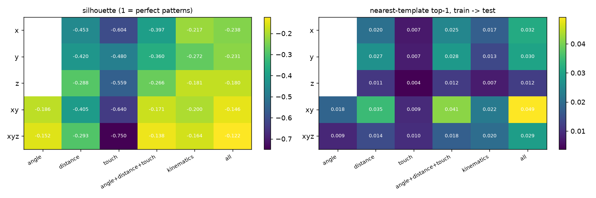
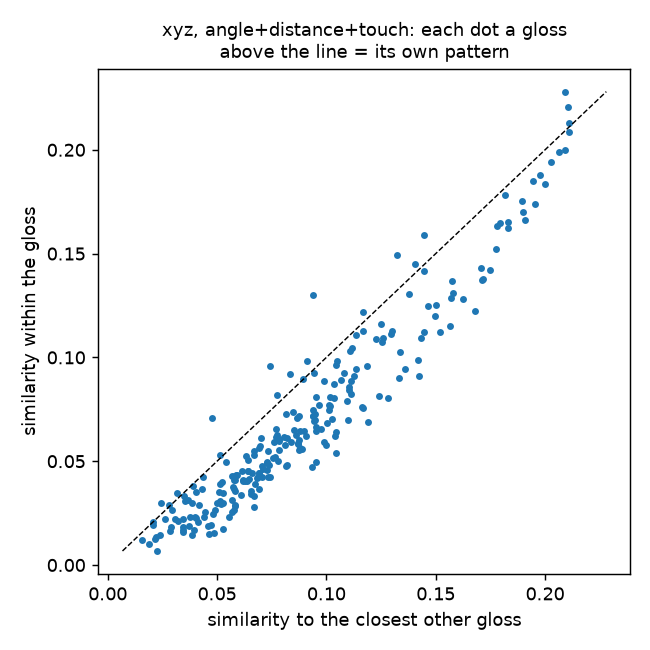

# Does each sign have a kinematic pattern? Intra- vs inter-gloss similarity on all 250 GISLR glosses

**Status: complete (2026-09-25). No model trained.** TODO §3.8. Narrative:
[docs/logs/daily/2026-09-25.md](../logs/daily/2026-09-25.md).

| | |
|---|---|
| **Question** | The user asked (2026-09-25): compute interpretable variables per clip (normalized angles, pair distances, variance of displacement/velocity/acceleration/jerk, touch counts), per axis. Is every gloss's pattern tight within the gloss and distinct from other glosses, so that each sign generalizes to a pattern? |
| **Instrument** | `experiments/recognition/gislr.0.dataset.sign-patterns.ipynb` over `sb.recognize.patterns` |
| **Data** | GISLR_Stratified, all **94,477 clips**: tests on the 75,581 `train.csv` clips, templates `train` → `test` (18,896) |
| **Settings** | axes `x`, `y`, `z`, `xyz` (the user's four) and `xy` (what the models use) × 6 variable families × hands as labeled / relabeled so "right" = the hand seen more |
| **Artifacts** | `data/cache/gislr/sign_patterns/{descriptors/, results.csv, results.json, fisher.csv, per_gloss.csv}` |

---

## 1. Method (the user's 7 steps)

Per clip, for one axis setting:

1. **Reference point**: minus the mid-shoulder point of each frame.
2. **Scale**: ÷ the clip's median shoulder width in xy. One scale serves every axis setting, because
   the shoulder width along y or z alone is about 0.
3. **Angles** at each elbow, shoulder and wrist. They need at least two axes, so the `x`/`y`/`z` runs
   have none.
4. **Distances**: hand ↔ hand, hand ↔ face (nose tip), hand ↔ chest (mid-shoulder).
5. **Null frames dropped**: no shoulders or no hand. This removed 39.1% of frames; no clip lost all
   of its frames. A hand missing inside a kept frame stays NaN, and every statistic is NaN-aware.
6. **Variances** of displacement, velocity, acceleration and jerk for 11 points (per axis) and for
   every distance, plus the mean of each angle and distance.
7. **Touches**: onsets of hand–hand and hand–face contact (closest points < 0.12 shoulder widths, with
   hysteresis), plus the fraction of frames in contact.

Tests on the standardized variables (heavy-tailed ones `log1p`-compressed):

- **intra / inter**: mean cosine similarity of two clips of the same gloss vs two of different glosses.
- **nearest rival**: each gloss's mean similarity to its single most similar other gloss.
- **separable**: share of glosses whose own clips are more alike than their nearest rival.
- **silhouette**: +1 = perfect patterns, 0 = overlapping, < 0 = a clip sits closer to another gloss.
- **nearest template**: the mean vector per gloss from `train`, each `test` clip assigned to the closest
  one. Chance is 0.4%.

## 2. Headline: no — these variables do not give each sign its own pattern

Hands relabeled to dominant. The "as labeled" rows have lower template accuracy (xy, all: 3.8%) but sometimes
a less negative silhouette (`results.csv` has both):

| axes | variables | intra | inter | nearest rival | separable glosses | silhouette | template top-1 | top-5 |
|---|---|---|---|---|---|---|---|---|
| x | angle+distance+touch | 0.285 | 0.081 | 0.365 | 2.0% | −0.397 | 2.5% | 9.7% |
| y | angle+distance+touch | 0.293 | 0.089 | 0.365 | 5.2% | −0.360 | 2.8% | 10.9% |
| z | angle+distance+touch | 0.149 | 0.087 | 0.202 | 2.0% | −0.266 | 1.2% | 5.2% |
| xyz | angle+distance+touch | 0.071 | 0.005 | 0.091 | 7.2% | −0.138 | 1.8% | 7.2% |
| xy | angle+distance+touch | 0.107 | 0.005 | 0.127 | 13.6% | −0.171 | 4.1% | 15.1% |
| **xy** | **all (+ point kinematics)** | 0.107 | 0.023 | 0.125 | **16.0%** | −0.146 | **4.9%** | **16.3%** |
| xyz | all | 0.076 | 0.025 | 0.097 | 10.8% | −0.122 | 2.9% | 10.3% |

(x/y/z single-axis rows have no angles; `n_vars` is in `results.csv`.)

- **Intra > inter holds on average.** Two clips of the same gloss are more alike than two random clips,
  in every setting. So the variables carry *some* sign identity.
- **Every gloss has a rival closer than itself.** The nearest other gloss is more similar than the gloss's
  own clips in every setting (nearest rival > intra). At best 16% of glosses are tighter than their
  nearest rival.
- **Silhouette is negative everywhere.** For the user's combined variables in `xyz`, it is negative for
  **all 250 glosses** (median −0.14). A typical clip sits closer to some other gloss than to its own.
- **Templates barely generalize.** The best setting (`xy`, all variables) gets 4.9% top-1 and 16.3% top-5
  on unseen clips: 12× chance, but far from the trained GRU's ~74% on the same split.

## 3. Axis comparison: x ≈ y > z; adding z hurts

- Each axis alone is weak. x and y are about equal (template top-1 3.2% / 3.0%, all variables) and z is
  the weakest (1.2%).
- **`xy` beats `xyz` in every family except touch** (all: 4.9% vs 2.9%; separable 16% vs 11%; touch 0.9% vs 1.0%). The z channel adds
  noise. MediaPipe's z is measured relative to each part (pose to the hips, hands to the wrist, face to the
  face centre), so distances along z mix scales. This matches the repo's earlier finding that z is mostly noise
  (`docs/logs/daily/2026-07-15.md`, `2026-07-16.md`).
- Single-axis intra/inter numbers look higher only because a handful of variables are more correlated
  across all clips. Their silhouettes are the worst.

## 4. Which variables carry sign identity (Fisher ratio, `xyz`, dominant hand)

Between-gloss variance ÷ within-gloss variance; 1 would mean the glosses differ as much as clips within
a gloss do:

| rank | variable | Fisher |
|---|---|---|
| 1 | dominant hand touching the face, fraction of frames | 0.91 |
| 2 | dominant hand ↔ face touch count | 0.53 |
| 3 | dominant hand ↔ face mean distance | 0.50 |
| 4–7 | spread (displacement variance) of the dominant index tip / hand / wrist / elbow | 0.15–0.17 |
| 9 | dominant wrist angle, mean | 0.11 |

By family, median Fisher: touch 0.27 > distance 0.026 > angle 0.022 > point kinematics 0.016. **Where
the hand goes relative to the face** is the strongest single cue. Arm angles and the variances of
velocity, acceleration and jerk are almost the same across glosses. Every derivative order beyond
displacement adds little: of the top 20 variables, 12 are displacement variances or means, 2 are touches, and only 6 are velocity, acceleration or jerk.

**Handedness matters.** GISLR labels left/right as seen by the model, and in 42% of clips the "left" hand
is the one seen more. Relabeling to the dominant hand raises template top-1 (xy, all: 3.8% → 4.9%). Any
pattern-based method has to canonicalize handedness first.

## 5. Per gloss

With `xyz` and angle+distance+touch, **no** gloss has a positive silhouette:

- The most pattern-like glosses are face-contact signs: `shhh`, `minemy`, `have`, `clown`, `chin`,
  `fireman`, `lion`.
- The least pattern-like are signs defined by handshape or by movement in neutral space: `garbage`,
  `lamp`, `girl`, `hen`, `pizza`, `airplane`, `look`.

Their nearest rivals share location, not meaning: `duck`/`bird`, `frog`/`shhh`, `chin`/`shhh`.
`per_gloss.csv` has every gloss.

## 6. Why, and what would make a "pattern" work

The variables summarize a whole clip into orderless statistics of the arm and hand position. Signs are
distinguished by four things (ASL phonology): **handshape**, **location**, **movement** and **palm
orientation**. The variables here cover location coarsely and movement as a magnitude only:

- no finger configuration, so handshape is invisible;
- no temporal order: "towards the face then away" has the same variances as the reverse;
- no palm orientation.

Within-gloss variation between signers (speed, size, style, partial clips) is as large as the differences
this summary can express.

If the goal is a pattern per sign without a trained network, the next steps in order of expected gain:

1. **Add handshape**: finger joint angles and fingertip distances for the dominant hand (the 20 finger
   angles in `sb.recognize.interp.kinematics`). Measured the same way.
2. **Keep time**: resample each clip to a fixed number of steps and compare trajectories (the dominant
   hand's location relative to the face and chest, plus handshape) by DTW distance to per-gloss
   templates, rather than comparing variances.
3. **Canonicalize** handedness (as here) and signing speed (time normalization) before templating.

Each is a nearest-template test like §2, so it answers the same question without training.
