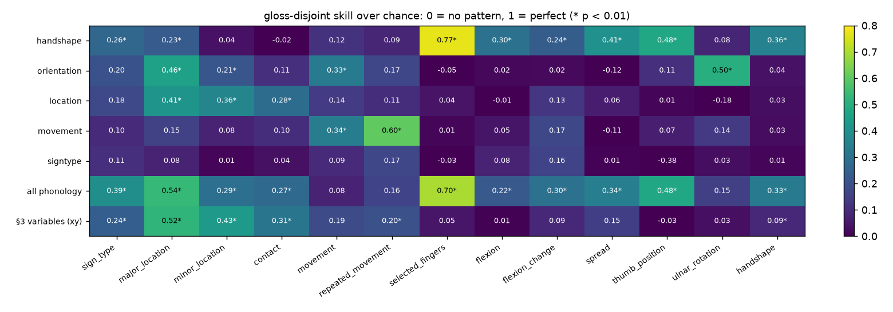

# Does each sign have a kinematic pattern? Intra- vs inter-gloss similarity on all 250 GISLR glosses

**Status: complete (2026-09-25). No model trained.** TODO §3.8. **Update (§7, same day): with handshape, orientation, location and movement variables, patterns exist per phonological parameter (every ASL-LEX parameter recovered on unseen signs, p < 0.005), and per-sign templates reach 38.8% top-1 (§2: 4.9%). §8: keeping time order with DTW over per-frame phonology reaches 41.6% top-1 / 66.8% top-5, and 15.2% from one example per sign.** Narrative:
[docs/logs/daily/2026-09-25.md](../logs/daily/2026-09-25.md).

| | |
|---|---|
| **Question** | The user asked (2026-09-25): compute interpretable variables per clip (normalized angles, pair distances, variance of displacement/velocity/acceleration/jerk, touch counts), per axis. Is every gloss's pattern tight within the gloss and distinct from other glosses, so that each sign generalizes to a pattern? |
| **Instrument** | `experiments/recognition/gislr.0.dataset.sign-patterns.ipynb` over `sb.recognize.patterns` |
| **Data** | GISLR_Stratified, all **94,477 clips**: tests on the 75,581 `train.csv` clips, templates `train` → `test` (18,896) |
| **Settings** | axes `x`, `y`, `z`, `xyz` (the user's four) and `xy` (what the models use) × 6 variable families × hands as labeled / relabeled so "right" = the hand seen more |
| **Artifacts** | `data/cache/gislr/sign_patterns/{descriptors/, results.csv, results.json, fisher.csv, per_gloss.csv}` |

---

## 1. Method (the user's 7 steps)

Per clip, for one axis setting:

1. **Reference point**: minus the mid-shoulder point of each frame.
2. **Scale**: ÷ the clip's median shoulder width in xy. One scale serves every axis setting, because
   the shoulder width along y or z alone is about 0.
3. **Angles** at each elbow, shoulder and wrist. They need at least two axes, so the `x`/`y`/`z` runs
   have none.
4. **Distances**: hand ↔ hand, hand ↔ face (nose tip), hand ↔ chest (mid-shoulder).
5. **Null frames dropped**: no shoulders or no hand. This removed 39.1% of frames; no clip lost all
   of its frames. A hand missing inside a kept frame stays NaN, and every statistic is NaN-aware.
6. **Variances** of displacement, velocity, acceleration and jerk for 11 points (per axis) and for
   every distance, plus the mean of each angle and distance.
7. **Touches**: onsets of hand–hand and hand–face contact (closest points < 0.12 shoulder widths, with
   hysteresis), plus the fraction of frames in contact.

Tests on the standardized variables (heavy-tailed ones `log1p`-compressed):

- **intra / inter**: mean cosine similarity of two clips of the same gloss vs two of different glosses.
- **nearest rival**: each gloss's mean similarity to its single most similar other gloss.
- **separable**: share of glosses whose own clips are more alike than their nearest rival.
- **silhouette**: +1 = perfect patterns, 0 = overlapping, < 0 = a clip sits closer to another gloss.
- **nearest template**: the mean vector per gloss from `train`, each `test` clip assigned to the closest
  one. Chance is 0.4%.

## 2. Headline: no — the first variables do not give each sign its own pattern (see §7 for what does)

Hands relabeled to dominant. The "as labeled" rows have lower template accuracy (xy, all: 3.8%) but sometimes
a less negative silhouette (`results.csv` has both):

| axes | variables | intra | inter | nearest rival | separable glosses | silhouette | template top-1 | top-5 |
|---|---|---|---|---|---|---|---|---|
| x | angle+distance+touch | 0.285 | 0.081 | 0.365 | 2.0% | −0.397 | 2.5% | 9.7% |
| y | angle+distance+touch | 0.293 | 0.089 | 0.365 | 5.2% | −0.360 | 2.8% | 10.9% |
| z | angle+distance+touch | 0.149 | 0.087 | 0.202 | 2.0% | −0.266 | 1.2% | 5.2% |
| xyz | angle+distance+touch | 0.071 | 0.005 | 0.091 | 7.2% | −0.138 | 1.8% | 7.2% |
| xy | angle+distance+touch | 0.107 | 0.005 | 0.127 | 13.6% | −0.171 | 4.1% | 15.1% |
| **xy** | **all (+ point kinematics)** | 0.107 | 0.023 | 0.125 | **16.0%** | −0.146 | **4.9%** | **16.3%** |
| xyz | all | 0.076 | 0.025 | 0.097 | 10.8% | −0.122 | 2.9% | 10.3% |

(x/y/z single-axis rows have no angles; `n_vars` is in `results.csv`.)

- **Intra > inter holds on average.** Two clips of the same gloss are more alike than two random clips,
  in every setting. So the variables carry *some* sign identity.
- **Every gloss has a rival closer than itself.** The nearest other gloss is more similar than the gloss's
  own clips in every setting (nearest rival > intra). At best 16% of glosses are tighter than their
  nearest rival.
- **Silhouette is negative everywhere.** For the user's combined variables in `xyz`, it is negative for
  **all 250 glosses** (median −0.14). A typical clip sits closer to some other gloss than to its own.
- **Templates barely generalize.** The best setting (`xy`, all variables) gets 4.9% top-1 and 16.3% top-5
  on unseen clips: 12× chance, but far from the trained GRU's ~74% on the same split.

## 3. Axis comparison: x ≈ y > z; adding z hurts

- Each axis alone is weak. x and y are about equal (template top-1 3.2% / 3.0%, all variables) and z is
  the weakest (1.2%).
- **`xy` beats `xyz` in every family except touch** (all: 4.9% vs 2.9%; separable 16% vs 11%; touch 0.9% vs 1.0%). The z channel adds
  noise. MediaPipe's z is measured relative to each part (pose to the hips, hands to the wrist, face to the
  face centre), so distances along z mix scales. This matches the repo's earlier finding that z is mostly noise
  (`docs/logs/daily/2026-07-15.md`, `2026-07-16.md`).
- Single-axis intra/inter numbers look higher only because a handful of variables are more correlated
  across all clips. Their silhouettes are the worst.

## 4. Which variables carry sign identity (Fisher ratio, `xyz`, dominant hand)

Between-gloss variance ÷ within-gloss variance; 1 would mean the glosses differ as much as clips within
a gloss do:

| rank | variable | Fisher |
|---|---|---|
| 1 | dominant hand touching the face, fraction of frames | 0.91 |
| 2 | dominant hand ↔ face touch count | 0.53 |
| 3 | dominant hand ↔ face mean distance | 0.50 |
| 4–7 | spread (displacement variance) of the dominant index tip / hand / wrist / elbow | 0.15–0.17 |
| 9 | dominant wrist angle, mean | 0.11 |

By family, median Fisher: touch 0.27 > distance 0.026 > angle 0.022 > point kinematics 0.016. **Where
the hand goes relative to the face** is the strongest single cue. Arm angles and the variances of
velocity, acceleration and jerk are almost the same across glosses. Every derivative order beyond
displacement adds little: of the top 20 variables, 12 are displacement variances or means, 2 are touches, and only 6 are velocity, acceleration or jerk.

**Handedness matters.** GISLR labels left/right as seen by the model, and in 42% of clips the "left" hand
is the one seen more. Relabeling to the dominant hand raises template top-1 (xy, all: 3.8% → 4.9%). Any
pattern-based method has to canonicalize handedness first.

## 5. Per gloss

With `xyz` and angle+distance+touch, **no** gloss has a positive silhouette:

- The most pattern-like glosses are face-contact signs: `shhh`, `minemy`, `have`, `clown`, `chin`,
  `fireman`, `lion`.
- The least pattern-like are signs defined by handshape or by movement in neutral space: `garbage`,
  `lamp`, `girl`, `hen`, `pizza`, `airplane`, `look`.

Their nearest rivals share location, not meaning: `duck`/`bird`, `frog`/`shhh`, `chin`/`shhh`.
`per_gloss.csv` has every gloss.

## 6. Why, and what would make a "pattern" work

The variables summarize a whole clip into orderless statistics of the arm and hand position. Signs are
distinguished by four things (ASL phonology): **handshape**, **location**, **movement** and **palm
orientation**. The variables here cover location coarsely and movement as a magnitude only:

- no finger configuration, so handshape is invisible;
- no temporal order: "towards the face then away" has the same variances as the reverse;
- no palm orientation.

Within-gloss variation between signers (speed, size, style, partial clips) is as large as the differences
this summary can express.

If the goal is a pattern per sign without a trained network, the next steps in order of expected gain:

1. **Add handshape**: finger joint angles and fingertip distances for the dominant hand (the 20 finger
   angles in `sb.recognize.interp.kinematics`). Measured the same way.
2. **Keep time**: resample each clip to a fixed number of steps and compare trajectories (the dominant
   hand's location relative to the face and chest, plus handshape) by DTW distance to per-gloss
   templates, rather than comparing variances.
3. **Canonicalize** handedness (as here) and signing speed (time normalization) before templating.

Each is a nearest-template test like §2, so it answers the same question without training.

## 7. Follow-up (same day): patterns exist per phonological parameter, and they carry sign identity

§6's diagnosis was tested directly (research note B1 + B2,
[improvements-research.md](improvements-research.md)). Still no model is trained.

**Variables added** (`sb.recognize.patterns.phonology_descriptors`, 125 after cleaning), one family per
ASL phonological parameter:

- **handshape** (75): 15 finger flexion angles, fingertip-to-wrist distance ÷ palm size, 4 spread angles,
  thumb–index gap; each as mean, std, and change over the sign (last third − first third);
- **orientation** (14): palm normal and pointing direction;
- **location** (22): the hand's distance to nose, chin, forehead, mouth, shoulder, chest and the other
  hand, and the share of frames near each;
- **movement** (11): path length, net displacement, straightness, extent, direction reversals, turning,
  speed;
- **signtype** (3 survive): hand presence, inter-hand distance, velocity correlation.

The left hand is computed mirrored, so relabeling to the dominant hand is an exact mirror.

**Ground truth.** ASL-LEX 2.0 phonological codes (`sb.recognize.aslex`, CC BY-NC 4.0, downloaded to
`data/external/asl_lex/`). **233 of 250 glosses map** (updated 2026-09-25 — see below):

- 209 exactly;
- 24 through same-sign synonyms (MOM = MOTHER, GARBAGE = TRASH, EYE = EYES, WAKE = AWAKE, …);
- 17 unmapped, including `say`, `shhh`, `puppy` and `sleepy`, where ASL-LEX's own docstring
  (`sb.recognize.aslex`) explicitly treats the closest entry as a *different* sign — `sleepy` vs.
  `tired`, and (originally) `look` vs. `see`.

**A real tension worth naming.** §9's direct landmark check finds `look`/`see` and (via the
`sleep`/`sleepy`/`nap` group) `sleepy` kinematically near-identical *in this GISLR data*
(confusability 1.147 and 0.951 — both far below the random-pair baseline of ~1.27), and
`sb.recognize.label_merge` treats them as the same sign for evaluation on that basis. ASL-LEX's
curators — a broader, citation-form reference lexicon, not GISLR's signers — apparently
disagree for at least `look`/`see` and `sleepy`/`tired`. Both can be right: a citation-form
lexicon records the sign as ASL formally distinguishes it, while a corpus of extemporaneous
child-directed signing can show two citation-distinct signs produced identically, or one
gloss's actual GISLR clips drifting toward a near-synonym's form. Not resolved here — flagged
for whoever curates ASL-LEX's next release, or for inspecting individual GISLR clips by hand.

A parameter counts for a gloss only if all its ASL-LEX variants agree.

**Test.** Each score is **gloss-disjoint**: a value's template is built from *other* signs than the one
tested, so passing means the pattern transfers to unseen signs.

- Leave-one-gloss-out nearest template on per-gloss mean descriptors, as balanced accuracy.
- A 200-shuffle null. Every entry below has p < 0.005 (no shuffle did as well).
- The same at clip level (train-clip templates → test clips of held-out glosses).

### 7.1 Each family recovers its own parameter on unseen signs

| ASL-LEX parameter (values tested) | best family | chance | gloss-level bal. acc | clip-level |
|---|---|---|---|---|
| selected fingers (6) | **handshape** | 0.17 | **0.81** | 0.63 |
| repeated movement (2) | **movement** | 0.50 | **0.80** | 0.59 |
| ulnar rotation (2) | **orientation** | 0.50 | **0.75** | 0.59 |
| thumb position (2) | **handshape** | 0.50 | **0.74** | 0.68 |
| spread (2) | handshape | 0.50 | 0.70 | 0.57 |
| contact (2) | §3 variables (touch) | 0.50 | 0.66 | 0.57 |
| major location (Head/Neutral/Body/Hand) | all phonology | 0.25 | 0.65 | 0.50 |
| flexion change (2) | all phonology | 0.50 | 0.65 | 0.57 |
| movement shape (Straight/Curved/Circular) | **movement** | 0.33 | 0.56 | 0.43 |
| sign type (one-handed, symmetric, …) | all phonology | 0.25 | 0.55 | 0.40 |
| minor location (10) | §3 variables | 0.10 | 0.49 | 0.25 |
| flexion (5) | handshape | 0.20 | 0.44 | 0.34 |
| handshape (17) | handshape | 0.06 | 0.39 | 0.30 |

The grid is close to diagonal: each family predicts the parameter it was built for. Handshape → selected
fingers / thumb / spread / handshape; location → major/minor location and contact; movement → repeated
movement and movement shape; orientation → ulnar rotation. Most mismatched pairs sit near chance (e.g.
location → selected fingers 0.20 vs chance 0.17). The exception is orientation → major location (skill 0.46),
because palm direction changes with where the hand is. Skill = (bal. acc − chance) / (1 − chance). The **pattern per parameter is real and
generalizes across signs**; the user's idea holds at this level.

Weak spots: **sign type** (one- vs two-handed) is poorly captured because the non-dominant hand is tracked
in few frames (each hand in ~30% of GISLR frames), and **movement shape** (0.56) is limited by orderless
path statistics.

### 7.2 With these parameters, whole-sign patterns appear

§2's test again (per-gloss templates, train → test clips, 250 glosses):

| variables | n | separable glosses | silhouette | top-1 | top-5 |
|---|---|---|---|---|---|
| §3 variables (the user's, xy, dominant) | 111 | 16% | −0.146 | 4.9% | 16.3% |
| handshape only | 75 | 38% | −0.164 | **26.1%** | 48.8% |
| orientation only | 14 | 23% | −0.275 | 10.8% | 29.6% |
| location only | 22 | 9% | −0.396 | 6.6% | 19.6% |
| movement only | 11 | 11% | −0.276 | 2.7% | 9.3% |
| **all phonology** | 125 | **70%** | **−0.086** | **38.8%** | **61.9%** |
| all phonology + §3 | 236 | 72% | −0.072 | 36.5% | 59.3% |

- **Handshape was the missing ingredient.** Alone it gives 5× the template accuracy of all of §3's
  variables.
- With all four parameters, **70% of glosses are tighter than their nearest rival** (§2: 16%). A single
  mean template per sign, with no fitted weights, gets 38.8% top-1 (97× chance) on unseen clips.
- Adding §3's variables on top slightly *lowers* accuracy: they are mostly redundant with location and
  add noise.
- Silhouette is still negative at clip level. Single clips are noisy (partial clips, 30% hand detection),
  while gloss means are clean. That is why gloss-level tests are strong and clip-level ones weaker.

For scale: the trained GRU gets ~74% top-1. Orderless templates reach half of that with no training.

### 7.3 What is left, and what this enables

- **Time order** (research note B3): movement is the weakest family. It is summarized, not compared as a
  trajectory. §8 tests DTW over time-normalized sequences.
- **Two-handedness**: needs a better handle on the non-dominant hand (presence is too sparse to use as is).
- **Uses:**
  - custom signs (§12.4/§12.7): a new sign can be described, and matched, as a parameter combination from
    one or two examples;
  - the confusable pairs (`give`/`gift`, `awake`/`wake`) can be checked for which parameter they share;
  - an interpretable parameter-level readout could sit beside the GRU.

## 8. Time order: DTW over per-frame phonology (research note B3, same day)

§7 still summarized each clip over time. Here each clip keeps its time course.

**Setup:**
- 39 per-frame channels of the dominant hand (`patterns.phonology_sequence`), mirrored for left-dominant
  clips: handshape 25, orientation 6, location 5, other hand 3.
- Gaps interpolated, resampled to 32 steps (normalizes signing speed); each family weighted equally.
- Every `test` clip is matched to its nearest of K = 20 `train` exemplars per gloss.
- The distances compared all use the same exemplars and channels, so the table isolates what order and
  warping add. DTW runs on the GPU (`patterns.dtw_distances`), checked against a naive DTW to 7e-6.
- 96.3% of clips have a usable dominant hand; the test set is 18,183 clips.

| channels | orderless (time average) | lockstep | DTW ±4 | DTW ±8 | DTW ±16 | DTW, no band |
|---|---|---|---|---|---|---|
| handshape | 24.6% | 24.2% | 28.0% | | | |
| orientation | 4.9% | 8.3% | 10.0% | | | |
| location | 3.3% | 7.2% | 8.4% | | | |
| **all** | 34.5% | 36.8% | 40.1% | 41.1% | 41.5% | **41.6%** (top-5 66.8%) |

- **Order helps, and warping helps more.** For the same channels: orderless 34.5% → lockstep 36.8%
  (+2.3) → DTW 41.6% (+4.8). A wider band is better up to about ±16 steps (half the sign). Signers
  differ in timing more than a fixed resampling can absorb.
- **Order matters most where movement lives.** Location goes 3.3% → 8.4% and orientation 4.9% → 10.0%,
  both more than double. Handshape, mostly static, gains less (24.6% → 28.0%).
- **Against §7.2:** DTW on 39 channels (41.6%) edges out the orderless template on 125 variables (38.8%).
  The two methods differ in matching as well as in order (exemplar nearest neighbour vs one mean per
  gloss); within one method, order is worth +7.1 points.

**Few-shot** (DTW, no band, all channels):

| exemplars per gloss | top-1 | top-5 |
|---|---|---|
| 1 | 15.2% (38× chance) | 32.5% |
| 5 | 27.8% | 51.1% |
| 20 | 41.6% | 66.8% |

This is the regime custom signs (§12.7) would run in: one or a few recordings per new sign, no training.

**Per gloss.** Median accuracy is 39.7%; 29.6% of glosses reach ≥ 50%, and only one (0.4%) is below 10%.

- Best: `uncle` 85%, `airplane` 80%, `brown` 78%, `cow` 77%, `callonphone` 76%. These signs have
  distinctive handshape + location combinations.
- Worst, and their most common wrong answer:
  - `give` → `gift` 13%, `pen` → `pencil` 14%, `mouth` → `lips` 14%: near-identical sign pairs, the same
    ones the trained models confuse (`five-arch-benchmark.md`);
  - `there` 10%, `go` 15%, `why` 14%, `on` 17%, `touch` 15%: short pointing or contact signs whose shape
    is common.

### 8.1 Where this leaves the pattern question

| method (no training) | top-1 | top-5 |
|---|---|---|
| the user's 7-step variables, per-gloss template (§2) | 4.9% | 16.3% |
| + handshape / orientation / location / movement, per-gloss template (§7.2) | 38.8% | 61.9% |
| per-frame phonology, DTW, 20 exemplars (§8) | **41.6%** | **66.8%** |
| trained GRU (for scale) | ~74% | – |

A sign is recognizable as a pattern of phonological parameters over time. Without any training that
reaches about 42% top-1 over 250 glosses, and about 15% from a single example. The remaining gap to a
trained model is about half the accuracy. It comes from near-identical sign pairs, short pointing signs,
and noisy single clips (each hand is detected in only ~30% of frames).

**Next, if pursued:**
- a learned per-parameter embedding (the PhonSSM idea) instead of hand-set channel weights;
- using DTW templates for custom-sign enrollment (§12.4/§12.7) and comparing them with the cosine-head
  imprinting planned there.

## 9. How similar are the signs, directly? Intra- vs. inter-gloss DTW distance (2026-09-25)

**User: "run an experiment to see just how similar the signs are. No model training, work
with the landmark files."** §7.3 had listed this as a follow-up ("the confusable pairs
… can be checked for which parameter they share"). Direct answer, from the same cached
per-frame phonology sequences §8 built from the raw landmark files — no training,
no classifier.

**Method.** For a pair of glosses, sample 40 clips of each; compute GPU DTW distance
(`patterns.dtw_distances`, unconstrained band) between same-gloss clips (**within**,
pooled over both glosses) and between-gloss clips (**between**). **Confusability index**
= mean(between) / mean(within): 1.0 means the two glosses are indistinguishable by this
metric; higher means kinematically separable. Three groups tested, so the metric checks
itself:

1. **`sb.recognize.label_merge`'s 9 merge groups** — semantically the same and
   empirically confused. Expected near 1.0.
2. **Rejected pairs** (empirically confused, but judged *not* a semantic duplicate:
   `cut`/`scissors`, `goose`/`duck`, `bedroom`/`bed`, `bedroom`/`room`, `dryer`/`dry`,
   `hear`/`ear`, `wait`/`finger`, `touch`/`find`, `please`/`minemy`, `bad`/`thankyou`,
   `stay`/`that`, `animal`/`have`).
3. **12 random gloss pairs** — this notebook's usual calibration control.

### Results

| group | mean confusability | median | min | max | n |
|---|---|---|---|---|---|
| merge | **1.043** | 1.051 | 0.951 | 1.147 | 11 |
| rejected | **1.060** | 1.058 | 0.998 | 1.143 | 12 |
| random | **1.271** | 1.234 | 1.081 | 1.457 | 12 |

**The merge groups are kinematically near-indistinguishable** (4.3% farther apart
between-gloss than within-gloss on average) **and clearly separable from random pairs**
(1.271, ~3x further from 1.0) — the merge decision is a real property of the signs, not a
relabeling of a modeling gap.

**Correction, found by actually running this**: the *rejected* pairs are **just as
kinematically close as the merge groups** (1.060 vs 1.043). §7.3 speculated that if these
came out separable here, their confusion would have "a different, non-kinematic source" —
they didn't come out separable. `goose`/`duck` (0.998) and `wait`/`finger` (1.023) are
*more* kinematically identical than several merge pairs. **These are true near-homophones
in this vocabulary** — visually near-identical signs for unrelated concepts, ordinary
lexical homophony, not a separate fixable model weakness. Leaving them as distinct
*labels* (`label-merging.md`'s decision) is still correct — `cut` and `scissors` mean
different things — but "the model should tell these apart from landmarks alone" was too
optimistic specifically for these pairs.

**Per-family — which parameter each merge pair actually shares** (near 1.0 = shared;
`other_hand` is the noisiest column — each hand is tracked in only ~30% of frames, so its
ratios swing widest, 0.50–1.63):

| pair | handshape | orientation | location | other_hand |
|---|---|---|---|---|
| `sleep`/`sleepy` | 0.985 | 0.981 | 0.983 | 0.499 |
| `awake`/`wake` | 1.016 | 0.994 | 0.998 | 0.845 |
| `mouth`/`lips` | 1.034 | 0.982 | 0.961 | 0.890 |
| `listen`/`hear` | 1.046 | 0.959 | 1.025 | 1.223 |
| `give`/`gift` | 1.076 | 1.045 | 0.998 | 0.500 |
| `pencil`/`pen` | 1.024 | 1.066 | 1.047 | 1.493 |
| `nap`/`sleep` | 1.096 | 1.152 | 1.060 | 0.770 |
| `nap`/`sleepy` | 1.120 | 1.052 | 1.054 | 1.019 |
| `puppy`/`dog` | 1.033 | 1.084 | 1.081 | 1.094 |
| `kitty`/`cat` | 1.117 | 1.119 | 1.051 | 1.265 |
| `look`/`see` | 1.130 | 1.287 | 0.988 | 1.627 |

- `sleep`/`sleepy`, `awake`/`wake`, `mouth`/`lips` share **every** family near-exactly —
  uniformly, not through one dominant channel.
- `give`/`gift` and `pencil`/`pen` share **location** most tightly — the handoff position
  and the pinch-grip position, respectively.
- `look`/`see` is the **weakest** merge pair by this test too (1.147) — separable on
  orientation (1.287) and `other_hand` (1.627), sharing only location (0.988, both near
  the eyes). Matches it also being the weakest by raw empirical confusion (0.080 mean
  rate, the lowest of the 9 — `label-merging.md`): two independent methods agree
  `look`/`see` is the most marginal of the nine merges.

Data: `data/cache/gislr/sign_patterns/sign_similarity.csv`. Method:
`experiments/recognition/gislr.0.dataset.sign-patterns.ipynb` §9.
