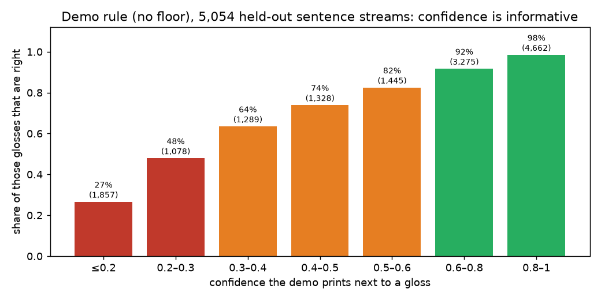

# Why the sign → speech demo says the wrong thing

**TODO §12.5/§12.6** · 2026-09-24 · diagnostic of `gislr.5.pipeline.sign-to-speech.demo.ipynb`
(the user's question: "the inference is outputting very misleading glosses and then the
translation is way off").

**Short answer.** Three things stack up:
1. The recognizer gets about **1 gloss in 5 wrong**. The errors are spread across many
   unrelated signs, not concentrated in a few look-alike pairs.
2. The demo runs **with no confidence floor**, so guesses it is unsure of are shown and
   spoken too.
3. The gloss → English rule engine **turns any gloss sequence into a fluent-looking
   sentence**. Wrong glosses come out as confident English, and even correct glosses
   often come out as awkward English.

None of these is a bug in the pipeline code. The streaming path equals the offline path
(`sign-to-speech-downstream.md` §5). They are limits of the current models and of the
demo's settings, and most of them can be fixed.

**Data.** All 5,054 held-out sentence streams (16 evaluation signers). They use C1's cached
per-frame outputs, which are the demo's streaming path (parity 293/300 + 7 float
near-ties). English is scored against the 132 draft references (`gloss2en.v1`, 389 streams
of those sentences). Artifacts: `data/cache/gislr/pipeline_demo/analysis/`
(`summary.json`, `alignments.parquet`, `sentences.parquet`).

## 1. What the demo showed

The demo's three printed examples and its 300-stream table are representative, not
unlucky:

| signed | recognized | English |
|---|---|---|
| if rain yourself haveto jacket | if rain yourself **later** jacket | If it will rain, you later the jacket. |
| giraffe tongue black | giraffe **red** black | The giraffe is red and black. |
| lips sticky | lips **cat** | The lips cat. |
| if rain weus stay home | if **shoe** weus stay home | If our shoe stays home. |
| person man police | person man police (correct) | The person man police. |
| shhh dad talk callonphone | (correct) | Shh, Dad talks call. |

Two different failures show up: **wrong glosses** (rows 1–4) and **bad English from
correct glosses** (rows 5–6).

## 2. Recognition: how often, how confident, and which signs

With the demo's rule (rescore λ=0.3, **no floor**):

| | demo rule (no floor) | floor + prior (θ=0.3) | wait 1 sign (lattice lag 1, θ=0.263) |
|---|---|---|---|
| sentences exactly right | **40.7%** | 33.7% | 34.7% |
| sentences with ≥1 **wrong or extra** gloss | **48.2%** | 25.1% | **21.8%** |
| sentences with ≥1 **missing** gloss | 17.9% | 52.6% | 53.7% |
| displayed glosses that are right (precision) | **77.7%** | 88.1% | **89.4%** |
| wrong glosses per signed sign | 0.197 | 0.088 | 0.078 |

- **About half of all demo sentences contain a wrong or invented gloss.** With 78%
  precision per gloss, a 3–5 sign sentence is more likely wrong than right. Exact-sentence
  accuracy is roughly per-sign accuracy raised to the sentence length, and the best
  isolated-sign model is at about 76% (`README.md`).
- **The confidence the demo prints is informative, and the demo ignores it.** Glosses at
  ≤ 0.2 are right only 27% of the time, and those at 0.2–0.3 only 48%. Those two bins are
  about a fifth (2,935 of 14,934) of everything the demo shows. Above 0.8, 98.5% are right. `later` at 0.19 in the
  first example is exactly this case.

- **The errors are a long tail.** Of 3,079 wrong glosses:
  - 7% are the documented look-alike pairs (`pair-similarity.md`: listen→hear,
    lips→mouth, awake→wake, pen↔pencil, dryer→dry, nap→sleep, goose→duck…);
  - 2% are near-meaning (grandpa→dad, grandma→mom);
  - under 1% are opposites (close→open);
  - **about 90% are unrelated signs** (can→bye, jump→read, clown→smile, tongue→red,
    rain→shoe).

  These are what make the output misleading: they change the meaning completely, and no
  single-pair fix removes them.
- **The worst signs** (recall on ≥ 20 occurrences): nap 32%, give 36%, ride 44%, there 44%,
  bedroom 44%, go 45%, beside 46%, close 47%, after 47%. The median gloss is recalled 75%
  of the time, and the bottom decile 58% or less. **Most-invented glosses:** beside, shoe,
  night, rain, go, dog, not, open.
- **The right sign is often not even a close second.** For a substituted gloss, the true
  sign is in the recognizer's top 3 only 38% of the time, and in its top 5 48%
  (selection signers). Passing alternatives downstream can repair some errors, not most.

## 3. Gloss → English: bad even when the glosses are right

The rule engine (`sb.rescore.gloss2en`) scores **chrF 73.6 / BLEU 57.9 on the true
glosses**. Recognition errors bring that down to **chrF 55.0 / BLEU 39.2** with the demo
rule, and **59% of streams get different English** than their true glosses would. The
floor and the lattice lower that to chrF 52–53, because missing words also cost chrF.
Fewer *wrong* words is still the less misleading failure.

Even with perfect glosses the engine fails in recognizable ways (worst of the 132
references, plus 60 random corpus sentences):

| pattern | example (true glosses → rules) | should be |
|---|---|---|
| noun lists without relations | `chin lips nose face` → The chin lips nose face. · `person man police` → The person man police. | The chin, lips and nose are on the face. · The man is a police officer. |
| missing locative preposition | `minemy cat sleep bed` → My cat sleeps the bed. · `wolf hide tree` → The wolf hides the tree. | …sleeps in the bed. · …hides behind the tree. |
| clauses and time order | `before sleep bath` → Sleep the bath. · `rain finish go outside` → Rain finish go to outside. · `stay home now rain` → Stay home now rain. | Take a bath before bed. · When the rain stops, go outside. |
| aspect/tense markers | `finish` as "already", `drop` → drops (fell), `vacuum finish room clean` → Vacuum the room clean. | I finished vacuuming… |
| pronouns and body words | `hesheit cry` → They cry. · `minemy nose owie cry` → My nose owie cries. | She is crying. · My nose hurts and I'm crying. |
| adjective vs verb | `hot water bath` → The hot water takes a bath. · `dryer shirt dry` → The dryer shirt is dry. | A hot bath. · The dryer dries the shirt. |

These are **semantic** decisions: which noun is the subject, how the clauses relate, what
`finish` means. A deterministic rule engine can patch individual patterns but cannot make
them in general. It also has no way to say "this doesn't make sense", so wrong glosses
become confident English: `can dog jump high` → `can bye read high` → "The bye can read high."

## 4. Suggested fixes, in order of effort

**A. Settings and UI (no training, now):**
1. **Turn the floor on in the demo and the client.**
   - Use the lag-2 lattice (k=5, λ=0.2, θ=0.269). It was confirmed on the evaluation signers
     (`sign-to-speech-downstream.md` §2.2) and beats the floor on missed, wrong and extra signs
     and on noise. The table above shows lag 1. Lag 2 was not scored in this analysis; on
     the evaluation signers its wrong-sign rate is 0.079 per sign vs lag 1's 0.078.
   - Sentences with a wrong or invented gloss drop from **48% to 22%**, and displayed-gloss
     precision rises from 78% to 89%. The price is more missed signs.
   - The demo already picks the next-gloss sweep's best rule when that file exists. The
     saved outputs predate the sweep ("rule_default"), so a re-run shows floor + prior.
     Pin the rule in `gislr.pipeline-demo.json` instead of relying on that.
2. **Show the uncertainty, don't hide it.**
   - Show glosses next to the English.
   - Grey out and mark any gloss under 0.5 (precision 27–74%).
   - Speak only when every gloss is ≥ 0.5, or ask the user to confirm ("did you sign
     *red*?").
   - The confidence is well calibrated enough to drive this.
3. **Refuse nonsense.** Show glosses only (no English, no speech) when the gloss sequence
   is very unlikely under the trigram (`can bye read high`) *and* a gloss is low
   confidence.

**B. Translation (no model training):**
4. **The LLM arm with alternatives.**
   - Send the top-3 glosses per sign with their confidences
     (`giraffe [red .60 | tongue .21 | lips .08] black`) to the Workers AI model, with the
     same content-word meaning guard the speech side uses.
   - This fixes the §3 patterns, and can repair the ~38% of substitutions whose true sign
     is in the top 3.
   - Needs `CLOUDFLARE_ACCOUNT_ID`/`CLOUDFLARE_API_TOKEN` in `.env`.
   - Add an arm to `gislr.4.downstream.gloss-to-english.ipynb` that uses recognized, not
     true, glosses.
5. **Patch the rule engine** for the offline fallback: coordination with "and" for noun
   lists, a place-noun → preposition table (bed, tree, farm…), `finish` as perfective,
   `before`/`after` clause order, `hesheit` → he/she, `owie` → hurts. Measure each patch on
   the references.
6. **End-to-end metric.** Score English from *recognized* glosses (as in this report) in
   the demo's integration check, not only gloss GER. Review the 132 draft references, and
   write more.

**C. Recognition (training, the user runs):**
7. **Per-sign accuracy is the ceiling.** With 90% of errors unrelated signs, the lever is a
   better recognizer overall, not pair fixes:
   - the isolated-sign leaderboard (≈76%) and C1's continuous training;
   - **noise as null** (already proposed);
   - targeted data for the worst glosses (nap, give, ride, there, go, beside…).
8. **Test on real signing** before tuning further. Every number here is on composed GISLR
   clips. A phone video will be worse (domain shift), and the demo's `VIDEO_FILE` path has
   not been run yet.

## Caveats

- The English references are 132 unreviewed Claude drafts (389 streams). Treat chrF/BLEU as
  a relative measure between settings.
- "Look-alike", "near-meaning" and "opposite" are hand-listed pairs. Everything else counts
  as unrelated, which slightly overstates the unrelated share.
- Streams are composed from isolated clips (see `continuous-models.md`). Real continuous
  signing has coarticulation this data doesn't.
