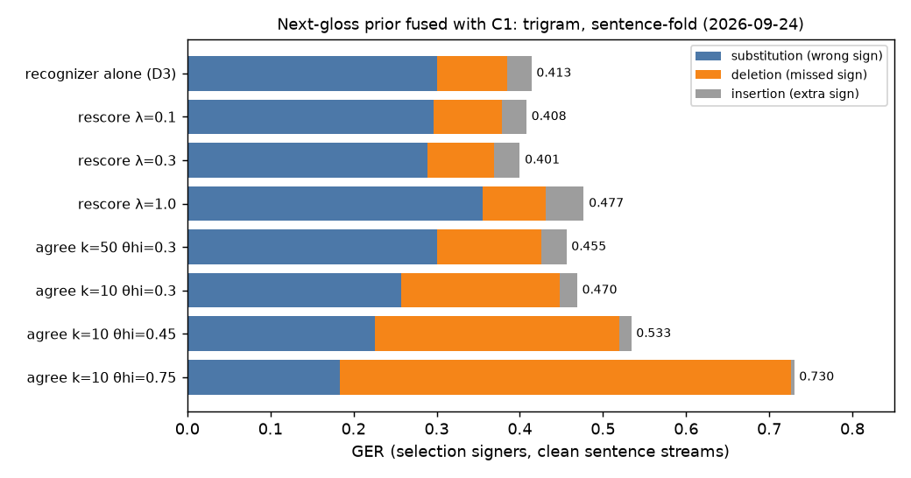
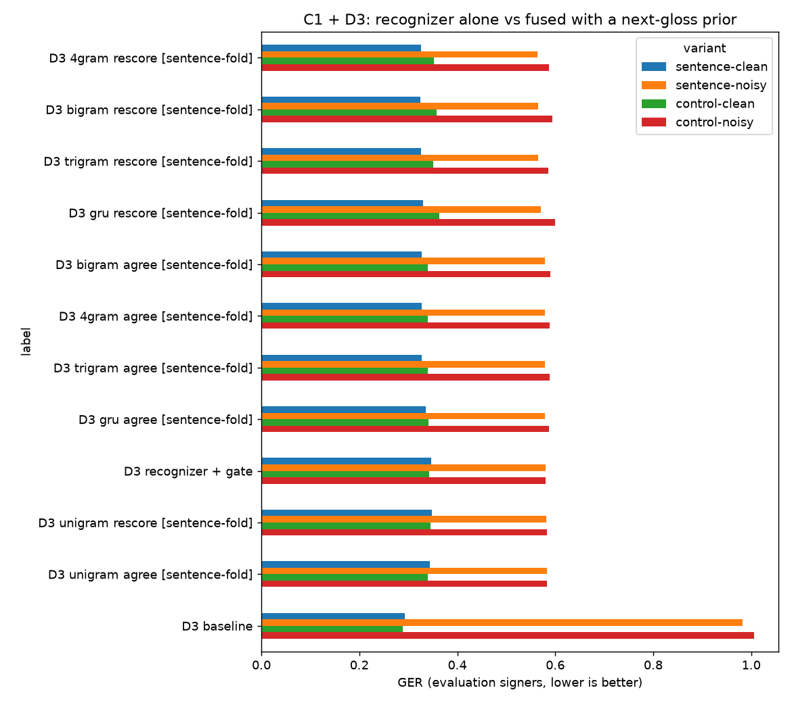
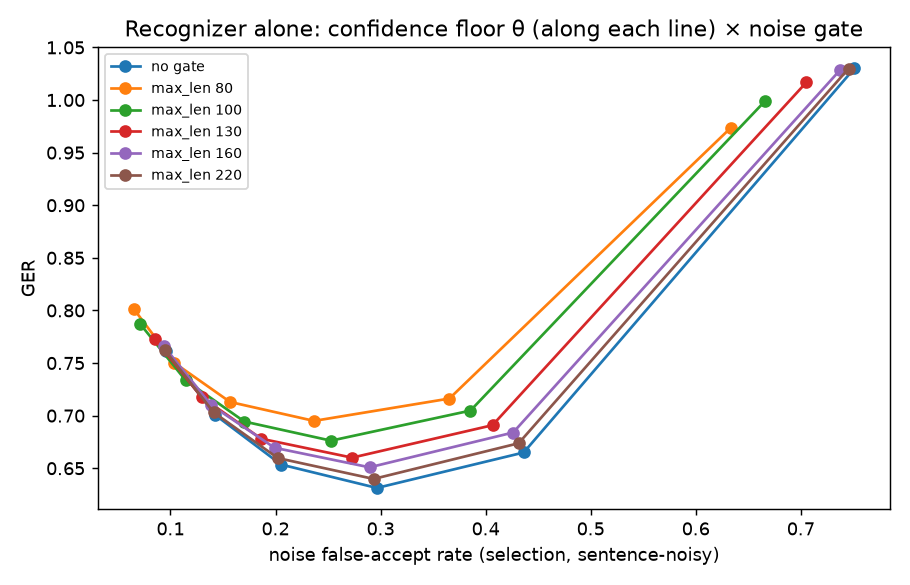
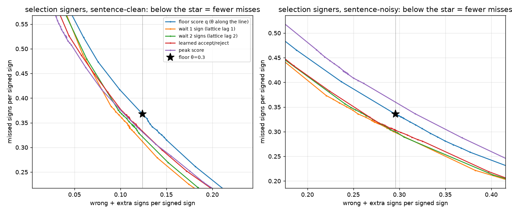

# Sign → speech after the recognizer: next-gloss prediction, gloss → English, speech

**TODO §12.6** · 2026-09-24 · status: stage 2 **complete** (full sweep + evaluation
signers, user run 2026-09-24, §2); floor-recall experiment run and refined on the
selection signers, evaluation check pending (§2.2); stage 3 rules arm, stage 4 client voices, and the
end-to-end integration check are run. The LLM arm and the Workers AI TTS arm are
**pending** (§7).

**Question.** C1 turns landmarks into glosses (GER 0.293, `continuous-models.md`). What
has to happen after that to *speak* a sentence, and how good is each step?

```
MediaPipe → [ recognizer (C1) + next-gloss prediction ] → gloss → English → speech
   stage 1        stage 2 (side by side, separate)          stage 3        stage 4
```

The stages stay **separate** (user decision, 2026-09-24): each one can be measured,
swapped and debugged alone. A single video → text model is future work (TODO Backlog).
Extraction and recognition run on the client (`deployment-research.md`).

## Summary

- **The whole chain runs, and the streaming path is the evaluated path.** On 300
  held-out streams, the browser's TFLite step model feeding the new frame-by-frame
  `OnlineDecoder` emits the same signs as the offline PyTorch + batch decoder on 293. The
  other 7 are float near-ties, and there are **0 unexplained** mismatches. On that sample,
  end to end: **GER 0.245, 47% of sentences exactly right** (0.276 on all 5,054
  evaluation streams with the same rule). The recognizer takes 0.06 ms/frame, the
  decoder 2 µs/frame, English about 0.01 ms and speech about 0.2 s (§5).
- **A next-gloss prior helps real sentences: GER 0.293 → 0.276 on the 16 evaluation
  signers** (−6%, sentence accuracy 37.7% → 40.7%). It is a held-out trigram fused as
  `q·p^0.3`, chosen on the selection signers. On random gloss sequences (`control`) it
  costs 3% (0.289 → 0.298). Weighting it fully (λ=1) hurts (§2).
- **Noise is the bigger problem, and the prior does not touch it.** With synthetic
  non-sign activity inserted (1–2 blocks per sentence), GER goes from 0.293 to **0.982**:
  75% of noise blocks come out as a sign. Only a **recognizer-confidence floor** (θ=0.3)
  rejects noise: GER 0.580, 39% of blocks accepted. It costs clean accuracy (0.293 →
  0.347), because it turns wrong signs into missed ones. The best noise-tuned setting
  (prior + floor) reaches 0.565 noisy / 0.326 clean. **The length gate does not help** once
  a floor is in place, and no selected setting uses it (§2).
- **Waiting one sign before deciding recovers some of what the floor throws away.** A
  fixed-lag lattice (hold an uncertain sign until the next one arrives, then pick the
  best path over the top guesses or "skip" with the prior) misses **2.4 fewer signs per
  100 on clean sentences and 1.6 fewer on noisy ones, at the floor's wrong-sign,
  extra-sign and noise rates** (selection signers; evaluation check pending). It costs
  about 20 frames of delay on uncertain signs. The limit is noise again: any method that
  recovers real signs also lets more noise through (§2.2).
- **The "agree" rule does not lower GER. It trades wrong signs for missing ones.** The
  rule is the user's: accept a sign only when the prediction and the recognizer agree.
  At strict settings it cuts substitutions from 0.301 to 0.184, but deletions rise from
  0.084 to 0.542. Tuned on the full grid, it lands next to `rescore` (0.327 vs 0.326
  clean). It is a **precision mode** ("say nothing rather than a wrong word"), which may
  still be the right UX choice for speech, but GER cannot show that (§2).
- **Predicting the next gloss is hard on this corpus, and counts beat a neural LM.** The
  best n-gram (trigram) ranks the true next gloss first 11–12% of the time, and in its
  top 5 30% of the time (vs 2% for a uniform guess). The GRU LM ranks worse (25% top-5). In-sample the 4-gram reaches
  65% top-5, so the corpus is small enough to memorize (§1).
- **Rule-based gloss → English is a usable offline baseline.** On 132 draft references
  it scores BLEU 60.2 / chrF 75.0 / 42% exact, vs 7.9 / 46.8 / 7% for the glosses as
  written. It keeps 92.6% of the signed content and invents 5.4%. The references are
  unreviewed Claude drafts (§3).
- **Speech should default to the browser's own voices.** The Windows OS voices, which
  are what `speechSynthesis` uses, are fully intelligible to Whisper (WER 0–0.3%) in
  about 0.2 s, at no cost. On the Workers Free plan, Aura-2 costs about 120 neurons per
  sentence, so about 80 sentences a day (§4).

## 1. Stage 2a: can the next gloss be predicted?

**Predictors** (`sb.rescore.prior`, `sb.rescore.neural`): interpolated Kneser-Ney n-grams
(order 1–4, discount 0.75) and a small GRU LM. All are fitted on the GISLR-Sentences corpus:
1,757 gloss sentences, mean length 3.1, all 250 glosses, written by Claude to themed templates.

**Protocol:** the scores below are pooled over held-out folds. `sentence-fold` is 5
theme-stratified folds: an unseen sentence on a familiar topic. `theme-out` holds out one
theme of 11: an unseen topic. `in-sample` fits and scores on everything, and is shown only
to measure memorization. top-k is computed over gloss positions (end-of-sentence excluded).

| family | predictor | perplexity | top-1 | top-5 | top-10 | top-5, first gloss | top-5, later | MRR |
|---|---|---|---|---|---|---|---|---|
| sentence-fold | uniform | 251 | — | 2.0% | 4.0% | — | — | — |
| sentence-fold | unigram | 104.2 | 2.8% | 9.5% | 15.1% | 13.7% | 7.6% | 0.075 |
| sentence-fold | bigram | 52.8 | 10.3% | 28.9% | 39.2% | 16.4% | 34.7% | 0.196 |
| sentence-fold | **trigram** | 52.1 | **11.6%** | **30.0%** | 39.2% | 16.4% | 36.4% | **0.207** |
| sentence-fold | 4-gram | 54.4 | 11.4% | 30.0% | 39.1% | 16.4% | 36.3% | 0.206 |
| sentence-fold | GRU LM | **51.3** | 10.4% | 25.3% | 34.0% | 16.3% | 29.5% | 0.185 |
| theme-out | trigram | 74.5 | 11.8% | 27.5% | 35.6% | 15.1% | 33.2% | 0.197 |
| theme-out | GRU LM | 89.1 | 9.5% | 23.0% | 30.1% | 15.6% | 26.4% | 0.167 |
| in-sample | 4-gram | 8.9 | 40.9% | 64.6% | 71.8% | 17.2% | 86.7% | 0.517 |

The uniform row is exact: 1/250 per gloss. The notebook prints it as 1.0 because every
gloss ties.

- **Order 3 is enough.** The 4-gram adds nothing held out, because sentences are only 3.1
  glosses long.
- **The first gloss is nearly unpredictable** (top-5 16%): with no history, only
  sentence-initial frequency helps. Later positions reach 36% top-5.
- **Unseen topics cost little** (27.5% vs 30.0% top-5). The model learns function-word
  patterns (`minemy X`, `who have/that/finish`) more than topic words.
- **The GRU LM loses where it matters** (pooled over folds; from the user's run of the
  notebook, 2026-09-24). Its perplexity is the lowest on unseen sentences (51.3 vs 52.1),
  so its probabilities are smoother, but it **ranks the true next gloss worse** (top-5 25.3%
  vs 30.0%, MRR 0.185 vs 0.207). It also degrades more on unseen topics (perplexity 89 vs
  74). Fusion uses the ranking and the shape near the top, so **the n-gram ships**. It is
  also a few KB of tables instead of a model the client would have to run.

**What the predictor says** (full-corpus trigram; `</s>` = end of sentence):

| history | top next glosses | what the corpus actually continues with |
|---|---|---|
| `who` | have 0.24 · that 0.14 · finish 0.11 · `</s>` 0.08 · like 0.05 | have ×8, that ×5, finish ×4, like ×2 |
| `dog` | `</s>` 0.13 · hate 0.07 · bad 0.05 · go 0.05 · fine 0.04 | hate ×3, go/bad/fine ×2 |
| `yesterday grandma` | give 0.28 · `</s>` 0.15 · callonphone 0.06 · home 0.03 | give ×1 |
| `minemy give` | child 0.10 · minemy 0.10 · gift 0.10 · milk 0.06 · `</s>` 0.04 | **never occurs**. The model backs off to what follows `give` anywhere: child ×4, minemy ×4, gift ×3, milk ×2 |

The user's example shows the corpus's size limit: no sentence contains `minemy give`, so
the trigram answers from the bigram `give → ·`. A larger or real sentence corpus is what
would make the prior sharper (TODO §8/§12.6).

## 2. Stage 2b: fusing the prediction with the recognizer

`sb.recognize.continuous.fuse` cuts the stream into D3 segments (ν=0.7, min_len 4, C1's
chosen setting). Each segment gets a recognizer vote `q` over the glosses, and a rule
decides with the prior `p(· | accepted glosses so far)`:

| rule | accepts |
|---|---|
| `none` | `argmax q` (θ floor optional). With no floor and no gate this is exactly D3, verified on all 5,054 evaluation streams: GER 0.29338 both ways |
| `rescore` | `argmax(q · p^λ)`: shallow fusion |
| `agree` | the fused top gloss if it is in the prior's top-k **and** `q ≥ θ_lo`. `q ≥ θ_hi` accepts `argmax q` without the prior. Otherwise reject |

**Selection-signer check** (1,562 clean sentence streams, trigram fitted without each
stream's own sentence). This is a legitimate tuning set, and the numbers below are not
evaluation-signer results:



| rule | GER | substitutions | deletions | insertions |
|---|---|---|---|---|
| recognizer alone (D3) | 0.413 | 0.301 | 0.084 | 0.029 |
| rescore λ=0.1 | 0.408 | 0.296 | 0.083 | 0.029 |
| **rescore λ=0.3** | **0.401** | 0.289 | 0.080 | 0.031 |
| rescore λ=0.5 | 0.406 | 0.292 | 0.079 | 0.035 |
| rescore λ=1.0 | 0.477 | 0.355 | 0.076 | 0.046 |
| agree k=50, θ_hi=0.3 | 0.455 | 0.301 | 0.125 | 0.030 |
| agree k=10, θ_hi=0.3 | 0.470 | 0.257 | 0.191 | 0.021 |
| agree k=10, θ_hi=0.45 | 0.533 | 0.226 | 0.294 | 0.014 |
| agree k=10, θ_hi=0.75 | 0.730 | 0.184 | 0.542 | 0.004 |

- **Gentle fusion is a small, real gain.** Substitutions fall 0.301 → 0.289, since
  the prior breaks ties between visually similar glosses. A strong prior overrides the
  recognizer and adds substitutions.
- **Why `agree` deletes so much:** the true next gloss is in the prior's top 10 only
  about 39% of the time (§1). So "only accept what the prior expects" rejects most correct
  signs whose recognizer confidence is below θ_hi. It never makes a GER win, but it is the
  most *precise* setting: at θ_hi=0.75 it emits almost no wrong or extra signs (sub 0.18,
  ins 0.004). Whether "silent rather than wrong" is better for a user is a product
  question, not a GER one.
- The first demo default (`agree`, k=10, θ_hi=0.75, picked before this check) gave GER
  0.598 on held-out streams, which is what prompted it. The full sweep's grid now reaches
  θ_hi 0.2 and k 50.

### 2.1 Full sweep and the evaluation signers (user run, 2026-09-24)

`gislr.4.downstream.next-gloss.ipynb`, run to completion:
- 22 sweep parts: D3 and D1 × {recognizer alone, 5 predictors × 2 held-out families} ×
  every rule setting, **selected on the selection signers' noisy sentence streams**;
- the chosen settings scored on the 16 evaluation signers in four variants: `sentence`
  (corpus sentences) or `control` (random gloss sequences, no grammar), each clean or with
  noise. Noise here is 1–2 blocks per stream: 2,410 `fidget` (median 94 frames), 2,600 `hold`
  (96) and 2,535 `reverse` (21) on the evaluation signers.

Parity holds: D3 with no prior and no floor reproduces `continuous-models.md`'s 0.2934.
Because selection used noisy streams, every chosen D3 setting includes a **confidence
floor θ=0.3**. To separate what the prior does from what the floor does, the clean-tuned
rule from the selection check above (rescore λ=0.3, no floor) was also scored on the
evaluation signers, from the cached forward passes
(`data/cache/gislr/downstream/results/clean_vs_noise_tuned.json`):

| rule (D3, trigram, sentence-fold) | sentence clean | sentence noisy | control clean | control noisy | noise blocks accepted |
|---|---|---|---|---|---|
| recognizer alone | 0.293 | 0.982 | 0.289 | 1.006 | 75% |
| **+ prior, clean-tuned** (rescore λ=0.3) | **0.276** | 0.977 | 0.298 | 1.022 | 75% |
| confidence floor only (θ=0.3) | 0.347 | 0.580 | 0.343 | **0.580** | **39%** |
| **+ prior + floor, noise-tuned** (rescore λ=0.3, θ=0.3) | 0.326 | **0.565** | 0.351 | 0.586 | 40% |

Sentence accuracy: clean 37.7% alone → **40.7%** with the prior; noisy 2.2% alone → 9.6% with prior + floor.



**What this says:**
- **The prior is worth about 6% on real sentences and costs about 3% on sequences it
  has no grammar for.** The gain is all substitutions (0.213 → 0.197). Under the floor it
  is the same size (0.347 → 0.326 clean, 0.580 → 0.565 noisy). Topic shift cuts it to about a
  third: under the floor, `theme-out` gets 0.341 vs `sentence-fold` 0.326 (floor alone 0.347).
- **Which predictor hardly matters above unigram.** Bigram, trigram and 4-gram land
  within 0.001 of each other (0.325–0.326 clean, 0.564–0.565 noisy). The GRU LM is slightly
  worse (0.331 / 0.571), consistent with its weaker ranking in §1. A unigram (no context)
  gives nothing (0.348).
- **Noise dominates everything else.** Without a floor, three out of four noise blocks
  become a spoken word. The floor rejects most `hold` blocks (30% accepted), fewer
  `reverse` (41%) and fewest `fidget` (46%), which is spliced from real sign fragments
  and genuinely sign-like. Under the floor, 39–40% of noise blocks still produce a sign,
  too many for a product.
- **The floor is a precision/recall dial, not a free fix.** On clean sentences it cuts
  wrong signs from 0.213 to 0.091 and extra signs from 0.017 to 0.003, but missed signs
  rise from 0.064 to 0.252. This is the same trade the `agree` rule makes.
- **The length gate is useless here.** It only helps with no floor at all (θ=0: 1.030 →
  0.974 at `max_len` 80). At every useful floor it raises GER (figure below), and no chosen
  setting uses one. D3 merges a noise run with an adjacent sign into one long segment, so
  the gate discards real signs along with the noise.
- **D1 is worse on every variant** (best 0.480 clean / 0.632 noisy). It has the lowest
  noise acceptance for `hold` (18–22%), but at a large cost in accuracy.



### 2.2 Fewer missed signs at the floor's error rates (user run + refinement, 2026-09-24)

**Question (the user's):** the floor turns wrong signs into missed ones. Can it miss fewer
signs **without** more wrong signs, more extra signs, or more noise getting through?

`gislr.4.downstream.acceptance.ipynb` reuses the next-gloss cache, so no model runs. It
compares alternatives to `q ≥ 0.3`, all from `sb.recognize.continuous.select`:
- other scores: `peak` (a gloss's best single frame), `margin` (top-1 minus top-2), and `qp`;
- a floor per sign (`class`);
- a **lattice that waits** 1–2 more segments and then picks the best path over the
  top-k glosses or "skip", with the trigram on both sides;
- a **logistic-regression accept/reject** on 10 segment and prior features (`linear`).

**The budget:** a setting counts only if, on the 5 selection signers, it stays within the
floor's + 0.002 on each of substitutions and insertions (clean *and* noisy), and within
+0.005 on the noise false-accept rate. Among those, the one with the fewest deletions
wins.

**What the floor throws away** (selection signers, segments labelled by GER alignment):
- On clean sentences it rejects 1,620 segments: 530 correct (33%), 939 wrong, 151 extra.
- On noisy sentences it rejects 4,410: 642 correct (15%), 1,394 wrong, 2,374 extra
  (mostly noise).
- A rejected wrong segment has the true gloss in `q`'s top 5 only 37% of the time on
  clean, and 24% on noisy.
- The earlier overlap-based estimate (60%, TODO) counted correct segments too, and it
  overstated how much re-ranking alone can recover.

**First run: the θ grid was too coarse.** Every method's best eligible grid point sat
*inside* the budget, with **more** deletions than the floor, and the next θ step down broke
a limit. So on the evaluation signers every chosen setting had fewer wrong and extra
signs and more missed ones than the floor. None "won" by the user's criterion.

The **lattice** still gave the best *overall* evaluation-signer GER of any setting:

| (evaluation signers, run 1) | sentence clean | sentence noisy | control clean | control noisy | noise accepted |
|---|---|---|---|---|---|
| floor θ=0.3 | 0.347 | 0.580 | **0.343** | 0.580 | 39% |
| floor + prior | **0.326** | 0.565 | 0.351 | 0.586 | 40% |
| lattice, wait 1 sign (θ=0.3) | 0.336 | 0.545 | 0.385 | 0.589 | 34% |
| lattice, wait 2 signs (θ=0.3) | 0.335 | **0.542** | 0.384 | 0.591 | **33%** |
| learned accept/reject (θ=0.4) | 0.348 | 0.548 | 0.368 | **0.565** | 36% |

**Refinement (§5b, Claude, selection signers only):**
- Two rounds of 9 θ values between each method's last eligible and first ineligible grid
  point, 612 more settings. Real decoding, not interpolation.
- The binding limit was almost always **extra signs on noisy streams** (0.0529).
- Budget-matched results (every limit met):

| method (selection signers) | θ | Δ missed, clean | Δ missed, noisy | decision delay (median, frames) |
|---|---|---|---|---|
| floor θ=0.3 (the reference) | 0.30 | 0 (0.368) | 0 (0.336) | 0 |
| **lattice, wait 1 sign** (k=5, λ=0.3) | 0.263 | **−0.024** | −0.016 | 20 (clean) |
| **lattice, wait 2 signs** (k=3, λ=0.2) | 0.269 | −0.022 | **−0.020** | 35 (clean) |
| learned accept/reject (λ=0) | 0.380 | −0.006 | **−0.028** | 0 |
| per-sign floor (λ=0.3, γ=0.5) | 0.308 | −0.011 | −0.010 | 0 |
| lattice, no wait (lag 0) | 0.272 | −0.010 | −0.004 | 0 |
| floor + prior (rescore λ=0.3) | 0.314 | −0.011 | −0.003 | 0 |
| `qp` / `margin` / `peak` | – | +0.014 / +0.034 / +0.150 | −0.012 / +0.025 / +0.080 | 0 |



**What this says:**
- **Yes, but the gain is modest: about 2.4 fewer missed signs per 100 on clean sentences**
  (lattice, wait 1 sign), and 1.6 per 100 on noisy (2.0 when waiting 2 signs), at the floor's own wrong-sign,
  extra-sign and noise rates. The floor costs about 19 extra misses per 100 on clean
  sentences (0.064 → 0.252 on the evaluation signers), so this recovers about an eighth of
  that. **These are selection-signer numbers. The evaluation-signer check for the refined
  settings is pending** (the user re-runs the notebook; §1–§5b are cached).
- **Waiting for the next sign is what helps, not the prior on its own.** With lag 0,
  the same lattice gains only about 1 point. Letting the next sign vouch for an uncertain
  one doubles it or better. The cost is a delay before the uncertain sign is spoken: a
  median of about 20 frames (1 sign), or 35 (2 signs). Lag 1 is the better deal.
- **Noise is still the ceiling.** Looking only at wrong + extra combined (the figure),
  the lattice and learned lines sit well below the floor's: about −0.05 missed at the
  floor's combined error. Keeping extra signs on *noisy* streams at the floor's level
  cuts that to about −0.02. Every method that recovers real signs also lets more noise
  through. This is the same conclusion as §2.1: noise needs the recognizer fixed
  (noise as null).
- **The learned accept/reject separates noise best, not uncertainty.** It is the best
  method on noisy streams (−0.028) but nearly nothing on clean (−0.006). Held-out-signer
  AUC is 0.844 vs 0.816 for `q` alone. Its weight is on `margin`, `log q`, `log peak`
  and (negatively) the null share. The prior features add little.
- **`peak` confirms the diagnostic.** It is excellent on clean sentences but noise makes
  peaky frames too, so under the noise limit it is the worst method (+0.15 missed).
  `margin` and per-sign floors do not beat the floor under the budget.
- **On random sequences (`control`) the prior-based methods cost more.** Run 1: the
  lattice's control-clean GER was 0.385 vs the floor's 0.343. A sign the grammar doesn't
  expect needs more visual evidence, as in §2.1, but more so.

## 3. Stage 3: gloss → English

`sb.rescore.gloss2en` reverses `sb.synthesize.gloss.rules_v2`, restoring articles, the
copula, tense (`yesterday`/`finish` → past, `will`/`tomorrow` → future), `do`-support
and pronoun case. It is driven by the corpus lexicon's part-of-speech tags. `hesheit`
becomes "they", because GISLR has one sign for he/she/it. It is deterministic and runs
anywhere, the client included.

**Scores** (`gislr.4.downstream.gloss-to-english.ipynb`). References: 132 sentences (12
per theme, seeded), 1–2 English references each. Round trip: English → `rules_v2` →
GISLR labels, compared with the original glosses, on the 132 plus a 300-sentence sample.

| engine | BLEU | chrF | exact | content recall | invented content | gloss WER (round trip) |
|---|---|---|---|---|---|---|
| glosses as written (`identity`) | 7.9 | 46.8 | 6.8% | 93.5% | 2.2% | 0.152 |
| **rules_v1** | **60.2** | **75.0** | **42.4%** | 92.6% | 5.4% | 0.193 |
| Workers AI Llama 3.2-3B / 3.1-8B | pending (credentials) | | | | | |

Examples: `minemy dog hungry` → "My dog is hungry." · `where gum` → "Where is the
gum?" · `yesterday grandma give minemy gift` → "Yesterday Grandma gave my gift." (the
reference has "me a gift") · `if rain weus stay home` → "If it is raining, we stay home."
· `cut napkin scissors`-style telegraphic sentences stay awkward. That is the LLM arm's
job.

**Caveat:** the same author (Claude) wrote the references and the rules, so the BLEU is a
development number until the user reviews the references. The round trip is
reference-free, but it rewards staying close to the gloss (`identity` scores highest),
so it measures content kept, not fluency.

## 4. Stage 4: speech

`gislr.4.downstream.tts.ipynb`, on the first reference of each of the 132 sentences.
Intelligibility means Whisper `large-v3-turbo` transcribes the clip back and the WER is
taken against the text.

| engine | where | latency (median) | audio (median) | real-time factor | Whisper WER | cost |
|---|---|---|---|---|---|---|
| Windows SAPI, Zira | client (≈ `speechSynthesis`) | 0.20 s | 2.2 s | 0.09 | 0.0% | free |
| Windows SAPI, David | client | 0.20 s | 2.2 s | 0.09 | 0.3% | free |
| Workers AI MeloTTS / Aura-1 / Aura-2 | edge | pending (credentials) | | | | ~1 / ~60 / ~120 neurons per sentence |

The SAPI latency includes PowerShell start-up, which a browser does not pay. On the
**Free plan** (10,000 neurons/day), Aura-2 allows about 80 sentences a day, Aura-1 about
160, and MeloTTS thousands. **Recommendation: the browser's `speechSynthesis` is the
default voice.** A Workers AI voice is an opt-in upgrade within a daily budget.

## 5. End to end, as the client will run it

`gislr.5.pipeline.sign-to-speech.demo.ipynb`. The chain: raw landmarks (543×3, NaNs) →
**the browser export** (`export/web/model.tflite`, stepped frame by frame, state fed back)
→ class matrix → **`sb.recognize.continuous.online.OnlineDecoder`** (D3 + trigram prior +
rescore λ=0.3, collapse) → `gloss2en` → SAPI speech. A video file also works through
`sb.extract.holistic.extract_video`.

- **`OnlineDecoder` = batch decoder:** 0 mismatches in 2,400 random streams (every rule,
  the gate, collapse). A sign is decided on the first frame after its run ends, which
  is the "+1 frame" D3 latency.
- **Streaming path vs offline path, 300 held-out streams:** 293 identical, 7 near-ties
  (a null probability or top-2 margin within 1e-4 of the threshold), **0 unexplained**.
  GER 0.245 on both paths, sentence accuracy 47%.
- **Cost per frame:** recognizer 0.06 ms (TFLite, Python), decoder 2 µs. Per sentence:
  English about 0.01 ms, speech about 0.2 s. The binding costs are MediaPipe on the
  client, and the pause that marks a sentence end (`deployment-research.md` §8).

Sample outputs (held-out signers):

| signed | recognized | spoken |
|---|---|---|
| uncle ride airplane tomorrow | uncle ride airplane tomorrow | "The uncle will ride the airplane tomorrow." |
| giraffe tongue black | giraffe red black | "The giraffe is red and black." |
| if rain yourself haveto jacket | if rain yourself later jacket | "If it will rain, you later the jacket." |

The 0.245 is on a random 300-stream sample with a rule chosen on the selection signers.
On all 5,054 evaluation streams the same rule scores **0.276** (§2.1), so the sample
happened to be easier. 0.276 vs 0.293 is the like-for-like comparison.

## 6. Recommendations

0. **If the evaluation signers confirm §2.2, replace the plain floor with the lag-1 lattice**
   (k=5, λ=0.3, θ≈0.26). It gives fewer missed signs at the same wrong/extra/noise rates, for
   about 20 frames of delay on uncertain signs. `OnlineDecoder` already runs it (`select.Lattice`).
1. **Ship the trigram prior with `rescore` λ=0.3** (−6% GER on sentences, confirmed on the
   evaluation signers). Expose the **confidence floor θ as the user-facing dial** between
   "say everything" (θ=0) and "say only what you're sure of" (θ≈0.3). `agree` adds nothing
   over `rescore` plus the floor. Drop the length gate.
2. **The prior ships as n-gram tables** (`NgramLM.to_dict()`, a few KB per order). The GRU
   LM loses on ranking (§1) and on GER (§2.1).
3. **Noise needs a model fix, not a decoder fix.** 39% of synthetic noise blocks still
   become words under the best decoder setting. Train C1 with non-sign activity labelled
   **null**: fidget and hold segments composed into training streams, the way rest and
   transitions already are (`sb.recognize.continuous.data.compose`). Then re-measure with this
   notebook. This is the highest-value next experiment on the recognition side (TODO §12.3/§12.6).
   Also measure on *real* non-signing once the live prototype exists; this noise is
   built from sign frames and may be harder or easier than the real thing.
4. **Speech: the browser's `speechSynthesis` by default.** Aura only on request.
5. **gloss → English: rules offline/fallback, LLM on the edge**, pending the LLM arm's
   numbers and the reviewed references.
6. **Port `OnlineDecoder`, `fuse.decide` and the n-gram to TypeScript** with the same
   parity checks (`apps/web`, deployment step 1).

## 7. Pending

| what | where | needs |
|---|---|---|
| ~~Full next-gloss sweep~~ | `gislr.4.downstream.next-gloss.ipynb` | **done 2026-09-24** (§2.1) |
| Evaluation-signer check of the refined §2.2 settings | `gislr.4.downstream.acceptance.ipynb` (re-run top to bottom; §1–§5b cached) | the user runs it: about 25 min, almost all of it loading the evaluation streams |
| Retrain C1 with noise as null, then re-run the next-gloss notebook | `gislr.1.models.continuous.ipynb` + a composer change | a plan for review (TODO §12.6) |
| LLM gloss → English (Llama 3.2-3B, 3.1-8B) | `gislr.4.downstream.gloss-to-english.ipynb` §2 | `CLOUDFLARE_ACCOUNT_ID`, `CLOUDFLARE_API_TOKEN` in `.env` |
| Workers AI TTS (MeloTTS, Aura-1, Aura-2; about 1.6k neurons) | `gislr.4.downstream.tts.ipynb` §2 | the same credentials |
| Reviewed English references | `sb.rescore` `evalset/gloss2en.v1.jsonl` | user review → v2 |
| Real signing | `apps/web` live prototype | a camera; all numbers here are on composed GISLR streams |

## Caveats

- Every stream is composed from isolated GISLR clips with synthesized transitions and
  rest (`continuous-models.md` caveats apply).
- The corpus the prior learns from was written by Claude to templates, which flatters
  every predictor. The gains here are an upper bound for real signing.
- The speech numbers use clean synthetic audio and Whisper as the listener. They show
  intelligibility, not naturalness.
