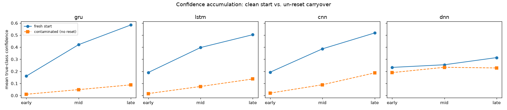

# Streaming confidence and reset: what actually needs fixing

**Status: Phase A/B/D complete, 0 failures.** Diagnostic — no training.
Reuses the `gislr.1.models.five-arch-benchmark.ipynb` checkpoints.

| | |
|---|---|
| **Question** | Is a causal model's mid-sequence confidence usable evidence, or garbage requiring a per-frame-supervised retrain (TODO Backlog, 2026-09-19)? Does explicitly resetting hidden state at a sign boundary actually help, and does the reset mechanism itself work correctly? |
| **Instrument** | `experiments/recognition/gislr.3.streaming.confidence-eval.ipynb` (TODO §11.1) |
| **Data** | 30 synthetic continuous streams, 4 isolated `test.csv` clips concatenated per stream (120 segments total), no gap between clips — neither GISLR nor POPSIGN has real multi-sign sequences |
| **Arms** | `gru`, `lstm`, `cnn` (finite receptive field, no persistent state), `dnn` (memory-free per-frame control). `bilstm` excluded — no causal per-frame readout exists to measure |

---

## 1. Method

`sb.recognize.streaming.per_frame_probs` reads a causal per-frame softmax off
each architecture's own trained head (`forward_all` on the recurrent/conv
classes, `LandmarkDNN`'s native per-frame output) — an analysis readout, not
the training or export contract. `RecurrentSession` is the reference
implementation of the actual live incremental API (`step()`/`reset()`) that
a real streaming caller would use; its output is checked against the batch
readout for numerical parity before being trusted for anything else.

Streams are built by concatenating 4 randomly sampled, full-length (not
subsampled to `MAX_SEQ_LEN=128`) `test.csv` clips end-to-end, with the true
label and start frame of each segment recorded. 10 of the 120 sampled clips
(8.3%) exceed 128 frames — a minor train/inference length mismatch, addressed
in §4.

## 2. Results

### 2.1 Mid-sequence confidence is usable — once you control for contamination

The notebook's first pass (§3) averaged every segment together and looked
weak: `gru`'s early/mid/late confidence was 0.048 / 0.142 / 0.212 — a
slow-looking climb that would seem to justify a per-frame-supervised
retrain. That average conflates two very different situations: 3 of every 4
segments per stream start with whatever hidden state the *previous* sign
left behind (no reset applied), while only the first segment in each stream
starts genuinely fresh. Splitting on that (§3b) tells a different story:

| arch | fresh start (early → mid → late) | contaminated, no reset (early → mid → late) |
|---|---|---|
| `gru` | 0.161 → 0.421 → **0.584** | 0.010 → 0.048 → 0.088 |
| `lstm` | 0.190 → 0.397 → **0.503** | 0.016 → 0.074 → 0.137 |
| `cnn` | 0.193 → 0.386 → **0.518** | 0.020 → 0.089 → 0.187 |
| `dnn` (no state to contaminate) | 0.233 → 0.254 → 0.314 | 0.189 → 0.233 → 0.228 |

**A genuinely fresh causal sequence already accumulates strong, well-behaved
evidence.** `gru`'s late-third confidence on a clean start (0.584) matches or
beats the whole-video mean-true-class-confidence numbers from
`five-arch-benchmark.md` (0.5898–0.6059 across `gru`/`lstm`/`bilstm`/`cnn`),
despite being averaged over only the last third of a shorter, unsubsampled
clip. The "last-frame-only supervision" concern behind the original Backlog
item is real in principle, but it is **not** the dominant effect visible
here — `gru`/`lstm`/`cnn` all show a clean, roughly monotonic accumulation
curve when nothing contaminates the start.

**What dominates instead is exactly what §2.2 measures directly: not
resetting is catastrophic**, not merely suboptimal. A contaminated
segment's confidence in its *own* late third (0.088 for `gru`) is *below* a
clean segment's confidence in its *own* early third (0.161) — carried-over
state doesn't just slow accumulation for the next sign, it actively
suppresses it for the entire segment. `dnn`, which has no persistent state
to contaminate, shows almost none of this gap (0.314 vs. 0.228) — confirming
the effect is specifically about carried recurrent state, not clip content
or stream position.

### 2.2 Reset works, and the mechanism is correct

Comparing no-reset to an oracle reset (`RecurrentSession.reset()` called
exactly at the true boundary, isolating the mechanism from any question of
who decides to trigger it):

| arch | condition | bleed-through (frames) | re-acquisition latency (frames) |
|---|---|---|---|
| `gru` | no reset | 19.6 | 41.4 |
| `gru` | oracle reset | **0.8** | **23.3** |
| `lstm` | no reset | 16.1 | 36.6 |
| `lstm` | oracle reset | **0.4** | **21.5** |

Bleed-through (frames after the boundary where the *old* sign's confidence
still exceeds the *new* one's) drops by 96% (`gru`) / 98% (`lstm`) with
reset. The no-reset re-acquisition numbers are inflated by segments that
never cross 0.5 confidence at all within their own length — consistent with
§2.1's finding that contaminated segments barely reach 0.09–0.14 confidence
even in their own late third.

**The mechanism itself is verified independently of these effect sizes.**
`RecurrentSession.step`, called one frame at a time with carried state,
reproduces the whole-sequence batch computation (`per_frame_probs`) to
**1.7e-06** (`gru`) / **1.0e-06** (`lstm`) max absolute error on real data
(checked on CPU, where GRU/LSTM computation is a plain step-by-step loop —
GPU cuDNN dispatches a different kernel for a single-step call than for a
whole-sequence call, which by itself produces ~5e-4 divergence unrelated to
correctness). Reset does exactly what it is supposed to.

### 2.3 A rule-based reset trigger already gets reasonable precision

`AcceptTrigger` (fires once the top class's confidence holds above `tau` for
`hold_frames` consecutive frames), swept over oracle-reset streams — a
fixed-rule stand-in for whatever eventually decides *when* to reset (an LLM,
per the user's proposed architecture, or a simpler rule):

| arch | tau | hold | precision | missed / 120 segments |
|---|---|---|---|---|
| `gru` | 0.9 | 10 | **1.000** | 97 |
| `gru` | 0.9 | 3 | 0.994 | 73 |
| `gru` | 0.7 | 5 | 0.858 | 51 |
| `gru` | 0.5 | 3 | 0.787 | 31 |
| `lstm` | 0.9 | 10 | 0.748 | 88 |
| `lstm` | 0.7 | 5 | 0.724 | 40 |

`gru` dominates `lstm` at every `(tau, hold_frames)` setting tested — consistent
with `gru` leading among streaming-viable arches in `five-arch-benchmark.md`.
There is a real precision/coverage trade, not a single winner: stricter
settings (`tau=0.9`, `hold=10`) get perfect precision but miss most segments
entirely (never sustain confidence that long); looser settings (`tau=0.5`,
`hold=3`) catch nearly everything at lower precision. `tau=0.7, hold=5` is a
reasonable middle ground for `gru` (0.858 precision, 51/120 missed). Note
`correct_accepts`/`wrong_accepts` count individual accept *events*, not
distinct segments — the trigger can re-fire multiple times within one
segment if confidence stays pinned above threshold, which is why some rows'
counts exceed 120.

## 3. Verdict

**Reprioritizes TODO §11.2 (the per-frame-supervised retrain) down, from
assumed prerequisite to optional refinement.** The existing checkpoints,
when their state isn't contaminated, already produce well-calibrated,
accumulating mid-sequence confidence — matching the whole-video confidence
numbers from the five-arch-benchmark by the final third of a fresh segment.
Retraining may still help at the margins, but it is not blocking anything.

**The lever that matters is making reset a first-class part of any live
inference loop.** `RecurrentSession` already does this correctly (verified
to 1e-6 against the batch computation) and its effect is large when applied
(bleed-through cut by 96–98%). The next real question is *when* to pull it —
§2.3's rule-based sweep is a usable baseline; an LLM decision-maker (TODO
§11.3) stays blocked on §8's unresolved next-word/sentence-data-source
question, independent of anything found here.

## 4. Caveats

- **Clip length mismatch**: streams are built from full-length clips, not
  subsampled to `MAX_SEQ_LEN=128` like training inputs. 10/120 clips (8.3%)
  exceed 128 frames. This is a real but minor mismatch — it is not the
  explanation for §2.1's fresh/contaminated gap, since `dnn` is equally
  exposed to it and shows almost none of that gap.
- **Synthetic streams, not real continuous signing.** Concatenated isolated
  clips have zero-frame transitions and no coarticulation between signs —
  a real continuous stream would likely show smoother, not sharper,
  boundaries. Whether that makes reset timing easier or harder is untested.
- **n=30 streams / 120 segments.** Adequate for the effect sizes found here
  (order-of-magnitude differences), too small to trust precise trigger-sweep
  precision figures to the third decimal.

Artifacts: `position_confidence.csv`, `position_confidence_by_freshness.csv`,
`freshness_split.png`, `boundary_effect.csv`, `trigger_sweep.csv` in
`data/cache/gislr/streaming_confidence_eval/` (gitignored — re-run the
notebook to regenerate).
