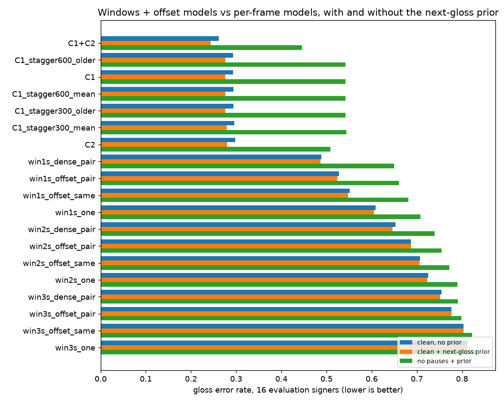

# Windows with offset models vs per-frame ensembles, with a next-gloss prior

**Status: run 2026-09-26 (Claude, inference only).** TODO §12.8. Notebook
`experiments/recognition/gislr.3.streaming.window-ensemble.ipynb`, module `sb.recognize.sequences.windows`.

| | |
|---|---|
| **Question** | The user's proposal: instead of a model reading every frame, feed windows of about a sign's length (1-3 s) to **two models offset by ~500 ms**, combine their predictions, and fuse with an **independent next-gloss model**. Is that better than C1? And do Claude's two variants (average two continuous models per frame; two copies of one model restarted in turn) help? |
| **Data** | GISLR-Sentences v1, `sentence` streams. Settings chosen on the 5 selection signers (segmenter first, then the fusion rule), every number from the **16 evaluation signers** (5,054 streams, 15,652 signs) |
| **Prior** | the app's: held-out trigram over the sentence corpus (sentence-fold), fused as `q·p^λ` |
| **Metric** | gloss error rate (GER; lower is better), repeats collapsed; also hard-cut (no pauses) and 6-sentence sessions (no prior) |
| **Parity** | C1 D3 (ν 0.7, min_len 4) on the evaluation signers = **0.2934**, identical to `continuous-models.md` |
| **Artifacts** | `data/cache/gislr/window_ensemble/{parts/<arm>.json, summary.csv, assets/ger_by_arm.png}` |

## 1. Headline

| arm | GER | + prior | no pauses (+ prior) | 6-sentence session | missed signs | exact sentences | commit lag (frames) |
|---|---|---|---|---|---|---|---|
| **C1 + C2, per-frame average** | **0.262** | **0.244** | **0.446** | 0.451 | 0.040 | **46.5%** | 1 |
| C1 (deployed) | 0.293 | 0.276 | 0.542 | **0.416** | 0.062 | 40.7% | 1 |
| C1 × 2, restarted every 20 s, older copy | 0.293 | 0.275 | 0.542 | 0.416 | | | |
| C1 × 2, restarted every 10 s, mean | 0.296 | 0.279 | 0.544 | 0.420 | | | |
| C2 | 0.298 | 0.280 | 0.508 | 0.520 | 0.049 | 41.3% | 1 |
| 1 s windows, both models every 500 ms (dense) | 0.489 | 0.486 | 0.650 | 0.463 | 0.325 | 17.6% | 10 |
| **the user's scheme, 1 s**: `gru` + `gru_phono_raw`, 500 ms apart | 0.527 | 0.523 | 0.660 | 0.501 | 0.358 | 14.3% | 13 |
| the user's scheme, 2 s | 0.687 | 0.687 | 0.754 | 0.639 | 0.571 | 3.9% | 23 |
| the user's scheme, 3 s | 0.777 | 0.777 | 0.799 | 0.766 | 0.698 | 1.5% | 33 |

- **Windows lose to the per-frame model, and longer windows lose more.** At 3 s, 70% of signs are never
  emitted. Signs are a median of about 20 frames (0.7 s), so a 3 s window holds 3-4 signs, and a model
  trained on one sign per clip returns one label per window. Even the best window arm (1 s, dense) misses a
  third of the signs and commits 10 frames after the sign ends; C1 commits 1 frame after.
- **The user's core idea, combining models, works inside the window approach.** For every window length the
  order is the same: one model < the same model twice, offset < two different models, offset < two models
  each every 500 ms (3 s: 0.812 → 0.803 → 0.777 → 0.752; 1 s: 0.609 → 0.551 → 0.527 → 0.489). It cannot
  close the gap the window framing opens.
- **Combining models per frame is the new best: GER 0.244 with the prior**, 12% below C1 + prior (0.276). It
  helps most where C1 is weakest: **no pauses 0.542 → 0.446**, and exactly-right sentences 40.7% → 46.5%. The
  commit lag stays at 1 frame. C1 and C2 differ only in the recurrent cell (GRU vs LSTM); two models that
  read different inputs gained more on isolated signs (+4 points, `phonology-models.md` §8), so a pair built
  from C4 (normalized input) should gain more still.
- **The next-gloss prior helps the per-frame models (−0.017 to −0.018) and does almost nothing for windows
  (≤ −0.006).** Windows fail by deletion; a prior can only re-rank signs that were found.
- **Staggered restarts do not help** (10 s or 20 s, mean or older copy: 0.293-0.296; long sessions
  0.416-0.420 vs C1's 0.416). On these streams C1's long-session loss (0.293 → 0.416) is not something a
  periodic restart repairs.
- **The per-frame pair is worse than C1 on long sessions** (0.451 vs 0.416). C2 alone is 0.520 there; its
  drift carries into the average. Weighting the members, or a partner that holds up over long sessions,
  should fix it; C4 was trained on streams up to 1,500 frames for this reason.

## 2. Settings chosen (selection signers)

| arm | segmenter | prior rule |
|---|---|---|
| C1 + C2 | D3 ν 0.5, min_len 4 | λ 0.3 |
| C1, staggered arms | D3 ν 0.7, min_len 4 | λ 0.3 |
| C2 | D3 ν 0.7, min_len 4 | λ 0.5 |
| window arms | τ 0.3-0.5, min run 1 | λ 0.3-0.5 |

The pair picks a lower ν (0.5 vs 0.7): averaging makes the null probability less extreme, so the null gate
has to open earlier.

## 3. Recommendation

1. **Ship a per-frame ensemble in the app, not windows.** Two continuous models step on the same frame; their
   gloss+null probabilities are averaged; D3 + the lag-2 lattice + the trigram prior run unchanged. Cost:
   two step models (each 0.06 ms/frame in the browser) and two recurrent states.
2. **The members:** C1 + C2 works today (0.244). Once C4/C5 are trained, this notebook adds `C4+C5` and
   `C1+C4` automatically (re-run it: only new arms are computed). Pick the best pair on the selection signers.
3. **Drop windows and staggered restarts** for the live path. Windows would need windows under a sign's length
   *and* a start every few frames, which is the per-frame model again at many times the cost.

## 4. Caveats

- All streams are composed from isolated clips (GISLR-Sentences), like every §12 result. The ranking between
  approaches is the finding; the absolute numbers are optimistic for live signing (`live-streaming-gap.md`).
- The window arms use isolated classifiers with no null class, so their only rejection is the threshold τ.
  A window model trained with a background class (Zuo et al., EMNLP 2024) would reject better; it would not
  fix a 3 s window holding several signs.
- Long sessions are scored without the prior (a chain crosses corpus folds, so no held-out prior exists for it).
