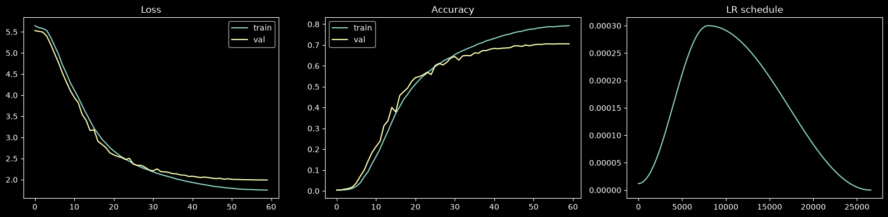
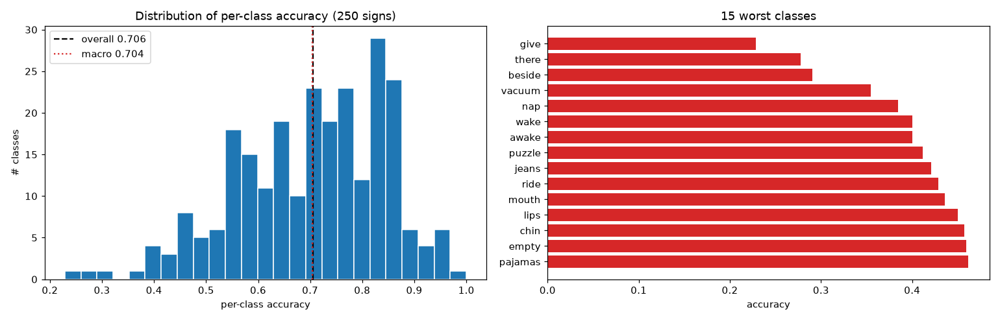

# gislr / gru / 20260713-213000 — full-543-landmark baseline

Unidirectional **StreamingGRU** trained on the complete MediaPipe Holistic
landmark set (no subset selection). This is the full-input baseline that the
landmark-subset ablations (TODO §3.1, `docs/2026-07-15.md` §6) are measured
against. Trained 2026-07-13 via `src/gislr.1.model.gru.ipynb`; folder renamed
from `0001` to the timestamp convention on 2026-07-15.

**Dataset:** see [data.md](data.md) — GISLR, all 543 landmarks × xyz
(input dim 1,629), stratified 90/10 split (seed 42).

## Architecture

```
input (B, T≤128, 1629)
  → LayerNorm(1629)
  → GRU(1629 → 256, 2 layers, unidirectional, dropout 0.3 between layers)   [packed sequences]
  → last valid timestep
  → LayerNorm(256) → Dropout(0.3) → Linear(256 → 250)
```

- **1,911,988 parameters**
- Unidirectional by design — streaming/causal inference is the deployment
  target; no future context is ever used.

## Training conditions

| hyperparameter | value |
|---|---|
| batch size | 192 |
| optimizer | AdamW, lr 3e-4, weight decay 1e-4 |
| LR schedule | OneCycleLR (max_lr 3e-4, per-step) |
| loss | CrossEntropy + label smoothing 0.1 |
| epochs | 60 (best at 57) |
| dropout | 0.3 |
| grad clip | 5.0 (on unscaled grads) |
| precision | AMP (autocast + GradScaler) |
| max seq len | 128 frames (uniform subsample beyond) |
| dataloader | 8 workers, memmap-backed `GISLRRawDataset` |
| hardware | RTX 4080 Super (16 GB), Windows 11 |

Checkpointing: `gru_latest.pt` every epoch (auto-resume), duplicated to
`gru_best.pt` on val-accuracy improvement. The checkpoint stores model,
optimizer and scheduler state, full history, `sign2idx`, hyperparameters and
`feature_dim`.

## Performance & evaluation

Val split = 9,448 videos (10%, stratified, seed 42). Per-class evaluation run
2026-07-15 straight from the raw parquet files (`scripts/eval_gru.py`); it
reproduces the checkpoint's stored best val accuracy exactly.

| metric | value |
|---|---|
| **overall val accuracy** | **70.59%** |
| macro (mean per-class) accuracy | 70.36% |
| median class accuracy | 72.22% |
| classes below 50% accuracy | 22 / 250 |
| final train accuracy | 78.98% (mild overfit, ~8 pt gap) |
| best epoch | 57 / 60 |

| worst 5 classes | acc | best 5 classes | acc |
|---|---|---|---|
| give | 22.9% | gum | 100.0% |
| there | 27.8% | brown | 95.0% |
| beside | 29.0% | horse | 94.9% |
| vacuum | 35.5% | clown | 94.9% |
| nap | 38.5% | sad | 94.9% |

Full per-class table: [cache/per_class_accuracy.csv](cache/per_class_accuracy.csv) ·
summary: [cache/eval_summary.json](cache/eval_summary.json)




## Files

| file | content |
|---|---|
| `gru_best.pt` | best-val-accuracy checkpoint (gitignored) |
| `data.md` | dataset / features / split detail |
| `assets/learning_loss_accuracy.png` | loss, accuracy, LR curves |
| `assets/per_class_accuracy.png` | per-class accuracy histogram + 15 worst classes |
| `cache/per_class_accuracy.csv` | accuracy + val count for all 250 classes |
| `cache/eval_summary.json` | machine-readable eval summary |
