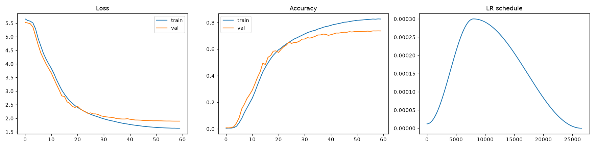
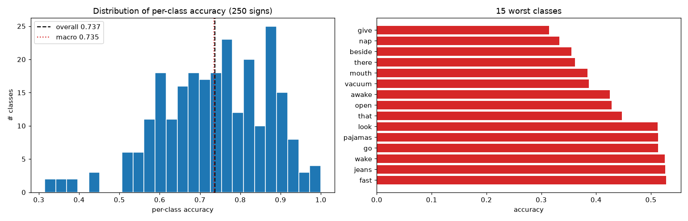

# gislr / gru / 20260715-190729 — ME-126 landmark subset

Unidirectional **StreamingGRU** trained on the **ME-126** landmark subset
(hands + upper-body pose + lips + eyes/nose — derived from the motion-energy
analysis and the Kaggle-1st-place cross-check, `docs/2026-07-15.md`).
A controlled ablation against the full-543 baseline
(`../20260713-213000/`): **the landmark subset is the only variable** — same
architecture, split, hyperparameters, NaN policy, and xyz channels.

**Result: 73.73% val accuracy vs the baseline's 70.59% (+3.14 pts) with
50.4% fewer parameters** — the 417 discarded landmarks weren't just neutral
bulk, they actively cost the baseline accuracy.

**Dataset:** see [data.md](data.md) — GISLR, 126 of 543 landmarks × xyz
(input dim 378), stratified 90/10 split (seed 42). Landmark indices:
[cache/landmarks.npy](cache/landmarks.npy).

## Architecture

```
input (B, T≤128, 378)
  → LayerNorm(378)
  → GRU(378 → 256, 2 layers, unidirectional, dropout 0.3 between layers)   [packed sequences]
  → last valid timestep
  → LayerNorm(256) → Dropout(0.3) → Linear(256 → 250)
```

- **948,718 parameters** (baseline: 1,911,988)
- Unidirectional/causal — streaming deployment target.

## Training conditions

| hyperparameter | value |
|---|---|
| batch size | 192 |
| optimizer | AdamW, lr 3e-4, weight decay 1e-4 |
| LR schedule | OneCycleLR (max_lr 3e-4, per-step) |
| loss | CrossEntropy + label smoothing 0.1 |
| epochs | 60 (best at 59) |
| dropout | 0.3 |
| grad clip | 5.0 (on unscaled grads) |
| precision | AMP (autocast + GradScaler) |
| max seq len | 128 frames (uniform subsample beyond) |
| seeds | torch/numpy/DataLoader generator = 42 |
| dataloader | in-RAM subset cache, `num_workers=0` |
| wall time | **17.5 min** on RTX 4080 Super (Windows 11) |

Trained 2026-07-15 by [cache/train_gru_me126.py](cache/train_gru_me126.py)
(run with CWD = `src/`), which mirrors `src/gislr.1.model.gru.ipynb`
cell-for-cell (auto-resume checkpointing, `gru_latest.pt` / `gru_best.pt`,
same state-dict schema plus `landmarks` and `subset_name` keys). Per-class
evaluation: `scripts/eval_gru.py`.

## Performance & evaluation

Val split = 9,448 videos (identical to baseline). Per-class evaluation from
raw parquet reproduces the stored best val accuracy.

| metric | ME-126 (this run) | baseline 20260713-213000 | Δ |
|---|---|---|---|
| **overall val accuracy** | **73.73%** | 70.59% | **+3.14** |
| macro (mean per-class) accuracy | 73.49% | 70.36% | +3.13 |
| median class accuracy | 74.36% | 72.22% | +2.14 |
| classes below 50% accuracy | **9** / 250 | 22 / 250 | −13 |
| parameters | 948,718 | 1,911,988 | −50.4% |
| final train accuracy | 82.76% | 78.98% | (gap ~9 pts both) |
| best epoch | 59 / 60 | 57 / 60 | |

The gain is broad-based, not concentrated: macro accuracy rises by the same
margin as overall, and the failing-class count drops from 22 to 9. The class
`mouth` (38.5%) entering the worst-5 is consistent with the subset's known
blind spot — it relies on mouthing context the discarded face landmarks
partially carried; see the discriminability follow-up (TODO §3).

| worst 5 classes | acc | best 5 classes | acc |
|---|---|---|---|
| give | 31.4% | donkey | 100.0% |
| nap | 33.3% | shhh | 97.6% |
| beside | 35.5% | gum | 97.4% |
| there | 36.1% | clown | 97.4% |
| mouth | 38.5% | horse | 94.9% |

Full per-class table: [cache/per_class_accuracy.csv](cache/per_class_accuracy.csv) ·
summary: [cache/eval_summary.json](cache/eval_summary.json)




## Files

| file | content |
|---|---|
| `gru_best.pt` / `gru_latest.pt` | checkpoints (gitignored) |
| `data.md` | dataset / ME-126 subset / split detail |
| `cache/landmarks.npy` | the exact 126 holistic row indices |
| `assets/learning_loss_accuracy.png` | loss, accuracy, LR curves |
| `assets/per_class_accuracy.png` | per-class accuracy histogram + 15 worst classes |
| `cache/per_class_accuracy.csv` | accuracy + val count for all 250 classes |
| `cache/per_class_vs_baseline.csv` | per-class accuracy joined with the baseline + delta (156 ↑ / 63 ↓ / 31 =) |
| `cache/eval_summary.json` | machine-readable eval summary |
| `cache/train_gru_me126.py` | the exact training script that produced this run |
